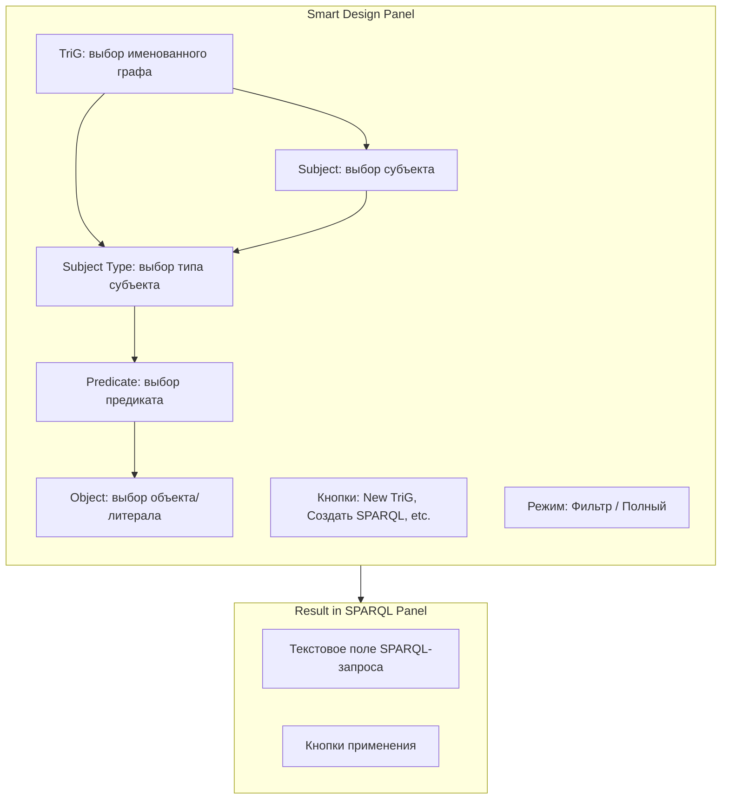
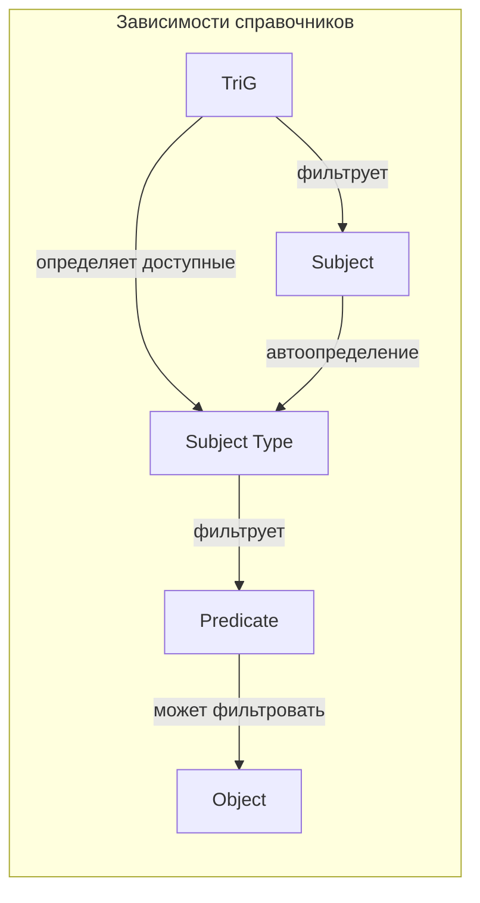
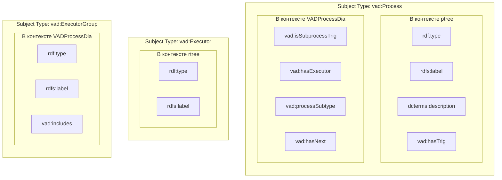
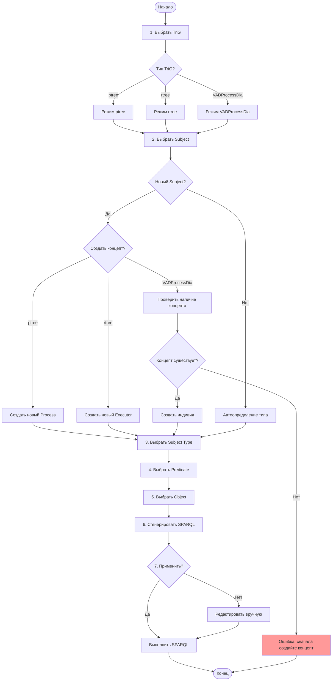
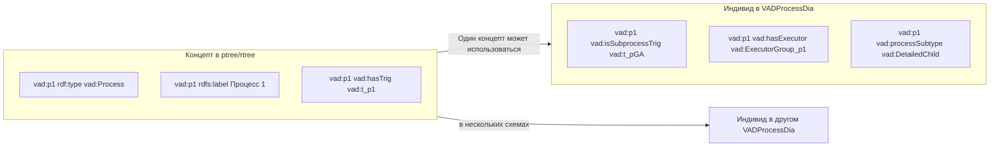
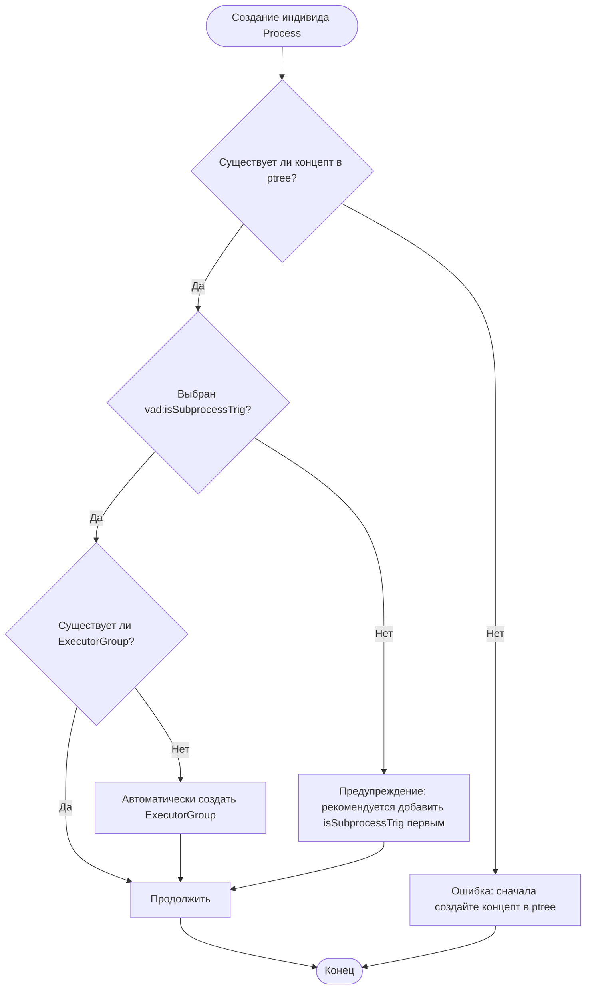

# Smart Design - Справка по работе

Данный файл содержит описание алгоритма работы с окном Smart Design, включая взаимосвязь справочников, выполняемые проверки и последовательность действий.

## 1. Общее описание

**Smart Design** - это интерфейс для создания SPARQL-запросов на добавление триплетов в RDF-данные. Интерфейс поддерживает работу с VAD (Value Added Diagram) онтологией и обеспечивает контекстную фильтрацию справочников.

### 1.1 Структура окна Smart Design



## 2. Связанные справочники

Справочники в Smart Design взаимосвязаны и зависят друг от друга:



### 2.1 Влияние выбора TriG

| Выбранный TriG | Доступные Subject Type | Доступные Subject |
|----------------|------------------------|-------------------|
| vad:ptree | vad:Process, vad:ProcessTree | Все Process из данных |
| vad:rtree | vad:Executor, vad:ExecutorTree | Все Executor из данных |
| VADProcessDia | vad:Process, vad:ExecutorGroup, vad:VADProcessDia | Все субъекты |

### 2.2 Влияние выбора Subject Type на Predicate



## 3. Режимы работы

Smart Design поддерживает два режима работы:

### 3.1 Режим "Фильтр" (по умолчанию)

- Справочник Predicate фильтруется по выбранному Subject Type
- Показываются только допустимые предикаты для данного типа субъекта
- Обеспечивает соответствие онтологии

### 3.2 Режим "Полный"

- Справочники отображают полный набор значений
- Нет фильтрации по типу субъекта
- Используется для нестандартных операций

Переключение режимов осуществляется кнопкой **"Режим: Фильтр"** / **"Режим: Полный"**.

## 4. Алгоритм создания триплета

### 4.1 Блок-схема алгоритма



### 4.2 Пошаговая инструкция

1. **Выбор TriG** - выберите именованный граф, в который будет добавлен триплет
2. **Выбор Subject** - выберите существующий субъект или создайте новый (New)
3. **Выбор Subject Type** - укажите тип субъекта (автоматически определяется для существующих)
4. **Выбор Predicate** - выберите предикат из отфильтрованного списка
5. **Выбор Object** - выберите объект или создайте новый литерал
6. **Создание SPARQL** - нажмите "Создать SPARQL" для генерации запроса
7. **Применение** - нажмите "Применить" для выполнения запроса

## 5. Создание концептов и индивидов

### 5.1 Концепт vs Индивид



### 5.2 Правила создания

#### Создание концепта (в ptree)
1. Выберите TriG = `vad:ptree`
2. Нажмите "New" в поле Subject
3. Введите имя нового процесса
4. Subject Type автоматически = `vad:Process`
5. Добавьте необходимые свойства (rdfs:label, dcterms:description, vad:hasTrig)

#### Создание индивида (в VADProcessDia)
1. Выберите TriG = схема процесса (например, `vad:t_pGA`)
2. Выберите существующий концепт из ptree
3. Subject Type = `vad:Process`
4. **ВАЖНО**: Первым добавляется `vad:isSubprocessTrig`
5. Затем добавляется `vad:hasExecutor` с автоматически созданной ExecutorGroup

### 5.3 Правило формирования ID для ExecutorGroup

При создании нового индивида Process в VADProcessDia автоматически создается связанный объект ExecutorGroup:

```
ID ExecutorGroup = "ExecutorGroup_" + ID процесса
```

Пример:
```turtle
vad:Process2 vad:hasExecutor vad:ExecutorGroup_Process2 .
vad:ExecutorGroup_Process2 rdf:type vad:ExecutorGroup ;
    rdfs:label "Группа исполнителей процесса Process2" ;
    vad:includes vad:Executor1 .
```

## 6. Выполняемые проверки

### 6.1 При создании нового индивида Process



### 6.2 Проверки уникальности

- При создании нового Subject проверяется уникальность имени
- При создании нового литерала проверка уникальности не выполняется

## 7. Сводная таблица «Объект-Предикат»

Данная таблица определяет допустимые предикаты для каждого типа объекта (см. Приложение 1 к онтологии):

| Тип объекта (Subject Type) | Контекст TriG | Допустимые предикаты |
|---------------------------|---------------|----------------------|
| vad:Process | ptree | rdf:type, rdfs:label, dcterms:description, vad:hasTrig |
| vad:Process | VADProcessDia | vad:isSubprocessTrig, vad:hasExecutor, vad:processSubtype, vad:hasNext |
| vad:Executor | rtree | rdf:type, rdfs:label |
| vad:ExecutorGroup | VADProcessDia | rdf:type, rdfs:label, vad:includes |
| vad:VADProcessDia | VADProcessDia | rdf:type, rdfs:label, vad:hasParentTrig, vad:definesProcess |
| vad:ProcessTree | ptree | rdf:type, rdfs:label, vad:hasParentTrig |
| vad:ExecutorTree | rtree | rdf:type, rdfs:label, vad:hasParentTrig |

## 8. Связанные файлы

- [vad-basic-ontology.ttl](vad-basic-ontology.ttl) - файл онтологии с приложениями
- [term.md](term.md) - терминологический словарь
- [vad-basic-ontology.mermaid.md](vad-basic-ontology.mermaid.md) - графическое представление онтологии
- [index.html](index.html) - основное приложение RDF Grapher

## 9. Горячие клавиши и кнопки

| Кнопка | Действие |
|--------|----------|
| New TriG | Открыть диалог создания нового TriG-контейнера |
| Создать SPARQL | Сгенерировать SPARQL INSERT запрос |
| Создать SPARQL (prefix) | Сгенерировать SPARQL с prefix-объявлениями |
| Удалить триплет | Сгенерировать SPARQL DELETE запрос |
| Очистить | Очистить все поля формы |
| Режим: Фильтр/Полный | Переключить режим фильтрации справочников |
| Применить как Simple Triple | Добавить триплет в простом формате |
| Применить как Shorthand Triple | Добавить триплет в сокращенном формате |

## 10. Типичные сценарии использования

### 10.1 Добавление нового процесса на схему

1. Создайте концепт процесса в `vad:ptree`:
   - TriG: `vad:ptree`
   - Subject: New -> введите имя (например, `myProcess`)
   - Subject Type: `vad:Process`
   - Predicate: `rdf:type` -> Object: `vad:Process`
   - Predicate: `rdfs:label` -> Object: New -> "Мой процесс"

2. Добавьте индивид на схему `vad:t_pGA`:
   - TriG: `vad:t_pGA`
   - Subject: `vad:myProcess`
   - Subject Type: `vad:Process`
   - Predicate: `vad:isSubprocessTrig` -> Object: `vad:t_pGA`
   - Predicate: `vad:hasExecutor` -> Object: `vad:ExecutorGroup_myProcess`
   - Predicate: `vad:processSubtype` -> Object: `vad:Basic`

### 10.2 Добавление связи между процессами

1. TriG: выберите схему процесса (например, `vad:t_pGA`)
2. Subject: выберите исходный процесс (например, `vad:Process1`)
3. Subject Type: `vad:Process`
4. Predicate: `vad:hasNext`
5. Object: выберите целевой процесс (например, `vad:Process2`)
6. Нажмите "Создать SPARQL" и "Применить"
