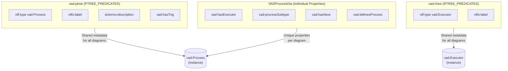
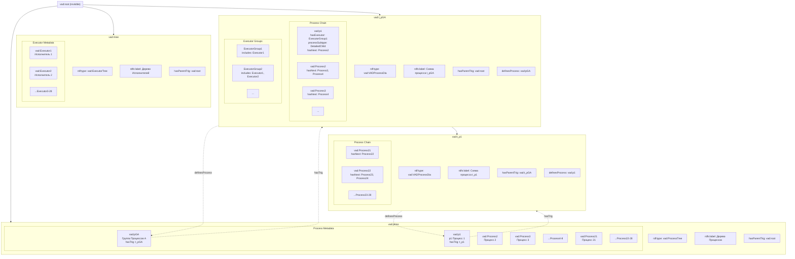
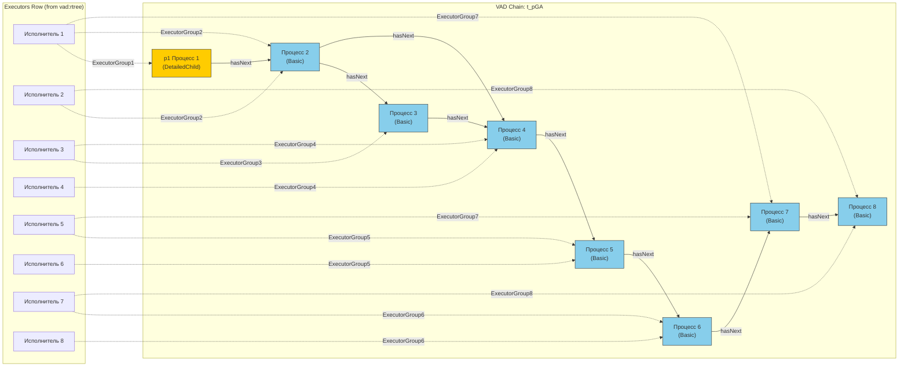
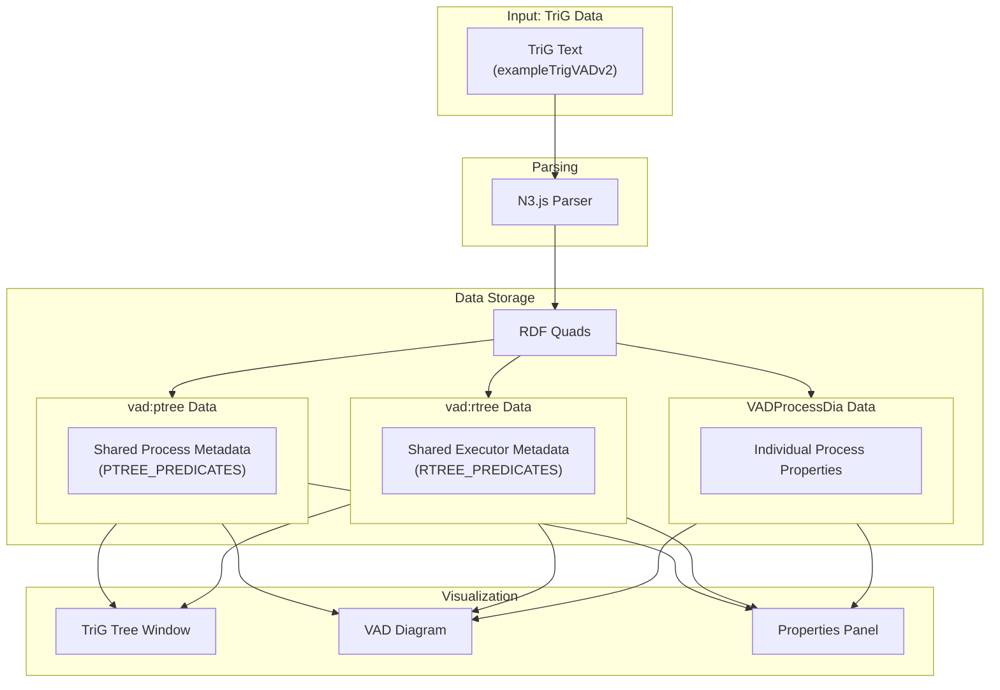

# Basic VAD Ontology - Graphical Representation

## Mermaid Diagram

This document provides a graphical representation of the Basic VAD Ontology using Mermaid diagrams.

### Class Diagram

```mermaid
classDiagram
    direction TB

    %% ======================================
    %% CLASSES
    %% ======================================

    class Process {
        <<Class>>
        +rdf:type vad:Process
        +rdfs:label : string
        +dcterms:description : string
        +vad:hasTrig : VADProcessDia [0..1]
        ---
        Individual properties in VADProcessDia:
        +vad:hasExecutor : ExecutorGroup
        +vad:processSubtype : Basic|Detailed|DetailedChild|DetailedExternal
        +vad:hasNext : Process [0..*]
    }

    class VADProcessDia {
        <<Class>>
        TriG Named Graph
        +rdf:type vad:VADProcessDia
        +rdfs:label : string
        +vad:hasParentTrig : VADProcessDia|root
        +vad:definesProcess : Process [0..1]
    }

    class ProcessTree {
        <<Class>>
        Single instance: vad:ptree
        +rdf:type vad:ProcessTree
        +rdfs:label : string
        +vad:hasParentTrig : root
        Contains PTREE_PREDICATES for all Process
    }

    class ExecutorTree {
        <<Class>>
        Single instance: vad:rtree
        +rdf:type vad:ExecutorTree
        +rdfs:label : string
        +vad:hasParentTrig : root
        Contains RTREE_PREDICATES for all Executor
    }

    class ExecutorGroup {
        <<Class>>
        +rdf:type vad:ExecutorGroup
        +rdfs:label : string
        +vad:includes : Executor [1..*]
    }

    class Executor {
        <<Class>>
        Stored in vad:rtree
        +rdf:type vad:Executor
        +rdfs:label : string
    }

    class Basic {
        <<Subtype of Process>>
        No child diagram
    }

    class Detailed {
        <<Subtype of Process>>
        Has child diagram via hasTrig
        Parent class for DetailedChild, DetailedExternal
    }

    class DetailedChild {
        <<Subtype of Detailed>>
        Child diagram has hasParentTrig to current diagram
    }

    class DetailedExternal {
        <<Subtype of Detailed>>
        Child diagram does NOT have hasParentTrig to current diagram
    }

    class root {
        <<Technical Instance>>
        Invisible tree root
    }

    class ptree {
        <<Instance of ProcessTree>>
        Stores shared Process metadata
    }

    class rtree {
        <<Instance of ExecutorTree>>
        Stores shared Executor metadata
    }

    %% ======================================
    %% RELATIONSHIPS
    %% ======================================

    Process "1" --> "0..1" VADProcessDia : hasTrig
    VADProcessDia "1" --> "0..1" Process : definesProcess
    Process "1" --> "1" ExecutorGroup : hasExecutor
    Process "1" --> "0..*" Process : hasNext
    Process "1" --> "1" Basic : processSubtype
    Process "1" --> "1" Detailed : processSubtype
    Process "1" --> "1" DetailedChild : processSubtype
    Process "1" --> "1" DetailedExternal : processSubtype

    ExecutorGroup "1" --> "1..*" Executor : includes

    VADProcessDia "1" --> "1" VADProcessDia : hasParentTrig
    VADProcessDia "1" --> "1" root : hasParentTrig

    ProcessTree "1" --> "1" root : hasParentTrig
    ExecutorTree "1" --> "1" root : hasParentTrig

    Basic --|> Process : subClassOf
    Detailed --|> Process : subClassOf
    DetailedChild --|> Detailed : subClassOf
    DetailedExternal --|> Detailed : subClassOf

    ptree ..|> ProcessTree : instanceOf
    rtree ..|> ExecutorTree : instanceOf
```

### Property Groups Diagram

### TriG Hierarchy Example

Based on `exampleTrigVADv2` from `index.html`:

### VAD Process Chain Visualization

Example of `vad:t_pGA` process chain:

Legend:
- Yellow: DetailedChild process (has child diagram via `hasTrig`, child has `hasParentTrig` to current)
- Blue: Basic process (no child diagram)
- (Not shown) DetailedExternal: would have different color for processes referencing external diagrams

### Data Flow Diagram

## Summary Table

| Concept | Class | Storage Location | JS Constant |
|---------|-------|------------------|-------------|
| Process (type) | `vad:Process` | `vad:ptree` | `VAD_ALLOWED_TYPES` |
| Process (label) | - | `vad:ptree` | `PTREE_PREDICATES` |
| Process (description) | - | `vad:ptree` | `PTREE_PREDICATES` |
| Process (hasTrig) | - | `vad:ptree` | `PTREE_PREDICATES` |
| Process (hasNext) | - | `VADProcessDia` | `VAD_ALLOWED_PREDICATES` |
| Process (hasExecutor) | - | `VADProcessDia` | `VAD_ALLOWED_PREDICATES` |
| Process (processSubtype) | - | `VADProcessDia` | `VAD_ALLOWED_PREDICATES` |
| Executor (type) | `vad:Executor` | `vad:rtree` | `VAD_ALLOWED_TYPES` |
| Executor (label) | - | `vad:rtree` | `RTREE_PREDICATES` |
| ExecutorGroup | `vad:ExecutorGroup` | `VADProcessDia` | `VAD_ALLOWED_TYPES` |
| TriG (definesProcess) | - | `VADProcessDia` | `VAD_ALLOWED_PREDICATES` |

## Process Subtypes

| Subtype | Description | Visual Indicator |
|---------|-------------|------------------|
| `vad:Basic` | No child diagram | Blue fill |
| `vad:Detailed` | Has child diagram (parent class) | Yellow fill |
| `vad:DetailedChild` | Child diagram has `hasParentTrig` to current | Yellow fill |
| `vad:DetailedExternal` | Child diagram does NOT have `hasParentTrig` to current | Yellow fill (with external indicator) |
