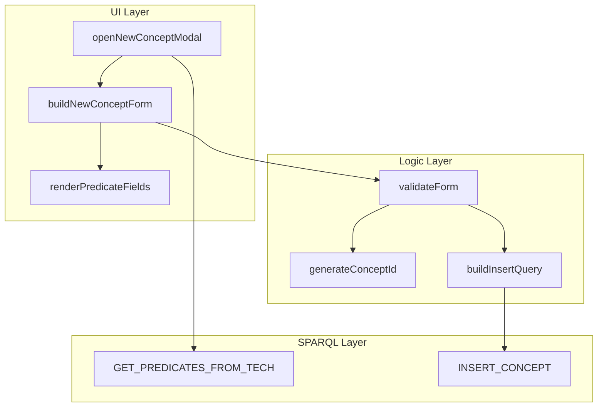

# Code Navigator Concept for ver8tree

## 1. Overview

This document proposes a code navigation system that enables visual navigation through the codebase using tags, hierarchical views, and graph-based representations.

## 2. Problem Statement

Large codebases are difficult to navigate:
- Hard to find specific functionality
- Relationships between modules unclear
- New developers spend time understanding structure
- Documentation often outdated

## 3. Existing Solutions

### 3.1 IDE-Based Navigation

| Tool | Features | Limitations |
|------|----------|-------------|
| **VSCode Outline** | Class/function tree | No cross-file relationships |
| **WebStorm Structure** | Rich navigation | IDE-specific |
| **Sourcegraph** | Code search, refs | Requires server setup |
| **CodeScene** | Behavioral analysis | Commercial |

### 3.2 Documentation Generators

| Tool | Type | Notes |
|------|------|-------|
| **JSDoc** | API docs | Static, no navigation graph |
| **Docusaurus** | Doc site | Manual maintenance |
| **Storybook** | UI components | Component-focused |
| **Compodoc** | Angular | Framework-specific |

### 3.3 Visualization Tools

| Tool | Type | Notes |
|------|------|-------|
| **Madge** | Dependency graph | NPM packages only |
| **Code2flow** | Flowcharts | Procedural code |
| **js-sequence-diagrams** | Sequence diagrams | Manual definition |
| **Mermaid** | Various diagrams | Manual markdown |

## 4. Proposed Code Navigator for ver8tree

### 4.1 Tag-Based Navigation

#### 4.1.1 Comment Tags

Add standardized tags in code comments:

```javascript
/**
 * @nav-module smart-design
 * @nav-feature new-concept
 * @nav-layer ui
 * @nav-relates-to sparql-queries.js
 * @nav-depends-on ui-utils.js
 */

/**
 * Open modal for creating new concept
 *
 * @nav-function openNewConceptModal
 * @nav-ui-trigger button#new-concept-btn
 * @nav-calls buildNewConceptForm
 * @nav-calls loadPredicatesForType
 * @nav-sparql NEW_CONCEPT_SPARQL.GET_PREDICATES_FROM_TECH
 */
function openNewConceptModal() {
    // ...
}
```

#### 4.1.2 Tag Types

| Tag | Purpose | Example |
|-----|---------|---------|
| `@nav-module` | Module/feature group | `smart-design`, `validation` |
| `@nav-feature` | Specific feature | `new-concept`, `delete-concept` |
| `@nav-layer` | Architecture layer | `ui`, `logic`, `sparql`, `data` |
| `@nav-relates-to` | Related files | `sparql-queries.js` |
| `@nav-depends-on` | Dependencies | `ui-utils.js` |
| `@nav-function` | Function identifier | `openNewConceptModal` |
| `@nav-ui-trigger` | UI element that triggers | `button#new-concept-btn` |
| `@nav-calls` | Functions called | `buildNewConceptForm` |
| `@nav-sparql` | SPARQL queries used | `NEW_CONCEPT_SPARQL.*` |
| `@nav-business-req` | Business requirement ID | `NC-001` |
| `@nav-issue` | Related GitHub issue | `#205` |

### 4.2 Navigation Index Generator

#### 4.2.1 Build Script

```javascript
/**
 * Generate navigation index from source files
 */
const fs = require('fs');
const path = require('path');

const NAV_TAG_PATTERN = /@nav-(\w+)\s+(.+)/g;

function buildNavigationIndex(srcDir) {
    const index = {
        modules: {},
        features: {},
        layers: {},
        functions: {},
        sparql: {},
        ui: {},
        graph: { nodes: [], edges: [] }
    };

    // Scan all JS files
    const files = glob.sync(`${srcDir}/**/*.js`);

    files.forEach(file => {
        const content = fs.readFileSync(file, 'utf8');
        const relativePath = path.relative(srcDir, file);

        // Extract nav tags
        let match;
        while ((match = NAV_TAG_PATTERN.exec(content)) !== null) {
            const [, tagType, tagValue] = match;
            processTag(index, tagType, tagValue, relativePath);
        }
    });

    // Generate relationship graph
    index.graph = buildDependencyGraph(index);

    return index;
}

function processTag(index, type, value, file) {
    switch (type) {
        case 'module':
            index.modules[value] = index.modules[value] || [];
            index.modules[value].push(file);
            break;
        case 'function':
            index.functions[value] = { file };
            break;
        case 'calls':
            index.graph.edges.push({
                from: currentFunction,
                to: value,
                type: 'calls'
            });
            break;
        // ... handle other tag types
    }
}
```

#### 4.2.2 Generated Index (JSON)

```json
{
  "modules": {
    "smart-design": [
      "business/smart-design/smart-design-ui.js",
      "business/smart-design/smart-design-logic.js"
    ],
    "new-concept": [
      "business/new-concept/new-concept-ui.js",
      "business/new-concept/new-concept-logic.js",
      "business/new-concept/new-concept-sparql.js"
    ]
  },
  "features": {
    "new-concept": {
      "files": ["new-concept-ui.js", "new-concept-logic.js"],
      "requirements": ["NC-001", "NC-002", "NC-003"],
      "issues": ["#205", "#207", "#209"],
      "sparql": ["GET_PREDICATES_FROM_TECH", "INSERT_CONCEPT"]
    }
  },
  "functions": {
    "openNewConceptModal": {
      "file": "new-concept-ui.js",
      "line": 45,
      "calls": ["buildNewConceptForm", "loadPredicatesForType"],
      "calledBy": ["UI button click"],
      "sparql": ["GET_PREDICATES_FROM_TECH"]
    }
  },
  "graph": {
    "nodes": [
      {"id": "openNewConceptModal", "type": "function", "module": "new-concept"},
      {"id": "buildNewConceptForm", "type": "function", "module": "new-concept"},
      {"id": "GET_PREDICATES_FROM_TECH", "type": "sparql", "module": "new-concept"}
    ],
    "edges": [
      {"from": "openNewConceptModal", "to": "buildNewConceptForm", "type": "calls"},
      {"from": "openNewConceptModal", "to": "GET_PREDICATES_FROM_TECH", "type": "uses"}
    ]
  }
}
```

### 4.3 Visual Navigator UI

#### 4.3.1 Hierarchical Tree View

```
ver8tree/
├── 📁 Modules
│   ├── 📂 smart-design
│   │   ├── 📄 smart-design-ui.js
│   │   └── 📄 smart-design-logic.js
│   ├── 📂 new-concept
│   │   ├── 📄 new-concept-ui.js (NC-001, NC-002)
│   │   ├── 📄 new-concept-logic.js (NC-003, NC-004)
│   │   └── 📄 new-concept-sparql.js
│   └── 📂 delete-concept
│       └── ...
├── 📁 Layers
│   ├── 📂 UI
│   │   └── All *-ui.js files
│   ├── 📂 Logic
│   │   └── All *-logic.js files
│   └── 📂 SPARQL
│       └── All *-sparql.js files
└── 📁 Business Requirements
    ├── 📂 NC (New Concept)
    │   ├── NC-001 → new-concept-ui.js:45
    │   ├── NC-002 → new-concept-ui.js:78
    │   └── ...
    └── 📂 DC (Delete Concept)
        └── ...
```

#### 4.3.2 Graph View (D3.js/Mermaid)



### 4.4 Interactive Features

#### 4.4.1 Search with Tags

```
Search: @module:new-concept @layer:ui
Results:
  - new-concept-ui.js (3 functions)
  - Matches: openNewConceptModal, closeNewConceptModal, onTypeSelect

Search: @sparql:INSERT
Results:
  - new-concept-sparql.js: INSERT_CONCEPT
  - del-concept-sparql.js: (no matches)

Search: @issue:#221
Results:
  - del_concept_individ.js:267 - Fix for individ detection
  - del_concept_individ.js:589 - Updated query
```

#### 4.4.2 Click-to-Navigate

```javascript
// In navigator UI
navigator.onNodeClick = (node) => {
    if (node.type === 'function') {
        // Open file at specific line in editor
        vscode.openFile(node.file, node.line);
    } else if (node.type === 'sparql') {
        // Show SPARQL query definition
        showSparqlDefinition(node.id);
    }
};
```

## 5. Implementation Plan

### 5.1 Phase 1: Add Tags to Existing Code

1. Define tag vocabulary (see Section 4.1.2)
2. Add tags to all existing functions
3. Create JSDoc template with nav tags

### 5.2 Phase 2: Build Index Generator

1. Create Node.js script to parse tags
2. Generate JSON index file
3. Integrate with build process

### 5.3 Phase 3: Create Navigator UI

1. Build HTML/CSS tree view
2. Add D3.js graph visualization
3. Implement search functionality

### 5.4 Phase 4: IDE Integration

1. VSCode extension for tag highlighting
2. Quick navigation commands
3. Auto-completion for tag values

## 6. Example Tagged Code

### 6.1 Before (Current Code)

```javascript
/**
 * Open modal for deleting concept/individ
 * Called when user clicks "Del Concept\Individ" button
 */
function openDelConceptModal() {
    if (typeof currentQuads === 'undefined') {
        alert('Load data first');
        return;
    }
    // ...
}
```

### 6.2 After (With Navigation Tags)

```javascript
/**
 * Open modal for deleting concept/individ
 * Called when user clicks "Del Concept\Individ" button
 *
 * @nav-module delete-concept
 * @nav-feature del-concept-modal
 * @nav-layer ui
 * @nav-function openDelConceptModal
 * @nav-ui-trigger button#del-concept-btn
 * @nav-calls resetDelConceptForm
 * @nav-calls updateSmartDesignFieldsState
 * @nav-business-req DC-001
 * @nav-business-req DC-009
 * @nav-issue #211
 * @nav-issue #223
 */
function openDelConceptModal() {
    // DC-009: Check data is loaded before opening
    if (typeof currentQuads === 'undefined' || currentQuads.length === 0) {
        alert('Сначала загрузите данные');
        return;
    }
    // ...
}
```

## 7. Alternatives Considered

### 7.1 Pure Documentation Approach

**Pros**: No code changes needed
**Cons**: Documentation gets outdated

### 7.2 TypeScript with Types

**Pros**: Built-in navigation via types
**Cons**: Requires migration to TypeScript

### 7.3 External Mapping File

**Pros**: Separates concerns
**Cons**: Can drift from actual code

## 8. Recommended Tools

### 8.1 For Graph Visualization

| Tool | Use Case |
|------|----------|
| **D3.js** | Custom interactive graphs |
| **Mermaid** | Markdown-embedded diagrams |
| **Cytoscape.js** | Complex network graphs |
| **vis.js** | Simple dependency graphs |

### 8.2 For Tree View

| Tool | Use Case |
|------|----------|
| **jstree** | jQuery-based file tree |
| **react-treeview** | React component |
| **vanilla-tree** | No dependencies |

### 8.3 For Search

| Tool | Use Case |
|------|----------|
| **Fuse.js** | Fuzzy search |
| **Lunr.js** | Full-text search |
| **FlexSearch** | Fast search |

## 9. Integration with ver8tree

The navigator could be integrated as:

1. **Separate HTML page**: `navigator.html`
2. **Sidebar in main app**: Add navigation panel
3. **VSCode extension**: For development
4. **Generated documentation**: Part of build process

## 10. References

- [Business Requirements](./business-requirements.md) - Requirement IDs for tagging
- [Code Structure](./code_structure.md) - Module organization
- [D3.js](https://d3js.org/) - Graph visualization
- [JSDoc](https://jsdoc.app/) - Documentation standard
