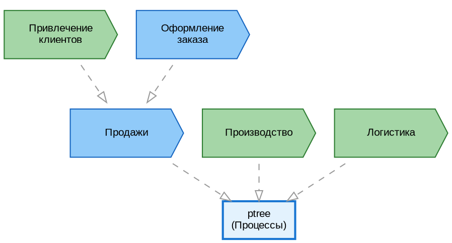
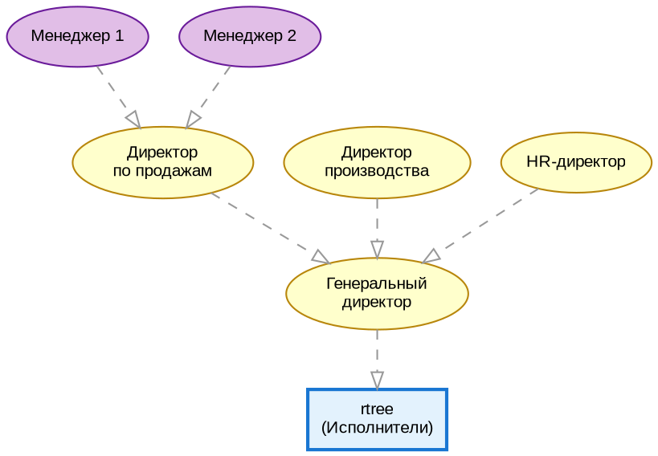
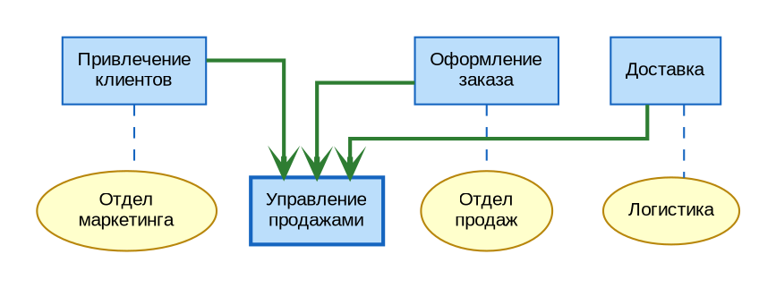
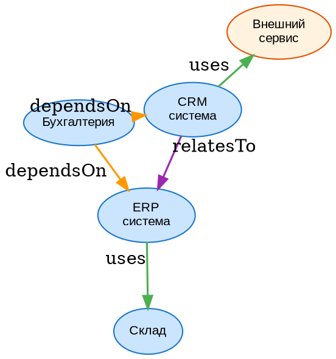
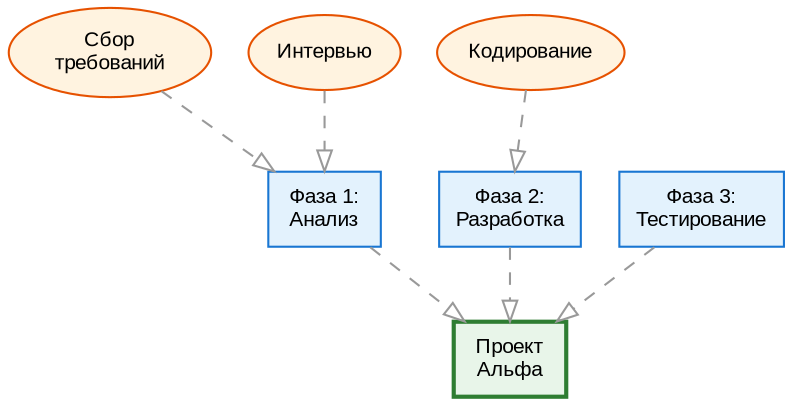

<!-- PR #308 | 2026-02-05 -->
<!-- Ссылка на issue: https://github.com/bpmbpm/rdf-grapher/issues/307 -->

# Анализ добавления Структурных и Иерархических схем в RDF Grapher

## Содержание

1. [Постановка задачи](#1-постановка-задачи)
2. [Анализ типов схем](#2-анализ-типов-схем)
   - [2.1 Иерархические схемы (дерево)](#21-иерархические-схемы-дерево)
   - [2.2 Верхнеуровневые процессы (vad:HiLevelProcessDia)](#22-верхнеуровневые-процессы-vadhilevelprocessdia)
   - [2.3 Структурные схемы (произвольные связи)](#23-структурные-схемы-произвольные-связи)
   - [2.4 Существующий тип vad:VADProcessDia](#24-существующий-тип-vadvadprocessdia)
3. [Анализ ARIS ToolSet и аналогов](#3-анализ-aris-toolset-и-аналогов)
   - [3.1 ARIS Function Tree](#31-aris-function-tree)
   - [3.2 ARIS Organizational Chart](#32-aris-organizational-chart)
   - [3.3 ARIS VAD (Value Added Chain)](#33-aris-vad-value-added-chain)
   - [3.4 Archi (ArchiMate)](#34-archi-archimate)
4. [Предложения по корректировке онтологии](#4-предложения-по-корректировке-онтологии)
   - [4.1 Новые классы](#41-новые-классы)
   - [4.2 Новые предикаты](#42-новые-предикаты)
   - [4.3 Сравнение вариантов реализации](#43-сравнение-вариантов-реализации)
5. [Унификация обработки схем](#5-унификация-обработки-схем)
   - [5.1 Базовый класс "Схемы" (vad:Diagram)](#51-базовый-класс-схемы-vaddiagram)
   - [5.2 Подклассы схем](#52-подклассы-схем)
   - [5.3 Архитектура наследования](#53-архитектура-наследования)
6. [Изменения в коде](#6-изменения-в-коде)
   - [6.1 Модули, требующие изменений](#61-модули-требующие-изменений)
   - [6.2 SPARQL-функции](#62-sparql-функции)
   - [6.3 Визуализация](#63-визуализация)
7. [Возможные проблемы](#7-возможные-проблемы)
8. [Вопросы для уточнения](#8-вопросы-для-уточнения)
9. [Рекомендации](#9-рекомендации)
10. [Графическая нотация (легенда)](#10-графическая-нотация-легенда)
    - [10.1 Легенда новых объектов](#101-легенда-новых-объектов)
    - [10.2 Примеры в нотации DOT](#102-примеры-в-нотации-dot)
11. [Ссылки](#11-ссылки)

---

## 1. Постановка задачи

Требуется добавить в проект RDF Grapher возможность формировать **три новых типа схем**:

1. **Типовое дерево (vad:HierarchicalDia)** — иерархические древовидные структуры:
   - Орг-штатная структура (`vad:OrgChart`) из `vad:rtree`
   - Иерархия процессов (`vad:FunctionTree`) из `vad:ptree`
   - Универсальное дерево (`vad:UniversalTree`) для произвольных иерархий

2. **Верхнеуровневые процессы (vad:HiLevelProcessDia)** — схема на основе `vad:VADProcessDia`, но:
   - Использует `vad:hasParentObj` вместо `vad:hasNext`
   - Строится **вертикально** (сверху вниз), а не горизонтально
   - Основной элемент: `vad:isSubprocessTrig` с `rdf:type vad:ExecutorGroup`

3. **Структурные схемы (vad:StructuralDia)** — не иерархические, с произвольными соединениями между объектами

**Аналог:** ARIS ToolSet

**Отличие от текущей реализации:**
- `vad:VADProcessDia` — схема процесса в нотации VAD с цепочками `vad:hasNext` (горизонтальная)
- `vad:HiLevelProcessDia` — вертикальная иерархия через `vad:hasParentObj` с группами исполнителей
- `vad:HierarchicalDia` — отображение типовых деревьев (`ptree`, `rtree` или произвольных)
- `vad:StructuralDia` — произвольные связи между объектами

---

## 2. Анализ типов схем

### 2.1 Иерархические схемы (дерево)

**Характеристики:**
- Структура типа "дерево" (tree)
- Каждый узел имеет не более одного родителя
- Связь: родитель → потомок (через `vad:hasParentObj`)
- Визуализация: вертикальное или горизонтальное дерево

**Подтипы иерархических схем:**

| Подтип | Тип объектов | Корень дерева | Описание |
|--------|--------------|---------------|----------|
| `vad:FunctionTree` | `vad:TypeProcess` | `vad:ptree` | Иерархия процессов |
| `vad:OrgChart` | `vad:TypeExecutor` | `vad:rtree` | Орг-штатная структура |
| `vad:UniversalTree` | Любой | Указывается в схеме | Универсальное дерево |

**Примеры применения:**
| Пример | Тип объектов | Предикат связи | Корень дерева |
|--------|--------------|----------------|---------------|
| Орг-штатная структура | `vad:TypeExecutor` | `vad:hasParentObj` | `vad:rtree` |
| Иерархия процессов | `vad:TypeProcess` | `vad:hasParentObj` | `vad:ptree` |
| Дерево документов | `vad:DataObject` (новый) | `vad:hasParentObj` | `vad:dtree` (новый) |
| Произвольная иерархия | Любой тип | `vad:hasParentObj` | Указывается явно |

**Текущая поддержка в коде:**
- Иерархия TriG уже строится через `parseTriGHierarchy()` в `2_triplestore_logic.js`
- Окно "Дерево TriG" отображает иерархию через `vad:hasParentObj`
- **Нет визуализации** иерархии концептов в формате диаграммы

### 2.2 Верхнеуровневые процессы (vad:HiLevelProcessDia)

**Характеристики:**
- Основан на `vad:VADProcessDia`, но с ключевыми отличиями
- Использует `vad:hasParentObj` вместо `vad:hasNext` для связей
- Визуализация: **вертикальная** (сверху вниз), а не горизонтальная
- Основной тип элемента: `vad:isSubprocessTrig`
- Привязка к группе исполнителей: `rdf:type vad:ExecutorGroup`

**Сравнение с VADProcessDia:**

| Аспект | vad:VADProcessDia | vad:HiLevelProcessDia |
|--------|-------------------|----------------------|
| Направление визуализации | Горизонтальное (LR) | Вертикальное (TB) |
| Предикат связи | `vad:hasNext` | `vad:hasParentObj` |
| Тип структуры | Последовательность (цепочка) | Иерархия (дерево) |
| Уровень детализации | Детальный процесс | Верхний уровень |
| Группы исполнителей | Да (`vad:ExecutorGroup`) | Да (`vad:ExecutorGroup`) |

**Пример использования:**
```
Верхнеуровневый процесс "Управление продажами"
├── Процесс "Привлечение клиентов"
│   └── ExecutorGroup: Отдел маркетинга
├── Процесс "Оформление заказа"
│   └── ExecutorGroup: Отдел продаж
└── Процесс "Доставка"
    └── ExecutorGroup: Логистика
```

### 2.3 Структурные схемы (произвольные связи)

**Характеристики:**
- Граф (graph), не дерево
- Узел может иметь множество связей с другими узлами
- Связи могут быть направленными или ненаправленными
- Произвольные типы связей (предикаты)

**Примеры применения:**
| Пример | Тип связей | Описание |
|--------|------------|----------|
| Карта взаимодействий | Двунаправленные | Связи между подразделениями |
| Зависимости систем | Направленные | Какая система использует какую |
| Процесс-ресурс | Направленные | Какие ресурсы использует процесс |

**Отличие от VAD:**
- VAD: цепочка процессов с `vad:hasNext` (последовательность)
- Структурная схема: произвольные связи между объектами

### 2.4 Существующий тип vad:VADProcessDia

**Текущая онтология:**
```turtle
vad:VADProcessDia
    rdf:type rdfs:Class, owl:Class ;
    rdfs:subClassOf vad:TriG ;
    rdfs:label "VADProcessDia" .
```

**Предикаты в VADProcessDia:**
- `vad:isSubprocessTrig` — связь индивида со схемой
- `vad:hasExecutor` — исполнитель процесса
- `vad:hasNext` — следующий процесс в цепочке
- `vad:processSubtype` — подтип процесса (вычисляется)

**Визуализация:** Горизонтальная цепочка процессов с группировкой по исполнителям

---

## 3. Анализ ARIS ToolSet и аналогов

### 3.1 ARIS Function Tree

**Источник:** [ARIS Method Manual](https://docs.aris.com/10.0.27.0/yaa-method-guide/en/Method-Manual.pdf), раздел 3.1.1.1

**Описание:**
- Иерархическая декомпозиция функций (процессов)
- Визуализация: вертикальное дерево
- Связь: функция → подфункции

**Аналог в RDF Grapher:**
- `vad:ptree` уже хранит иерархию процессов через `vad:hasParentObj`
- **Нет визуализации** в виде диаграммы дерева функций

**Предложение:** Добавить тип схемы `vad:FunctionTree` для визуализации иерархии из `vad:ptree`

### 3.2 ARIS Organizational Chart

**Источник:** [ARIS Organizational Chart](https://ariscommunity.com/organizational-chart)

**Описание:**
- Организационная структура компании
- Элементы: подразделения, должности, роли, сотрудники
- Связи: подчинённость, входимость

**Элементы ARIS Org Chart:**
| Элемент | Описание | Аналог в VAD |
|---------|----------|--------------|
| Organizational Unit | Подразделение | `vad:TypeExecutor` |
| Position | Должность | `vad:TypeExecutor` |
| Role | Роль | `vad:TypeExecutor` |
| Person | Сотрудник | (не реализовано) |
| Location | Местоположение | (не реализовано) |

**Аналог в RDF Grapher:**
- `vad:rtree` хранит иерархию исполнителей через `vad:hasParentObj`
- **Нет визуализации** в виде диаграммы организационной структуры

**Предложение:** Добавить тип схемы `vad:OrgChart` для визуализации иерархии из `vad:rtree`

### 3.3 ARIS VAD (Value Added Chain)

**Источник:** [studfile.net](https://studfile.net/preview/12770842/page:11/)

**Описание:**
- Цепочка добавленной стоимости
- Горизонтальная последовательность процессов
- Связь: `vad:hasNext`

**Текущая реализация:** Полностью поддерживается через `vad:VADProcessDia`

### 3.4 Archi (ArchiMate)

**Источник:** [Archi - Open Source ArchiMate Modelling](https://www.archimatetool.com/)

**Подход Archi:**
- **Concept** — определение объекта в Model Tree
- **Concept Reference** — визуальное представление на диаграмме
- Одна диаграмма может содержать объекты разных типов
- Связи между объектами определяются стандартом ArchiMate

**Типы диаграмм ArchiMate:**
| Тип | Описание | Аналог в VAD |
|-----|----------|--------------|
| Layered View | Слоевая архитектура | (не реализовано) |
| Actor Co-operation | Взаимодействие участников | Структурная схема |
| Business Process View | Процессы | VADProcessDia |
| Organization View | Организационная структура | OrgChart |

---

## 4. Предложения по корректировке онтологии

### 4.1 Новые классы

#### 4.1.1 Базовый класс vad:Diagram

```turtle
vad:Diagram
    rdf:type rdfs:Class, owl:Class ;
    rdfs:subClassOf vad:TriG ;
    rdfs:label "Diagram" ;
    rdfs:comment """
        Базовый класс для всех типов схем (диаграмм).

        Подклассы:
        - vad:VADProcessDia — схема процесса в нотации VAD
        - vad:HierarchicalDia — иерархическая схема (дерево)
        - vad:StructuralDia — структурная схема (произвольные связи)

        Общие свойства всех схем:
        - rdf:type — тип схемы
        - rdfs:label — название схемы
        - vad:hasParentObj — родительский объект
    """ ;
    dcterms:description "Базовый класс для всех типов схем" .
```

#### 4.1.2 Класс vad:HierarchicalDia

```turtle
vad:HierarchicalDia
    rdf:type rdfs:Class, owl:Class ;
    rdfs:subClassOf vad:Diagram ;
    rdfs:label "HierarchicalDia" ;
    rdfs:comment """
        Иерархическая схема (дерево).

        Отображает иерархию объектов через связь vad:hasParentObj.
        Используется для:
        - Орг-штатной структуры (vad:TypeExecutor)
        - Иерархии процессов (vad:TypeProcess)
        - Дерева документов (vad:DataObject)

        Специфичные свойства:
        - vad:hierarchyRoot — корневой объект иерархии
        - vad:hierarchyType — тип отображаемых объектов
    """ ;
    dcterms:description "Иерархическая схема типа дерево" .
```

#### 4.1.3 Класс vad:StructuralDia

```turtle
vad:StructuralDia
    rdf:type rdfs:Class, owl:Class ;
    rdfs:subClassOf vad:Diagram ;
    rdfs:label "StructuralDia" ;
    rdfs:comment """
        Структурная схема с произвольными связями.

        Отображает граф объектов с произвольными связями.
        Не ограничивается древовидной структурой.

        Примеры использования:
        - Карта взаимодействий подразделений
        - Зависимости между системами
        - Связи процесс-ресурс
    """ ;
    dcterms:description "Структурная схема с произвольными связями" .
```

### 4.2 Новые предикаты

#### 4.2.1 Предикаты для иерархических схем

```turtle
vad:hierarchyRoot
    rdf:type rdf:Property, owl:ObjectProperty ;
    rdfs:label "hierarchyRoot" ;
    rdfs:domain vad:HierarchicalDia ;
    rdfs:comment """
        Указывает корневой объект иерархии для отображения на схеме.

        Пример: схема орг-структуры отдела продаж
        vad:org_sales vad:hierarchyRoot vad:SalesDirector .
    """ ;
    dcterms:description "Корневой объект иерархии" .

vad:hierarchyType
    rdf:type rdf:Property, owl:ObjectProperty ;
    rdfs:label "hierarchyType" ;
    rdfs:domain vad:HierarchicalDia ;
    rdfs:range rdfs:Class ;
    rdfs:comment """
        Указывает тип объектов для отображения в иерархии.

        Возможные значения:
        - vad:TypeExecutor — организационная структура
        - vad:TypeProcess — иерархия процессов
    """ ;
    dcterms:description "Тип объектов в иерархии" .
```

#### 4.2.2 Предикаты для структурных схем

```turtle
vad:relatesTo
    rdf:type rdf:Property, owl:ObjectProperty ;
    rdfs:label "relatesTo" ;
    rdfs:comment """
        Произвольная связь между объектами на структурной схеме.

        Используется для связей, не имеющих чёткого направления
        или семантики (в отличие от vad:hasNext, vad:hasParentObj).
    """ ;
    dcterms:description "Произвольная связь между объектами" .

vad:uses
    rdf:type rdf:Property, owl:ObjectProperty ;
    rdfs:label "uses" ;
    rdfs:comment """
        Связь "использует" между объектами.

        Примеры:
        - Процесс использует систему
        - Подразделение использует ресурс
    """ ;
    dcterms:description "Связь использования" .

vad:dependsOn
    rdf:type rdf:Property, owl:ObjectProperty ;
    rdfs:label "dependsOn" ;
    rdfs:comment """
        Связь зависимости между объектами.

        Примеры:
        - Система зависит от другой системы
        - Процесс зависит от входных данных
    """ ;
    dcterms:description "Связь зависимости" .
```

### 4.3 Сравнение вариантов реализации

| Аспект | Вариант A: Отдельные классы | Вариант B: Единый класс с параметром |
|--------|---------------------------|-------------------------------------|
| **Онтология** | `HierarchicalDia`, `StructuralDia`, `VADProcessDia` | `Diagram` с `vad:diagramType` |
| **Расширяемость** | Легко добавить новый тип как подкласс | Нужно добавлять значения в справочник |
| **SPARQL** | `?dia rdf:type vad:HierarchicalDia` | `?dia vad:diagramType vad:Hierarchical` |
| **Визуализация** | Разные функции для разных типов | Одна функция с switch по типу |
| **Валидация** | Типизация на уровне онтологии | Валидация значения свойства |

**Рекомендация:** Вариант A (отдельные классы) — лучше соответствует принципам OWL и позволяет использовать механизмы наследования.

---

## 5. Унификация обработки схем

### 5.1 Базовый класс "Схемы" (vad:Diagram)

**Предложение:** Ввести базовый класс `vad:Diagram` для унификации обработки всех типов схем.

**Общие свойства всех схем:**

| Свойство | Описание | Граф хранения |
|----------|----------|---------------|
| `rdf:type` | Тип схемы (подкласс vad:Diagram) | TriG схемы |
| `rdfs:label` | Название схемы | TriG схемы |
| `vad:hasParentObj` | Родительский объект | TriG схемы |
| `dcterms:description` | Описание схемы | TriG схемы |
| `vad:createdAt` | Дата создания (опционально) | TriG схемы |

### 5.2 Подклассы схем

```
vad:Diagram (базовый)
├── vad:VADProcessDia    — существующая схема процесса VAD (горизонтальная, vad:hasNext)
├── vad:HierarchicalDia  — иерархическая схема (типовое дерево)
│   ├── vad:FunctionTree — дерево функций/процессов (из vad:ptree)
│   ├── vad:OrgChart     — организационная структура (из vad:rtree)
│   └── vad:UniversalTree — универсальное дерево (произвольная иерархия)
├── vad:StructuralDia    — структурная схема (произвольные связи, не древовидные)
└── vad:HiLevelProcessDia — верхнеуровневые процессы (вертикальная, vad:hasParentObj)
```

**Онтология подклассов:**

```turtle
vad:FunctionTree
    rdf:type rdfs:Class, owl:Class ;
    rdfs:subClassOf vad:HierarchicalDia ;
    rdfs:label "FunctionTree" ;
    rdfs:comment """
        Дерево функций (процессов) — иерархическая декомпозиция.
        Аналог ARIS Function Tree.

        Отображает иерархию vad:TypeProcess из vad:ptree.

        Специфичные свойства:
        - vad:hierarchyRoot — корневой процесс (или vad:ptree)
    """ ;
    dcterms:description "Дерево функций (процессов)" .

vad:OrgChart
    rdf:type rdfs:Class, owl:Class ;
    rdfs:subClassOf vad:HierarchicalDia ;
    rdfs:label "OrgChart" ;
    rdfs:comment """
        Организационная структура — иерархия исполнителей.
        Аналог ARIS Organizational Chart.

        Отображает иерархию vad:TypeExecutor из vad:rtree.

        Специфичные свойства:
        - vad:hierarchyRoot — корневой исполнитель (или vad:rtree)
    """ ;
    dcterms:description "Организационная структура" .

vad:UniversalTree
    rdf:type rdfs:Class, owl:Class ;
    rdfs:subClassOf vad:HierarchicalDia ;
    rdfs:label "UniversalTree" ;
    rdfs:comment """
        Универсальное дерево — иерархия произвольных объектов.

        Позволяет формировать древовидные структуры
        из объектов любого типа, не ограничиваясь
        vad:TypeProcess или vad:TypeExecutor.

        Специфичные свойства:
        - vad:hierarchyRoot — корневой объект иерархии
        - vad:hierarchyType — тип объектов (опционально)
    """ ;
    dcterms:description "Универсальное дерево произвольных объектов" .

vad:HiLevelProcessDia
    rdf:type rdfs:Class, owl:Class ;
    rdfs:subClassOf vad:Diagram ;
    rdfs:label "HiLevelProcessDia" ;
    rdfs:comment """
        Схема верхнеуровневых процессов.

        Основана на vad:VADProcessDia, но с ключевыми отличиями:
        - Использует vad:hasParentObj вместо vad:hasNext
        - Визуализируется вертикально (сверху вниз)
        - Отображает иерархию процессов верхнего уровня

        Основной тип элемента: vad:isSubprocessTrig
        Привязка к исполнителям: rdf:type vad:ExecutorGroup

        Пример: иерархия бизнес-процессов организации.
    """ ;
    dcterms:description "Схема верхнеуровневых процессов (вертикальная иерархия)" .
```

### 5.3 Архитектура наследования

```
vad:TriG
└── vad:Diagram
    ├── vad:VADProcessDia
    │   Предикаты: isSubprocessTrig, hasExecutor, hasNext, processSubtype
    │   Визуализация: горизонтальная цепочка с swim lanes (LR)
    │
    ├── vad:HierarchicalDia
    │   ├── vad:FunctionTree
    │   │   Предикаты: hierarchyRoot (→ ptree/process)
    │   │   Визуализация: вертикальное дерево (TB)
    │   │
    │   ├── vad:OrgChart
    │   │   Предикаты: hierarchyRoot (→ rtree/executor)
    │   │   Визуализация: вертикальное/горизонтальное дерево
    │   │
    │   └── vad:UniversalTree
    │       Предикаты: hierarchyRoot (→ любой объект), hierarchyType (опционально)
    │       Визуализация: вертикальное дерево (TB)
    │
    ├── vad:StructuralDia
    │   Предикаты: relatesTo, uses, dependsOn
    │   Визуализация: граф с произвольной компоновкой (neato/fdp)
    │
    └── vad:HiLevelProcessDia
        Предикаты: isSubprocessTrig, hasExecutor, hasParentObj (вместо hasNext!)
        Визуализация: вертикальная иерархия процессов (TB) с группами исполнителей
```

---

## 6. Изменения в коде

### 6.1 Модули, требующие изменений

| Модуль | Функция | Изменение | Приоритет |
|--------|---------|-----------|-----------|
| `vad-basic-ontology.ttl` | Онтология | Добавить vad:Diagram, vad:HierarchicalDia, vad:StructuralDia | Высокий |
| `vadlib.js` | `VAD_ALLOWED_TYPES` | Добавить новые типы схем | Высокий |
| `5_publisher_logic.js` | `rdfToDotVAD()` | Добавить визуализацию иерархий | Высокий |
| `5_publisher_logic.js` | `visualize()` | Определение типа схемы | Высокий |
| `3_sd_create_new_trig_logic.js` | `openNewTrigModal()` | Выбор типа схемы | Средний |
| `2_triplestore_logic.js` | `parseTriGHierarchy()` | Учёт новых типов | Средний |
| `config.json` | Конфигурация | Настройки визуализации | Низкий |

### 6.2 SPARQL-функции

**Текущие функции (`vadlib_sparql.js`):**
- `funSPARQLvalues` — не требует изменений (универсальная)
- `funSPARQLvaluesComunica` — не требует изменений
- `funSPARQLask` — не требует изменений

**Новые SPARQL-запросы:**

```javascript
const DIAGRAM_SPARQL = {
    /**
     * Получить тип схемы
     */
    GET_DIAGRAM_TYPE: (trigUri) => `
PREFIX rdf: <http://www.w3.org/1999/02/22-rdf-syntax-ns#>
PREFIX vad: <http://example.org/vad#>

SELECT ?type WHERE {
    GRAPH <${trigUri}> {
        <${trigUri}> rdf:type ?type .
        FILTER(?type IN (vad:VADProcessDia, vad:HierarchicalDia,
                         vad:FunctionTree, vad:OrgChart, vad:StructuralDia))
    }
}`,

    /**
     * Получить объекты иерархии для HierarchicalDia
     */
    GET_HIERARCHY_OBJECTS: (rootUri, objectType) => `
PREFIX rdf: <http://www.w3.org/1999/02/22-rdf-syntax-ns#>
PREFIX rdfs: <http://www.w3.org/2000/01/rdf-schema#>
PREFIX vad: <http://example.org/vad#>

SELECT ?object ?label ?parent WHERE {
    ?object rdf:type ${objectType} ;
            rdfs:label ?label .
    OPTIONAL { ?object vad:hasParentObj ?parent . }

    # Рекурсивный обход от корня
    FILTER EXISTS {
        ?object vad:hasParentObj* <${rootUri}> .
    }
}`,

    /**
     * Получить связи для StructuralDia
     */
    GET_STRUCTURAL_LINKS: (trigUri) => `
PREFIX vad: <http://example.org/vad#>

SELECT ?subject ?predicate ?object WHERE {
    GRAPH <${trigUri}> {
        ?subject ?predicate ?object .
        FILTER(?predicate IN (vad:relatesTo, vad:uses, vad:dependsOn))
    }
}`
};
```

### 6.3 Визуализация

#### 6.3.1 Функция определения типа визуализации

```javascript
/**
 * Определяет тип визуализации для TriG
 * @param {string} trigUri - URI TriG
 * @returns {string} Тип визуализации: 'vad', 'hierarchy', 'structural'
 */
async function getDiagramVisualizationType(trigUri) {
    const type = await funSPARQLvaluesComunica(
        DIAGRAM_SPARQL.GET_DIAGRAM_TYPE(trigUri),
        'type'
    );

    if (type.length === 0) return 'vad'; // По умолчанию

    const typeUri = type[0].uri;

    if (typeUri.includes('HierarchicalDia') ||
        typeUri.includes('FunctionTree') ||
        typeUri.includes('OrgChart')) {
        return 'hierarchy';
    }

    if (typeUri.includes('StructuralDia')) {
        return 'structural';
    }

    return 'vad';
}
```

#### 6.3.2 Функция визуализации иерархии

```javascript
/**
 * Генерирует DOT-код для иерархической схемы
 * @param {Array} quads - Квады
 * @param {Object} prefixes - Префиксы
 * @param {string} trigUri - URI TriG
 * @returns {string} DOT-код
 */
function rdfToDotHierarchy(quads, prefixes, trigUri) {
    let dot = 'digraph G {\n';
    dot += '    rankdir=TB;\n';  // Сверху вниз
    dot += '    node [shape=box, style=filled, fillcolor="#E8F4FD"];\n';

    // Собираем узлы и связи из quads
    const nodes = new Map();
    const edges = [];

    quads.forEach(quad => {
        const predicateLocal = getLocalName(quad.predicate.value);

        if (predicateLocal === 'hasParentObj') {
            const child = getPrefixedName(quad.subject.value, prefixes);
            const parent = getPrefixedName(quad.object.value, prefixes);
            edges.push({ from: parent, to: child });
        }

        if (predicateLocal === 'label') {
            const subject = getPrefixedName(quad.subject.value, prefixes);
            nodes.set(subject, quad.object.value);
        }
    });

    // Генерируем узлы
    nodes.forEach((label, uri) => {
        const nodeId = uri.replace(/[^a-zA-Z0-9]/g, '_');
        dot += `    ${nodeId} [label="${label}"];\n`;
    });

    // Генерируем рёбра
    edges.forEach(edge => {
        const fromId = edge.from.replace(/[^a-zA-Z0-9]/g, '_');
        const toId = edge.to.replace(/[^a-zA-Z0-9]/g, '_');
        dot += `    ${fromId} -> ${toId};\n`;
    });

    dot += '}\n';
    return dot;
}
```

---

## 7. Возможные проблемы

### 7.1 Совместимость с существующими данными

| Проблема | Описание | Решение |
|----------|----------|---------|
| Существующие VADProcessDia | Нужно сохранить обратную совместимость | `vad:VADProcessDia rdfs:subClassOf vad:Diagram` |
| Существующие SPARQL-запросы | Запросы по типу `vad:VADProcessDia` продолжат работать | Наследование классов |
| Визуализация | Текущая визуализация VAD должна остаться | Определение типа перед визуализацией |

### 7.2 Производительность

| Проблема | Описание | Решение |
|----------|----------|---------|
| Рекурсивные запросы | SPARQL property paths для иерархий | Использовать Comunica с поддержкой путей |
| Большие иерархии | Много узлов в дереве | Ограничение глубины, lazy loading |
| Структурные схемы | Много связей между объектами | Фильтрация по типам связей |

### 7.3 Визуализация

| Проблема | Описание | Решение |
|----------|----------|---------|
| Компоновка дерева | Graphviz может неоптимально располагать узлы | Настройка `rankdir`, `ranksep` |
| Структурные схемы | Нет чёткой структуры для компоновки | Использовать `neato` или `fdp` вместо `dot` |
| Масштабирование | Большие схемы не помещаются | SVG pan/zoom, миникарта |

### 7.4 Онтологические ограничения

| Проблема | Описание | Решение |
|----------|----------|---------|
| Смешанные типы | На структурной схеме могут быть разные типы объектов | Разрешить через онтологию |
| Цикличные связи | В структурных схемах возможны циклы | Обработка циклов в визуализации |
| Валидация | Нужна валидация связей по типам | SHACL или программная валидация |

---

## 8. Вопросы для уточнения

### 8.1 По иерархическим схемам

1. **Корень иерархии**: Всегда ли корень — это `vad:ptree`/`vad:rtree`, или может быть любой объект?
2. **Глубина отображения**: Нужно ли ограничивать глубину дерева на схеме?
3. **Фильтрация**: Нужно ли фильтровать объекты по типу (например, только определённые `TypeExecutor`)?
4. **Стиль узлов**: Должны ли разные типы объектов иметь разные стили?

### 8.2 По структурным схемам

1. **Типы связей**: Какие предикаты допустимы на структурных схемах?
2. **Направление связей**: Все связи направленные или есть ненаправленные?
3. **Объекты схемы**: Объекты должны быть из `vad:ptree`/`vad:rtree` или могут быть локальными для схемы?
4. **Компоновка**: Предпочтительный алгоритм компоновки (иерархический, силовой, круговой)?

### 8.3 По унификации

1. **Единый базовый класс**: Нужен ли `vad:Diagram` или достаточно текущей структуры?
2. **Общие предикаты**: Какие предикаты должны быть общими для всех типов схем?
3. **Smart Design**: Нужно ли отдельное модальное окно для каждого типа схемы?

---

## 9. Рекомендации

### 9.1 Этап 1: Минимальная реализация

**Цель:** Добавить базовую поддержку иерархических схем

1. Добавить в онтологию:
   - `vad:HierarchicalDia` как подкласс `vad:TriG`
   - `vad:hierarchyRoot` для указания корня

2. Добавить визуализацию:
   - Функция `rdfToDotHierarchy()` в `5_publisher_logic.js`
   - Определение типа схемы в `visualize()`

3. Тестирование:
   - Создать тестовую иерархическую схему вручную
   - Проверить визуализацию

### 9.2 Этап 2: Расширение иерархий

**Цель:** Специализированные подтипы

1. Добавить в онтологию:
   - `vad:FunctionTree` как подкласс `vad:HierarchicalDia`
   - `vad:OrgChart` как подкласс `vad:HierarchicalDia`
   - `vad:UniversalTree` как подкласс `vad:HierarchicalDia`

2. Улучшить визуализацию:
   - Разные стили для разных подтипов
   - Настройки компоновки

3. Smart Design:
   - Добавить кнопку "New Hierarchy" в модальное окно
   - Выбор типа иерархии

### 9.3 Этап 3: Верхнеуровневые процессы

**Цель:** Добавить поддержку `vad:HiLevelProcessDia`

1. Добавить в онтологию:
   - `vad:HiLevelProcessDia` как подкласс `vad:Diagram`

2. Визуализация:
   - Функция `rdfToDotHiLevel()` — вертикальная иерархия
   - Использование `vad:hasParentObj` вместо `vad:hasNext`
   - Группы исполнителей (`vad:ExecutorGroup`) как в VAD

3. Smart Design:
   - Добавить кнопку "New HiLevel Process"
   - Автоматическое определение направления визуализации

### 9.5 Этап 5: Структурные схемы

**Цель:** Добавить поддержку произвольных связей

1. Добавить в онтологию:
   - `vad:StructuralDia`
   - Предикаты `vad:relatesTo`, `vad:uses`, `vad:dependsOn`

2. Визуализация:
   - Функция `rdfToDotStructural()` с алгоритмом `neato`
   - Разные стили для разных типов связей

3. Smart Design:
   - Добавить кнопку "New Structural"
   - Редактор связей

### 9.6 Этап 6: Унификация

**Цель:** Единый базовый класс и обработка

1. Рефакторинг онтологии:
   - Ввести `vad:Diagram` как базовый класс
   - `vad:VADProcessDia rdfs:subClassOf vad:Diagram`

2. Рефакторинг кода:
   - Унифицировать функции визуализации
   - Общий интерфейс для работы со схемами

---

## 10. Графическая нотация (легенда)

### 10.1 Легенда новых объектов

В основе нотации новых элементов лежит существующая визуальная система:
- **Executor (исполнитель)**: желтоватые тона (`#FFFFCC`, `#E1BEE7`)
- **Process (процесс)**: зеленоватые или синеватые тона
  - Не детализированный: зелёный (`#A5D6A7`, `#C8E6C9`)
  - Детализированный (имеет схему): голубой/синий (`#90CAF9`, `#64B5F6`)

#### 10.1.1 Стили для иерархических схем (vad:HierarchicalDia)

| Объект | Форма | Цвет заливки | Цвет рамки | Описание |
|--------|-------|--------------|------------|----------|
| **Процесс (TypeProcess)** | cds (chevron) | `#A5D6A7` (зелёный) | `#2E7D32` | Не детализированный процесс |
| **Процесс детализ.** | cds (chevron) | `#90CAF9` (голубой) | `#1565C0` | Детализированный процесс |
| **Исполнитель (TypeExecutor)** | ellipse | `#FFFFCC` (желтый) | `#B8860B` | Организационная единица |
| **Корень дерева** | box | `#E3F2FD` (голубой) | `#1976D2` | ptree, rtree или явный корень |
| **Связь hasParentObj** | стрелка | `#999999` (серый) | — | Пунктирная, empty arrowhead |

#### 10.1.2 Стили для верхнеуровневых процессов (vad:HiLevelProcessDia)

| Объект | Форма | Цвет заливки | Цвет рамки | Описание |
|--------|-------|--------------|------------|----------|
| **HiLevel процесс** | box | `#BBDEFB` (светло-синий) | `#1565C0` | Верхнеуровневый процесс |
| **ExecutorGroup** | ellipse | `#FFFFCC` (желтый) | `#B8860B` | Группа исполнителей |
| **Связь hasParentObj** | стрелка | `#2E7D32` (зелёный) | — | Иерархия процессов |

#### 10.1.3 Стили для структурных схем (vad:StructuralDia)

| Объект | Форма | Цвет заливки | Цвет рамки | Описание |
|--------|-------|--------------|------------|----------|
| **Узел (любой тип)** | ellipse | `#CCE5FF` (голубой) | `#1976D2` | По умолчанию |
| **Связь relatesTo** | стрелка | `#9C27B0` (фиолетовый) | — | Произвольная связь |
| **Связь uses** | стрелка | `#4CAF50` (зелёный) | — | Использование |
| **Связь dependsOn** | стрелка | `#FF9800` (оранжевый) | — | Зависимость |

### 10.2 Примеры в нотации DOT

#### 10.2.1 Пример: Дерево функций (vad:FunctionTree)



#### 10.2.2 Пример: Организационная структура (vad:OrgChart)



#### 10.2.3 Пример: Верхнеуровневые процессы (vad:HiLevelProcessDia)



#### 10.2.4 Пример: Структурная схема (vad:StructuralDia)



#### 10.2.5 Пример: Универсальное дерево (vad:UniversalTree)



---

## 11. Ссылки

### 11.1 Документация проекта

- [Онтология VAD](https://github.com/bpmbpm/rdf-grapher/blob/main/ver9b/ontology/vad-basic-ontology.ttl)
- [Терминология](https://github.com/bpmbpm/rdf-grapher/blob/main/ver9b/ontology/term.md)
- [Важные функции](https://github.com/bpmbpm/rdf-grapher/blob/main/ver9b/doc/important_functions.md)
- [Предложения по ARIS](https://github.com/bpmbpm/rdf-grapher/blob/main/ver8tree/doc/aris-alignment-proposals.md)

### 11.2 ARIS ToolSet

- [ARIS Method Manual](https://docs.aris.com/10.0.27.0/yaa-method-guide/en/Method-Manual.pdf)
- [ARIS Organizational Chart](https://ariscommunity.com/organizational-chart)
- [ARIS Architecture and Reference Models](https://www.researchgate.net/publication/221585916_ARIS_Architecture_and_Reference_Models_for_Business_Process_Management)

### 11.3 ArchiMate

- [Archi - Open Source ArchiMate Modelling](https://www.archimatetool.com/)
- [ArchiMate Exchange File Format Guide](https://pubs.opengroup.org/architecture/archimate31-exchange-file-format-guide/)

### 11.4 Визуализация

- [Graphviz Documentation](https://graphviz.org/documentation/)
- [DOT Language](https://graphviz.org/doc/info/lang.html)

---

## Резюме

Добавление **трёх новых типов схем** в RDF Grapher требует:

1. **Расширения онтологии:**
   - Базовый класс `vad:Diagram`
   - Подклассы:
     - `vad:HierarchicalDia` — типовые деревья
       - `vad:FunctionTree` — дерево функций/процессов
       - `vad:OrgChart` — организационная структура
       - `vad:UniversalTree` — универсальное дерево
     - `vad:StructuralDia` — структурные схемы (произвольные связи)
     - `vad:HiLevelProcessDia` — верхнеуровневые процессы (вертикальная иерархия)
   - Новые предикаты `vad:hierarchyRoot`, `vad:relatesTo`, `vad:uses`, `vad:dependsOn`

2. **Изменений в коде:**
   - Новые функции визуализации для каждого типа схем
   - Определение типа схемы перед визуализацией
   - Расширение Smart Design для создания новых типов схем
   - Для `vad:HiLevelProcessDia`: вертикальная визуализация с `vad:hasParentObj` вместо `vad:hasNext`

3. **Унификации обработки:**
   - `vad:VADProcessDia` становится подклассом `vad:Diagram`
   - Общий интерфейс работы со схемами
   - Единый механизм создания и удаления

**Основные SPARQL-функции (`funSPARQLvalues`, `funSPARQLvaluesComunica`) изменений не требуют** — они универсальны. Потребуется добавить новые SPARQL-шаблоны для работы с иерархиями и структурными связями.

**Потенциальные проблемы:**
- Рекурсивные запросы для иерархий (решается через Comunica property paths)
- Компоновка структурных схем (решается через Graphviz neato/fdp)
- Обратная совместимость (решается через наследование классов)

**Ключевые отличия новых типов:**

| Тип схемы | Направление | Предикат связи | Визуализация |
|-----------|-------------|----------------|--------------|
| `vad:VADProcessDia` | Горизонтальное (LR) | `vad:hasNext` | Цепочка с swim lanes |
| `vad:HiLevelProcessDia` | Вертикальное (TB) | `vad:hasParentObj` | Иерархия с ExecutorGroup |
| `vad:HierarchicalDia` | Вертикальное (TB) | `vad:hasParentObj` | Дерево |
| `vad:StructuralDia` | Произвольное | `relatesTo`, `uses`, `dependsOn` | Граф (neato/fdp) |
