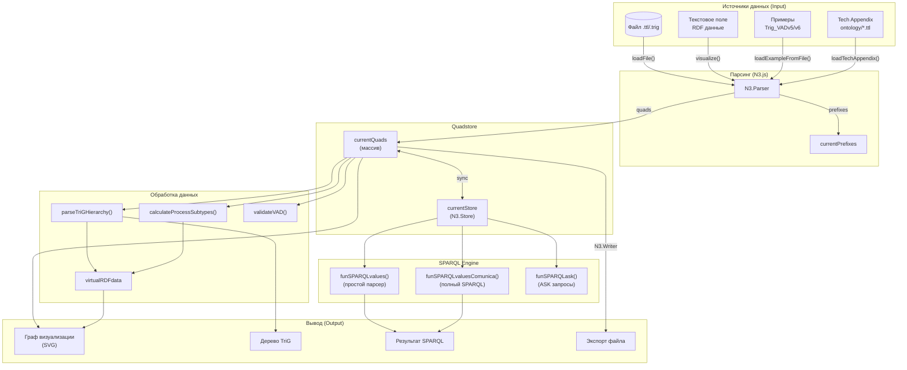
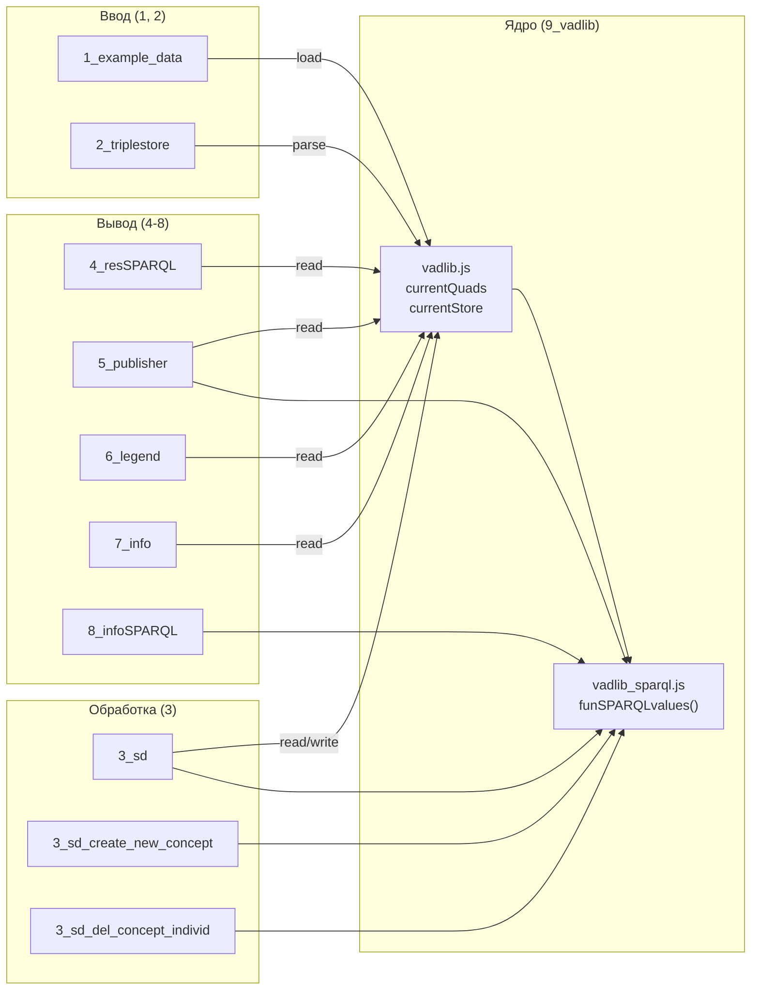
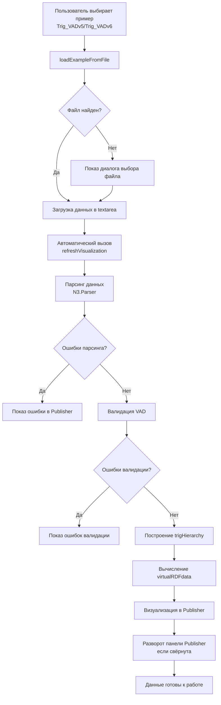

<!-- Ссылка на issue: https://github.com/bpmbpm/rdf-grapher/issues/272 -->
<!-- Pull Request: https://github.com/bpmbpm/rdf-grapher/pull/273 -->
<!-- Дата: 2026-02-04 -->

# Взаимодействие с Quadstore

Данный документ описывает механизмы взаимодействия с RDF Quadstore в проекте RDF Grapher ver9b, включая:
- Описание основных объектов хранения данных
- Потоки ввода и вывода данных
- Взаимодействие между модулями
- SPARQL-driven подход к работе с данными

## 1. Основные объекты хранения данных

### 1.1 currentQuads

**Определение:** Глобальный массив RDF квадов, содержащий все загруженные данные.

**Модуль:** `9_vadlib/vadlib.js`

```javascript
let currentQuads = [];
```

**Назначение:**
- Первичное хранилище всех RDF квадов после парсинга
- Источник данных для визуализации и SPARQL-запросов
- Обновляется при парсинге новых данных, применении INSERT/DELETE операций

**Использование:**
- Чтение: `currentQuads.forEach(quad => ...)`, `currentQuads.filter(...)`, `currentQuads.length`
- Обновление: происходит через `N3.Parser` при парсинге или через функции применения SPARQL-запросов

### 1.2 currentStore

**Определение:** Объект N3.Store для оптимизированного доступа к данным.

**Модуль:** `9_vadlib/vadlib.js`

```javascript
let currentStore = null;
```

**Назначение:**
- Индексированное хранилище для быстрого поиска квадов
- Используется для выполнения SPARQL-запросов через Comunica
- Синхронизируется с `currentQuads`

**Методы N3.Store:**
- `currentStore.getQuads(subject, predicate, object, graph)` — получение квадов по паттерну
- `currentStore.addQuad(quad)` — добавление квада
- `currentStore.removeQuad(quad)` — удаление квада

**Пример использования:**
```javascript
// Получить все квады из графа vad:ptree
const ptreeQuads = currentStore.getQuads(
    null,                                    // любой subject
    null,                                    // любой predicate
    null,                                    // любой object
    'http://example.org/vad#ptree'           // конкретный graph
);
```

### 1.3 Связь между currentQuads и currentStore

**SPARQL-driven подход:** Предпочтительным является использование `currentStore.getQuads()` вместо прямого обращения к `currentQuads`, т.к. это соответствует принципам SPARQL-driven programming:

| Аспект | currentQuads | currentStore.getQuads() |
|--------|--------------|------------------------|
| Тип | Массив | Метод N3.Store |
| Индексация | Нет | Да (оптимизировано) |
| Фильтрация | Ручная через `.filter()` | Встроенная по subject/predicate/object/graph |
| SPARQL-совместимость | Нет | Да (через Comunica) |
| Производительность | O(n) для поиска | O(1) - O(log n) для индексированного поиска |

**Рекомендация:** Для новых функций использовать `currentStore.getQuads()`. Массив `currentQuads` сохранён для обратной совместимости.

## 2. Потоки данных (Input/Output)

### 2.1 Схема информационных потоков



### 2.2 Подробное описание потоков

#### Input: Загрузка данных

| Источник | Функция | Модуль | Формат |
|----------|---------|--------|--------|
| Текстовое поле | `visualize()` | `index.html` | TriG/Turtle |
| Файл через кнопку "Загрузить" | `loadFile(event)` | `2_triplestore_ui.js` | TriG/Turtle/N-Triples/N-Quads |
| Примеры Trig_VADv5/v6 | `loadExampleFromFile()` | `1_example_data_ui.js` | TriG |
| Tech Appendix | `loadTechAppendix()` | `9_vadlib/vadlib.js` | Turtle |

#### Processing: Обработка данных

| Функция | Модуль | Вход | Выход | SPARQL-driven |
|---------|--------|------|-------|---------------|
| `parseTriGHierarchy()` | `2_triplestore_logic.js` | currentQuads, prefixes | trigHierarchy | Частично (анализ hasParentObj) |
| `calculateProcessSubtypes()` | `2_triplestore_logic.js` | trigHierarchy, prefixes | virtualRDFdata | Нет (вычисление) |
| `validateVAD()` | `2_triplestore_logic.js` | quads, prefixes | {valid, errors} | Нет (JS правила) |
| `validateVADSchema()` | `2_triplestore_validation.js` | quads, prefixes | {valid, violations} | Нет (JS правила) |
| `funSPARQLvalues()` | `vadlib_sparql.js` | sparqlQuery, variableName | Array<{uri, label}> | **Да** |
| `funSPARQLvaluesComunica()` | `vadlib_sparql.js` | sparqlQuery, variableName | Array<{uri, label}> | **Да** |
| `funSPARQLask()` | `vadlib_sparql.js` | sparqlQuery | boolean | **Да** |

#### Output: Вывод данных

| Назначение | Функция | Модуль | Источник данных |
|------------|---------|--------|-----------------|
| SVG граф | `rdfToDotVAD()` + Viz.js | `5_publisher_logic.js` | currentQuads + virtualRDFdata |
| Дерево TriG | `buildTrigTree()` | `5_publisher_trig.js` | trigHierarchy |
| Результаты SPARQL | `executeSparqlQuery()` | `8_infoSPARQL_ui.js` | funSPARQLvalues() |
| Экспорт файла | `saveAsFile()` | `2_triplestore_ui.js` | currentQuads через N3.Writer |

## 3. SPARQL-driven vs Non-SPARQL подходы

### 3.1 Функции на основе SPARQL

Согласно принципам [sparql-driven-programming_min1.md](../requirements/sparql-driven-programming_min1.md), следующие функции реализуют SPARQL-ориентированный подход:

| Функция | Назначение | Поддержка SPARQL |
|---------|------------|------------------|
| `funSPARQLvalues()` | SELECT запросы (простые) | Частичная (без UNION, OPTIONAL) |
| `funSPARQLvaluesComunica()` | SELECT запросы (полные) | Полная (через Comunica) |
| `funSPARQLask()` | ASK запросы | Полная (через Comunica) |
| `funSPARQLvaluesComunicaUpdate()` | UPDATE запросы | Полная (INSERT/DELETE) |
| `isVirtualGraphSPARQL()` | Проверка типа графа | Полная (ASK запрос) |
| `checkIdExistsSparql()` | Проверка уникальности ID | Полная (SELECT запрос) |

### 3.2 Функции без SPARQL (прямое обращение к данным)

Следующие функции работают напрямую с `currentQuads` или `currentStore.getQuads()` без SPARQL. Причины:
- Производительность (валидация всех данных)
- Историческая совместимость
- Простота реализации для базовых операций

| Функция | Причина отказа от SPARQL |
|---------|--------------------------|
| `validateVAD()` | Проход по всем квадам для проверки — SPARQL избыточен |
| `validateVADSchema()` | Набор правил требует множественных проходов |
| `parseTriGHierarchy()` | Построение дерева требует множественных связей |
| `calculateProcessSubtypes()` | Вычисление виртуальных данных, не хранимых в RDF |
| `isVirtualGraphByType()` | Синхронная версия для производительности |

### 3.3 Рекомендации по выбору подхода

**Используйте SPARQL (funSPARQLvalues/funSPARQLvaluesComunica) когда:**
- Нужно получить данные по сложному паттерну (OPTIONAL, UNION)
- Важна независимость от структуры хранения данных
- Запрос может быть переиспользован в других контекстах
- Результат должен быть показан пользователю как SPARQL-запрос

**Используйте прямой доступ (currentStore.getQuads) когда:**
- Нужна максимальная производительность для простых операций
- Выполняется обход всех данных (валидация)
- Операция синхронная и критична по времени
- SPARQL избыточен для задачи

## 4. Взаимодействие между модулями

### 4.1 Зависимости модулей от Quadstore



### 4.2 Таблица взаимодействий

| Модуль | Чтение из Quadstore | Запись в Quadstore | Использует SPARQL |
|--------|--------------------|--------------------|-------------------|
| 1_example_data | - | Да (загрузка) | Нет |
| 2_triplestore | Да (валидация) | Да (парсинг) | Нет |
| 3_sd | Да | Да (INSERT/DELETE) | Да |
| 3_sd_create_new_concept | Да | Да | Да |
| 3_sd_del_concept_individ | Да | Да | Да |
| 3_sd_create_new_trig | Да | Да | Да |
| 4_resSPARQL | Да | - | Нет |
| 5_publisher | Да | - | Да (частично) |
| 6_legend | Да (типы) | - | Нет |
| 7_info | Да (префиксы) | - | Нет |
| 8_infoSPARQL | Да | - | Да |

## 5. Глобальные переменные хранилища

| Переменная | Тип | Назначение |
|------------|-----|------------|
| `currentQuads` | `Array` | Массив всех RDF квадов |
| `currentStore` | `N3.Store` | Индексированное хранилище для быстрого поиска |
| `currentPrefixes` | `Object` | Словарь префиксов пространств имен |
| `trigHierarchy` | `Object` | Иерархия TriG графов (результат parseTriGHierarchy) |
| `virtualRDFdata` | `Object` | Вычисляемые данные (подтипы процессов) |
| `nodeTypesCache` | `Object` | Кэш типов узлов для быстрого доступа |
| `nodeSubtypesCache` | `Object` | Кэш подтипов узлов |
| `techAppendixData` | `Object` | Данные из vad-basic-ontology_tech_Appendix.ttl |
| `comunicaEngine` | `Comunica.QueryEngine` | Движок для полноценных SPARQL запросов |

## 6. Примеры использования

### 6.1 Получение концептов процессов через SPARQL

```javascript
// SPARQL-driven подход (рекомендуется)
const processes = funSPARQLvalues(`
    SELECT ?process ?label WHERE {
        GRAPH vad:ptree {
            ?process rdf:type vad:TypeProcess .
            ?process rdfs:label ?label .
        }
    }
`, 'process');
```

### 6.2 Быстрая проверка существования через N3.Store

```javascript
// Прямой доступ (для производительности)
const exists = currentStore.getQuads(
    uri,
    'http://www.w3.org/1999/02/22-rdf-syntax-ns#type',
    'http://example.org/vad#TypeProcess',
    'http://example.org/vad#ptree'
).length > 0;
```

### 6.3 Проверка через SPARQL ASK

```javascript
// SPARQL-driven подход
const isVirtual = await funSPARQLask(`
    PREFIX rdf: <http://www.w3.org/1999/02/22-rdf-syntax-ns#>
    PREFIX vad: <http://example.org/vad#>
    ASK {
        GRAPH <${graphUri}> {
            <${graphUri}> rdf:type vad:Virtual .
        }
    }
`);
```

## 7. Алгоритм автоматической загрузки и отображения данных

<!-- issue #282 -->

При загрузке данных из примеров или файлов применяется следующий алгоритм:

### 7.1 Последовательность действий при загрузке примера



### 7.2 Правила поведения

1. **Автоматическая валидация:**
   - При загрузке quadstore выполняется штатная проверка (эквивалентна кнопке "Тест" в окнах RDF-данные и Edit)
   - Если ошибок нет, данные загружаются и все справочники и окна работают корректно

2. **Автоматическая визуализация:**
   - После успешной загрузки автоматически вызывается `refreshVisualization()`
   - Это эквивалентно нажатию кнопки "Обновить" в окне Publisher

3. **Автоматическое открытие Publisher:**
   - После успешной загрузки данных панель Publisher автоматически разворачивается
   - Пользователь сразу видит результат визуализации

4. **Кнопка "Обновить":**
   - Кнопка "Обновить" в окне Publisher предназначена для ревизуализации данных после изменений
   - Не требуется нажимать после первоначальной загрузки — всё происходит автоматически

### 7.3 Функции, участвующие в процессе

| Функция | Модуль | Назначение |
|---------|--------|------------|
| `loadExampleFromFile()` | `1_example_data_ui.js` | Загрузка примера из файла |
| `loadFile()` | `2_triplestore_ui.js` | Загрузка файла через диалог |
| `refreshVisualization()` | `5_publisher_logic.js` | Парсинг, валидация и визуализация |
| `applyPanelCollapsedState()` | `index.html` | Управление состоянием панелей |

---

*Документ создан в рамках PR #273 по issue #272*
*Раздел 7 добавлен в рамках PR #283 по issue #282*
