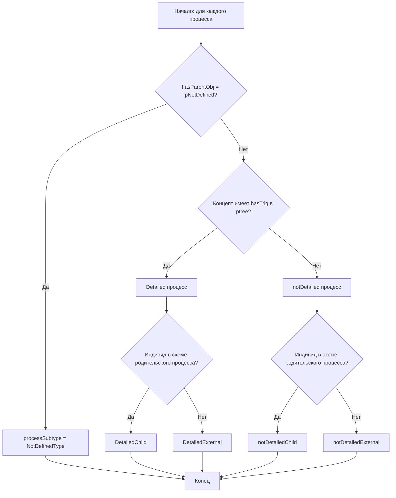
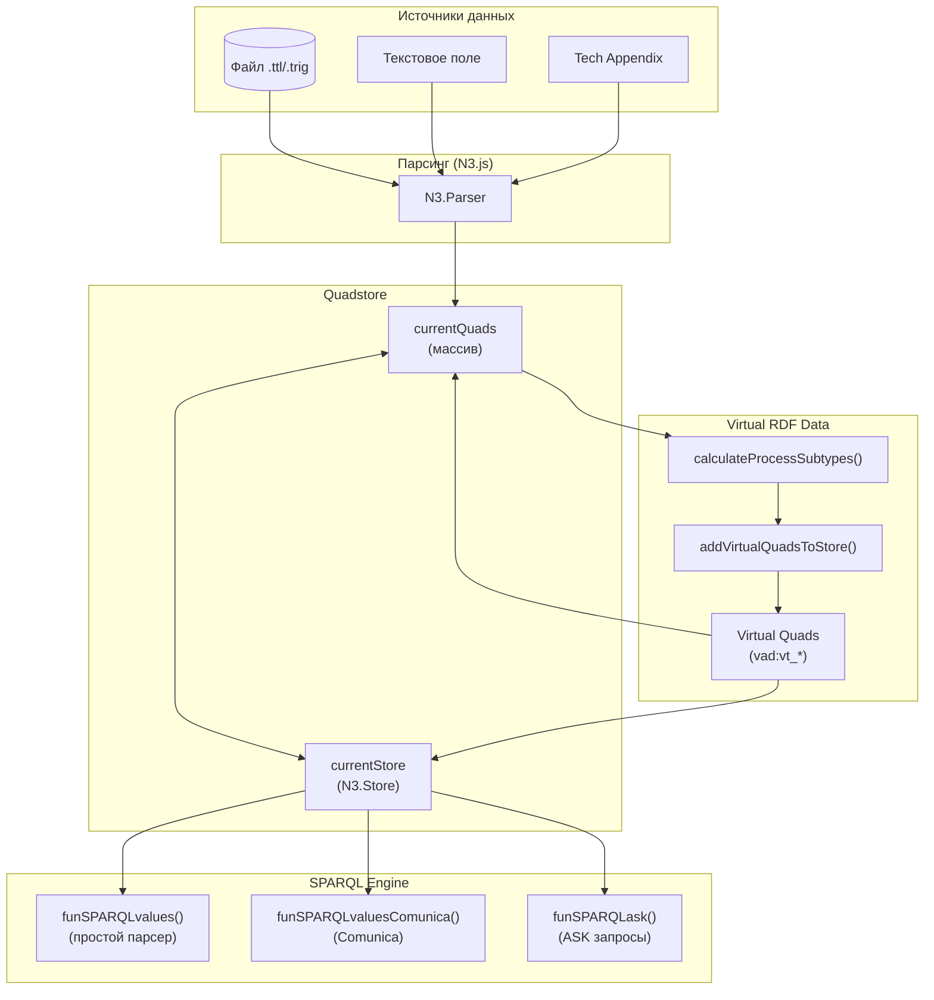
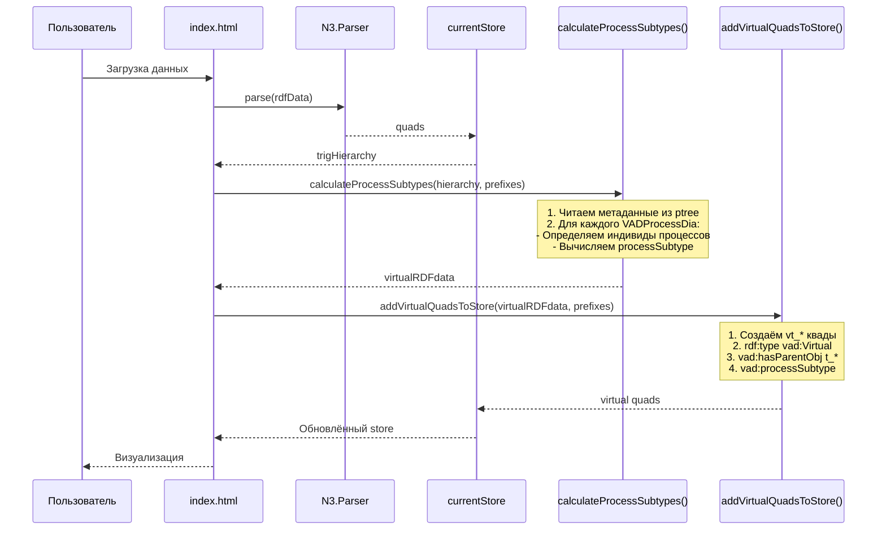
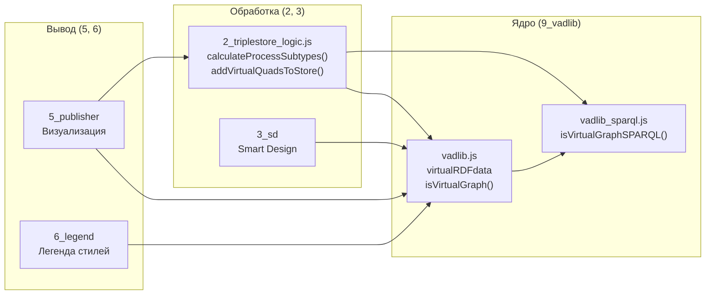
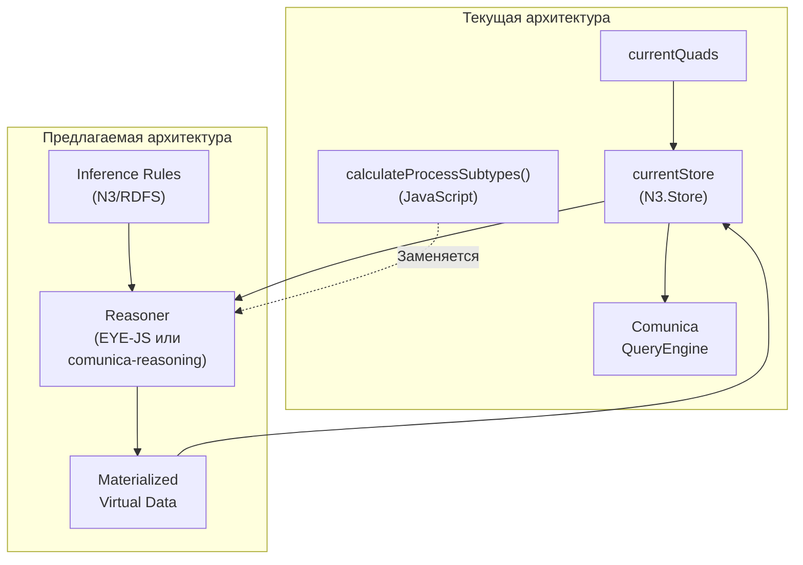
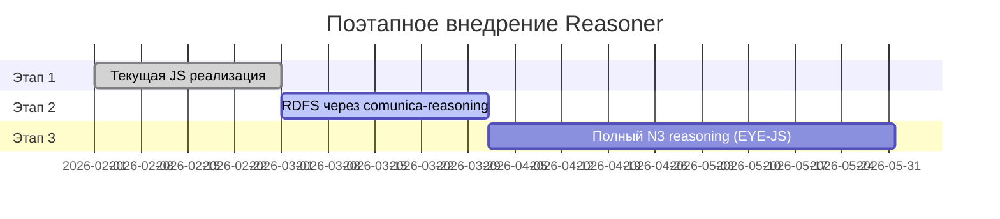

# Концепция Reasoner для RDF Grapher (версия 1)

<!-- Ссылка на issue: https://github.com/bpmbpm/rdf-grapher/issues/299 -->
<!-- Дата: 2026-02-05 -->

## Содержание

### Часть 1: Текущая реализация Virtual TriG и virtualRDFdata
1. [Введение](#1-введение)
2. [Архитектура Virtual TriG и virtualRDFdata](#2-архитектура-virtual-trig-и-virtualrdfdata)
   - [2.1 Основные компоненты](#21-основные-компоненты)
   - [2.2 Класс vad:Virtual в онтологии](#22-класс-vadvirtual-в-онтологии)
   - [2.3 Структура виртуального TriG](#23-структура-виртуального-trig)
3. [Основные функции virtualRDFdata](#3-основные-функции-virtualrdfdata)
   - [3.1 Функция calculateProcessSubtypes()](#31-функция-calculateprocesssubtypes)
   - [3.2 Функция addVirtualQuadsToStore()](#32-функция-addvirtualquadstostore)
   - [3.3 Функция formatVirtualRDFdata()](#33-функция-formatvirtualrdfdata)
4. [SPARQL-driven Programming при вычислении VIRTUAL RDF DATA](#4-sparql-driven-programming-при-вычислении-virtual-rdf-data)
   - [4.1 Принципы SPARQL-driven Programming](#41-принципы-sparql-driven-programming)
   - [4.2 Реализация через SPARQL](#42-реализация-через-sparql)
   - [4.3 Архитектурные схемы](#43-архитектурные-схемы)
5. [Существующие проблемы](#5-существующие-проблемы)

### Часть 2: Концепция стандартного Reasoner
6. [Введение в семантические механизмы рассуждений](#6-введение-в-семантические-механизмы-рассуждений)
7. [Сравнительный анализ JavaScript-библиотек](#7-сравнительный-анализ-javascript-библиотек)
   - [7.1 comunica-feature-reasoning](#71-comunica-feature-reasoning)
   - [7.2 EYE-JS (eyereasoner)](#72-eye-js-eyereasoner)
   - [7.3 N3.js Reasoner](#73-n3js-reasoner)
   - [7.4 Сводная таблица сравнения](#74-сводная-таблица-сравнения)
8. [Предлагаемая концепция реализации](#8-предлагаемая-концепция-реализации)
   - [8.1 Архитектура интеграции](#81-архитектура-интеграции)
   - [8.2 Правила вывода для VAD онтологии](#82-правила-вывода-для-vad-онтологии)
   - [8.3 Механизм реализации](#83-механизм-реализации)
9. [Рекомендации](#9-рекомендации)

---

# Часть 1: Текущая реализация Virtual TriG и virtualRDFdata

## 1. Введение

В проекте RDF Grapher ver9c реализован механизм **Virtual RDF Data** — автоматически вычисляемых свойств процессов, которые не хранятся непосредственно в RDF-данных пользователя, а рассчитываются при загрузке на основе структуры данных.

Взаимодействие Virtual TriG и virtualRDFdata с quadstore описано в документе [quadstore_io.md](https://github.com/bpmbpm/rdf-grapher/blob/main/ver9c/doc/quadstore_io.md)

**Ключевые особенности текущей реализации:**
- Виртуальные данные вычисляются автоматически при загрузке данных
- Для каждого TriG типа `vad:VADProcessDia` создаётся виртуальный двойник (`vt_*`)
- Virtual TriG связан с родительским TriG через `vad:hasParentObj`
- Пересчёт происходит при изменении схемы процесса

---

## 2. Архитектура Virtual TriG и virtualRDFdata

### 2.1 Основные компоненты

Система виртуальных данных состоит из следующих компонентов:

| Компонент | Модуль | Назначение |
|-----------|--------|------------|
| `virtualRDFdata` | `vadlib.js` | Глобальный объект хранения вычисленных данных |
| `calculateProcessSubtypes()` | `2_triplestore_logic.js` | Вычисление подтипов процессов |
| `addVirtualQuadsToStore()` | `2_triplestore_logic.js` | Добавление виртуальных квадов в store |
| `formatVirtualRDFdata()` | `2_triplestore_logic.js` | Форматирование для отображения |
| `isVirtualGraph()` | `vadlib.js` | Проверка типа графа |
| `isVirtualGraphSPARQL()` | `vadlib_sparql.js` | SPARQL-проверка типа графа |

### 2.2 Класс vad:Virtual в онтологии

Согласно файлу `vad-basic-ontology_tech_Appendix.ttl`:

```turtle
# ==============================================================================
# ВИРТУАЛЬНЫЕ ДАННЫЕ (VIRTUAL RDF DATA)
# ==============================================================================
# Класс для виртуальных TriG-контейнеров, хранящих вычисляемые свойства
# ==============================================================================
vad:Virtual
    rdf:type rdfs:Class, owl:Class ;
    rdfs:subClassOf vad:Tech ;
    rdfs:label "Virtual" ;
    rdfs:comment """
        Класс Virtual - технологический класс для виртуальных TriG-контейнеров.

        issue #264: Виртуальные TriG теперь хранятся в общем quadstore и имеют
        обязательный предикат vad:hasParentObj, указывающий на родительский VADProcessDia.

        Виртуальные контейнеры (virtualRDFdata) хранят вычисляемые свойства объектов,
        которые рассчитываются автоматически на основе данных из vad:ptree и VADProcessDia.

        Виртуальные TriG имеют имя vt_{processId} (v = virtual, t = trig).
    """ ;
    dcterms:description "Класс для виртуальных TriG-контейнеров с вычисляемыми свойствами" .
```

**Ключевые моменты:**
- `vad:Virtual` является подклассом `vad:Tech` (технологический класс)
- Виртуальные TriG именуются по формату `vt_{processId}`
- Обязательный предикат `vad:hasParentObj` связывает с родительским `VADProcessDia`
- Деревья типа `vad:Virtual` не отображаются в treeview окна Publisher

### 2.3 Структура виртуального TriG

```turtle
# Виртуальный TriG для схемы процесса t_p1
vad:vt_p1 {
    # Метаданные виртуального контейнера
    vad:vt_p1 rdf:type vad:Virtual ;
        vad:hasParentObj vad:t_p1 .  # Родительский физический TriG (VADProcessDia)

    # Вычисленные свойства процессов
    vad:p1.1 vad:processSubtype vad:DetailedChild .
    vad:p1.2 vad:processSubtype vad:notDetailedChild .
    vad:p1.3 vad:processSubtype vad:DetailedExternal .
}
```

**Правило удаления (issue #264):** При удалении `VADProcessDia` (например, `vad:t_p1`) должен также удаляться соответствующий дочерний TriG типа `vad:Virtual` (`vad:vt_p1`).

---

## 3. Основные функции virtualRDFdata

### 3.1 Функция calculateProcessSubtypes()

**Модуль:** `2_triplestore_logic.js`

**Назначение:** Вычисляет `vad:processSubtype` для всех процессов в каждом TriG.

**Алгоритм:**



**Входные данные:**
- `trigHierarchy` — иерархия TriG графов
- `prefixes` — словарь префиксов

**Выходные данные:**
- Объект `virtualRDFdata`: `{ trigUri: { processUri: { processSubtype, label, hasParentObj, hasTrig } } }`

**Подтипы процессов:**

| Подтип | Условие | Визуализация |
|--------|---------|--------------|
| `DetailedChild` | hasTrig + в схеме родителя | Голубая заливка (#90CAF9) |
| `DetailedExternal` | hasTrig + во внешней схеме | Синяя заливка (#64B5F6) |
| `notDetailedChild` | без hasTrig + в схеме родителя | Зелёная заливка (#A5D6A7) |
| `notDetailedExternal` | без hasTrig + во внешней схеме | Светло-зелёная заливка (#C8E6C9) |
| `NotDefinedType` | hasParentObj = pNotDefined | Серая заливка, пунктир (#BDBDBD) |

### 3.2 Функция addVirtualQuadsToStore()

**Модуль:** `2_triplestore_logic.js`

**Назначение:** Добавляет виртуальные квады в `currentStore` и `currentQuads`.

**Создаваемые триплеты:**
1. `vad:vt_{id} rdf:type vad:Virtual` — тип виртуального контейнера
2. `vad:vt_{id} vad:hasParentObj vad:t_{id}` — связь с родительским TriG
3. `vad:{process} vad:processSubtype vad:{subtype}` — подтип каждого процесса

### 3.3 Функция formatVirtualRDFdata()

**Модуль:** `2_triplestore_logic.js`

**Назначение:** Генерирует строковое представление `virtualRDFdata` в формате TriG для отображения пользователю (кнопка «virtualRDFdata»).

---

## 4. SPARQL-driven Programming при вычислении VIRTUAL RDF DATA

### 4.1 Принципы SPARQL-driven Programming

Согласно документу [sparql-driven-programming_min1.md](../requirements/sparql-driven-programming_min1.md):

> **SPARQL-ориентированное программирование** (SPARQL-driven programming) — это подход к разработке приложений, работающих с RDF данными, при котором:
> - Бизнес-логика описывается декларативно через SPARQL-запросы
> - JavaScript используется минимально — только для UI и координации
> - Данные и их структура определяются онтологией
> - Справочники и формы генерируются динамически на основе метаданных

| Аспект | Традиционный подход | SPARQL-driven подход |
|--------|---------------------|---------------------|
| Логика | Захардкожена в JS | Описана в SPARQL/онтологии |
| Изменения | Требуют правки кода | Достаточно изменить запрос |
| Тестирование | Unit-тесты для кода | Проверка запросов в SPARQL endpoint |
| Документация | Комментарии в коде | Самодокументируемые запросы |
| Расширяемость | Добавление JS-кода | Добавление данных в онтологию |

### 4.2 Реализация через SPARQL

Текущая реализация использует **гибридный подход**:

**SPARQL-driven компоненты:**
- `funSPARQLvalues()` — SELECT запросы (простой парсер)
- `funSPARQLvaluesComunica()` — SELECT запросы (полный SPARQL через Comunica)
- `funSPARQLask()` — ASK запросы
- `funSPARQLvaluesComunicaUpdate()` — UPDATE запросы (INSERT/DELETE)
- `isVirtualGraphSPARQL()` — проверка типа графа через SPARQL

**Non-SPARQL компоненты (оптимизация):**
- `calculateProcessSubtypes()` — вычисление требует множественных связей
- `parseTriGHierarchy()` — построение дерева
- `isVirtualGraphByType()` — синхронная проверка для производительности

**Пример SPARQL для получения виртуальных данных:**

```sparql
# Получить все виртуальные данные для процесса p1
SELECT ?subject ?subtype WHERE {
    GRAPH vad:vt_p1 {
        ?subject vad:processSubtype ?subtype .
    }
}

# Найти все виртуальные TriG
SELECT ?virtualTrig ?parentTrig WHERE {
    GRAPH ?virtualTrig {
        ?virtualTrig rdf:type vad:Virtual ;
            vad:hasParentObj ?parentTrig .
    }
}

# Проверка: является ли граф виртуальным (ASK запрос)
ASK {
    GRAPH <http://example.org/vad#vt_p1> {
        <http://example.org/vad#vt_p1> rdf:type vad:Virtual .
    }
}
```

### 4.3 Архитектурные схемы

#### Архитектура хранилища и SPARQL-запросов



#### Процесс вычисления Virtual RDF Data



#### Взаимодействие модулей с Virtual RDF Data



---

## 5. Существующие проблемы

### 5.1 Неполная SPARQL-driven архитектура

**Проблема:** Вычисление `virtualRDFdata` выполняется JavaScript-кодом, а не через SPARQL/reasoning.

**Текущий код:**
```javascript
function calculateProcessSubtypes(hierarchy, prefixes) {
    // Проход по всем квадам в JavaScript
    ptreeInfo.quads.forEach(quad => {
        // Логика определения подтипов
    });
}
```

**Идеальный SPARQL-driven подход:**
```sparql
# Вычисление processSubtype через SPARQL CONSTRUCT
CONSTRUCT {
    ?process vad:processSubtype ?subtype
}
WHERE {
    GRAPH vad:ptree {
        ?process rdf:type vad:TypeProcess .
        OPTIONAL { ?process vad:hasTrig ?trig }
        OPTIONAL { ?process vad:hasParentObj ?parent }
    }
    # Логика через FILTER/BIND
}
```

### 5.2 Отсутствие стандартного reasoning

**Проблема:** Подтипы процессов вычисляются императивным кодом, а не через inference rules.

**Что можно было бы сделать с reasoner:**
- Определить `vad:Detailed rdfs:subClassOf vad:TypeProcess`
- Использовать OWL restrictions для автоматического вывода подтипов
- Применить forward-chaining для материализации виртуальных данных

### 5.3 Дублирование данных

**Проблема:** `currentQuads` и `currentStore` содержат одни и те же данные.

**Согласно store_concept_v3.md:**
> Дублирование данных противоречит принципу SPARQL-driven programming.

**Рекомендация:** Переход к использованию `currentStore.getQuads()` вместо массива `currentQuads`.

### 5.4 Производительность vs Декларативность

**Проблема:** Выбор между SPARQL (декларативность) и JavaScript (производительность).

| Операция | SPARQL | JavaScript |
|----------|--------|------------|
| Вычисление подтипов | O(n * m) запросов | O(n) проход |
| Проверка типа графа | Асинхронный ASK | Синхронная проверка строки |
| Фильтрация квадов | SPARQL SELECT | Array.filter() |

**Компромисс:** Гибридный подход с синхронными JS-функциями для критичных операций.

---

# Часть 2: Концепция стандартного Reasoner

## 6. Введение в семантические механизмы рассуждений

**Semantic Reasoner** (семантический механизм рассуждений) — это программное обеспечение, способное выводить логические следствия из набора утверждённых фактов и аксиом.

В контексте Semantic Web reasoner используется для:
- **Inference (вывод)** — материализация неявных триплетов из явных
- **Consistency checking** — проверка непротиворечивости онтологии
- **Classification** — автоматическое определение иерархии классов
- **Instance checking** — проверка принадлежности индивида классу

**Типы reasoning:**
- **Forward chaining** — от фактов к выводам
- **Backward chaining** — от цели к условиям
- **Hybrid** — комбинация обоих подходов

**Профили OWL:**
| Профиль | Выразительность | Сложность | Применимость |
|---------|-----------------|-----------|--------------|
| OWL 2 EL | Низкая | Полиномиальная | Большие онтологии |
| OWL 2 QL | Низкая | Полиномиальная | Query answering |
| OWL 2 RL | Средняя | Полиномиальная | Rule-based systems |
| OWL 2 DL | Высокая | Decidable | Полные ontologies |
| OWL 2 Full | Полная | Неразрешимая | Теоретические исследования |

---

## 7. Сравнительный анализ JavaScript-библиотек

### 7.1 comunica-feature-reasoning

**GitHub:** https://github.com/comunica/comunica-feature-reasoning

**Описание:** Monorepo с пакетами для reasoning во время выполнения SPARQL-запросов в Comunica.

**Особенности:**
- Интеграция с существующей архитектурой (Comunica уже используется в проекте)
- Reasoning происходит "на лету" при выполнении запросов
- TypeScript, MIT лицензия

**Компоненты:**
- `Comunica SPARQL Reasoning` — query engine с reasoning
- `Comunica SPARQL Reasoning File` — поддержка локальных файлов

**Преимущества для RDF Grapher:**
- Минимальные изменения в архитектуре (замена `comunicaEngine`)
- Использует тот же API что и обычный Comunica
- Поддержка RDFS inference

**Недостатки:**
- Относительно новый проект (6 stars, 5 forks)
- Документация ограничена
- Reasoning ограничен поддерживаемыми профилями

**Пример использования:**
```javascript
import { QueryEngine } from '@comunica/query-sparql-reasoning';

const engine = new QueryEngine();
const result = await engine.queryBindings(`
    SELECT ?subtype WHERE {
        ?process vad:processSubtype ?subtype
    }
`, {
    sources: [currentStore],
    // Reasoning rules
});
```

### 7.2 EYE-JS (eyereasoner)

**GitHub:** https://github.com/eyereasoner/eye-js

**npm:** https://www.npmjs.com/package/eyereasoner

**Описание:** JavaScript-дистрибуция EYE reasoner через WebAssembly.

**Особенности:**
- Полная поддержка Notation3 (N3) reasoning
- Работает в браузере и Node.js
- RDF/JS совместимость (интеграция с N3.js)
- Forward-chaining reasoning

**Преимущества для RDF Grapher:**
- Мощный N3 reasoner с полной поддержкой inference rules
- Поддержка RDFS и пользовательских правил
- Может работать с квадами N3.js

**Недостатки:**
- Размер бандла ~1.4MB (gzip)
- Асинхронный API
- Требует написания правил в N3 синтаксисе

**Пример использования:**
```javascript
import { n3reasoner } from 'eyereasoner';

// Правила вывода в N3
const rules = `
@prefix vad: <http://example.org/vad#> .
@prefix rdf: <http://www.w3.org/1999/02/22-rdf-syntax-ns#> .

# Правило: процесс с hasTrig является Detailed
{
    ?process rdf:type vad:TypeProcess .
    ?process vad:hasTrig ?trig .
} => {
    ?process vad:processSubtype vad:Detailed .
} .
`;

const result = await n3reasoner(data + rules, query);
```

### 7.3 N3.js Reasoner

**Статус:** Экспериментальный (ограниченная поддержка)

**Описание:** N3.js поддерживает базовый reasoning с Basic Graph Patterns.

**Ограничения из документации:**
> N3.js currently only supports rules with Basic Graph Patterns in the premise and conclusion. Built-ins and backward-chaining are not supported. For an RDF/JS reasoner that supports all Notation3 reasoning features, see eye-js.

**Преимущества:**
- Уже используется в проекте
- Нет дополнительных зависимостей

**Недостатки:**
- Ограниченная функциональность
- Нет поддержки built-ins
- Только forward-chaining с BGP

### 7.4 Сводная таблица сравнения

| Критерий | comunica-feature-reasoning | EYE-JS | N3.js Reasoner |
|----------|---------------------------|--------|----------------|
| **Интеграция с проектом** | Высокая (Comunica) | Средняя (RDF/JS) | Высокая (уже есть) |
| **Размер бандла** | Средний | Большой (~1.4MB) | Минимальный |
| **RDFS поддержка** | Да | Да | Частичная |
| **OWL поддержка** | Ограничена | Нет | Нет |
| **N3 rules** | Нет | Да | Ограничено |
| **Forward chaining** | Да | Да | Да |
| **Backward chaining** | Нет | Нет | Нет |
| **Документация** | Базовая | Хорошая | Минимальная |
| **Активность** | Активен | Активен | Стабильный |
| **Лицензия** | MIT | MIT | MIT |
| **Браузер** | Да | Да (WASM) | Да |
| **Производительность** | Хорошая | Хорошая | Отличная |

---

## 8. Предлагаемая концепция реализации

### 8.1 Архитектура интеграции



### 8.2 Правила вывода для VAD онтологии

#### Правила в формате N3 (для EYE-JS)

```notation3
@prefix rdf: <http://www.w3.org/1999/02/22-rdf-syntax-ns#> .
@prefix rdfs: <http://www.w3.org/2000/01/rdf-schema#> .
@prefix vad: <http://example.org/vad#> .

# ==============================================================================
# ПРАВИЛО 1: NotDefinedType
# Если hasParentObj указывает на pNotDefined, процесс имеет тип NotDefinedType
# ==============================================================================
{
    ?process rdf:type vad:TypeProcess .
    ?process vad:hasParentObj vad:pNotDefined .
} => {
    ?process vad:processSubtype vad:NotDefinedType .
} .

# ==============================================================================
# ПРАВИЛО 2: Detailed (базовый)
# Если процесс имеет hasTrig, он является Detailed
# ==============================================================================
{
    ?process rdf:type vad:TypeProcess .
    ?process vad:hasTrig ?trig .
    ?process vad:hasParentObj ?parent .
    ?parent log:notEqualTo vad:pNotDefined .
} => {
    ?process vad:isDetailed true .
} .

# ==============================================================================
# ПРАВИЛО 3: notDetailed (базовый)
# Если процесс НЕ имеет hasTrig, он является notDetailed
# ==============================================================================
{
    ?process rdf:type vad:TypeProcess .
    ?process vad:hasParentObj ?parent .
    ?parent log:notEqualTo vad:pNotDefined .
    ?scope log:notIncludes { ?process vad:hasTrig ?anyTrig } .
} => {
    ?process vad:isDetailed false .
} .

# ==============================================================================
# ПРАВИЛО 4: DetailedChild
# Detailed процесс, находящийся в схеме родительского процесса
# ==============================================================================
{
    ?process vad:isDetailed true .
    ?process vad:isSubprocessTrig ?trig .
    ?trig vad:definesProcess ?parent .
    ?process vad:hasParentObj ?parent .
} => {
    ?process vad:processSubtype vad:DetailedChild .
} .

# ==============================================================================
# ПРАВИЛО 5: DetailedExternal
# Detailed процесс, находящийся во внешней схеме
# ==============================================================================
{
    ?process vad:isDetailed true .
    ?process vad:isSubprocessTrig ?trig .
    ?trig vad:definesProcess ?defProcess .
    ?process vad:hasParentObj ?parent .
    ?defProcess log:notEqualTo ?parent .
} => {
    ?process vad:processSubtype vad:DetailedExternal .
} .

# ==============================================================================
# ПРАВИЛО 6: notDetailedChild
# notDetailed процесс, находящийся в схеме родительского процесса
# ==============================================================================
{
    ?process vad:isDetailed false .
    ?process vad:isSubprocessTrig ?trig .
    ?trig vad:definesProcess ?parent .
    ?process vad:hasParentObj ?parent .
} => {
    ?process vad:processSubtype vad:notDetailedChild .
} .

# ==============================================================================
# ПРАВИЛО 7: notDetailedExternal
# notDetailed процесс, находящийся во внешней схеме
# ==============================================================================
{
    ?process vad:isDetailed false .
    ?process vad:isSubprocessTrig ?trig .
    ?trig vad:definesProcess ?defProcess .
    ?process vad:hasParentObj ?parent .
    ?defProcess log:notEqualTo ?parent .
} => {
    ?process vad:processSubtype vad:notDetailedExternal .
} .
```

#### Правила в RDFS (для comunica-feature-reasoning)

```turtle
# RDFS subclass hierarchy
vad:DetailedChild rdfs:subClassOf vad:Detailed .
vad:DetailedExternal rdfs:subClassOf vad:Detailed .
vad:notDetailedChild rdfs:subClassOf vad:notDetailed .
vad:notDetailedExternal rdfs:subClassOf vad:notDetailed .
vad:Detailed rdfs:subClassOf vad:TypeProcess .
vad:notDetailed rdfs:subClassOf vad:TypeProcess .
vad:NotDefinedType rdfs:subClassOf vad:TypeProcess .

# Domain/Range для автоматического вывода
vad:processSubtype rdfs:domain vad:TypeProcess .
vad:processSubtype rdfs:range vad:ProcessSubtype .
```

### 8.3 Механизм реализации

#### Вариант A: EYE-JS (рекомендуемый)

**Преимущества:**
- Полная поддержка N3 inference rules
- Можно описать сложную логику вычисления подтипов
- Гибкость в определении правил

**Реализация:**

```javascript
import { n3reasoner } from 'eyereasoner';

/**
 * Вычисляет Virtual RDF Data через reasoning
 * @param {string} rdfData - RDF данные в формате TriG
 * @param {string} rules - Inference rules в формате N3
 * @returns {Promise<string>} - Результат reasoning в формате N3
 */
async function calculateVirtualDataWithReasoner(rdfData, rules) {
    const query = `
        @prefix vad: <http://example.org/vad#> .

        { ?process vad:processSubtype ?subtype } => { ?process vad:processSubtype ?subtype } .
    `;

    const result = await n3reasoner(rdfData + rules, query);
    return result;
}

// Интеграция в существующий код
async function computeVirtualRDFdata(quads, prefixes) {
    // Сериализуем квады в TriG
    const trigData = serializeQuads(quads, prefixes);

    // Загружаем правила
    const rules = await fetch('ontology/inference-rules.n3').then(r => r.text());

    // Выполняем reasoning
    const inferredData = await calculateVirtualDataWithReasoner(trigData, rules);

    // Парсим результат и добавляем в store
    const inferredQuads = parseTriG(inferredData);
    addVirtualQuadsToStore(inferredQuads);

    return inferredQuads;
}
```

**Файловая структура:**

```
ver9c/
├── ontology/
│   ├── vad-basic-ontology.ttl
│   ├── vad-basic-ontology_tech_Appendix.ttl
│   └── inference-rules.n3           # NEW: правила вывода
├── 9_vadlib/
│   ├── vadlib.js
│   ├── vadlib_sparql.js
│   └── vadlib_reasoning.js          # NEW: интеграция с reasoner
```

#### Вариант B: comunica-feature-reasoning

**Преимущества:**
- Минимальные изменения в архитектуре
- Reasoning интегрирован в SPARQL-запросы

**Реализация:**

```javascript
import { QueryEngine } from '@comunica/query-sparql-reasoning';

// Замена существующего comunicaEngine
comunicaEngine = new QueryEngine();

// SPARQL-запросы автоматически применяют RDFS inference
const result = await comunicaEngine.queryBindings(`
    SELECT ?process ?subtype WHERE {
        GRAPH ?g {
            ?process vad:processSubtype ?subtype .
        }
    }
`, {
    sources: [currentStore],
    reasoner: 'rdfs'  // Включение RDFS reasoning
});
```

#### Вариант C: Гибридный подход (рекомендуемый для поэтапного внедрения)

**Этап 1:** Сохранить текущую JavaScript-реализацию для вычисления подтипов.

**Этап 2:** Добавить RDFS reasoning через comunica-feature-reasoning для иерархии классов.

**Этап 3:** Постепенно переносить логику в N3 rules через EYE-JS.



---

## 9. Рекомендации

### 9.1 Краткосрочные (текущий релиз)

1. **Сохранить текущую реализацию** `calculateProcessSubtypes()` как рабочую версию
2. **Документировать правила** вычисления подтипов для будущей миграции на reasoner
3. **Рассмотреть comunica-feature-reasoning** для RDFS inference иерархии классов

### 9.2 Среднесрочные (следующий релиз)

1. **Интегрировать comunica-feature-reasoning** для замены `comunicaEngine`
2. **Добавить RDFS правила** в онтологию (`rdfs:subClassOf` иерархия подтипов)
3. **Провести бенчмаркинг** производительности reasoning vs JavaScript

### 9.3 Долгосрочные (roadmap)

1. **Внедрить EYE-JS** для полного N3 reasoning
2. **Перенести логику** вычисления подтипов в inference rules
3. **Рассмотреть OWL restrictions** для более сложных выводов
4. **Оптимизировать** через материализацию виртуальных данных

### 9.4 Сводная таблица рекомендаций

| Рекомендация | Приоритет | Сложность | Библиотека |
|--------------|-----------|-----------|------------|
| Документирование правил | Высокий | Низкая | — |
| RDFS иерархия классов | Высокий | Низкая | comunica-reasoning |
| Интеграция comunica-reasoning | Средний | Средняя | comunica-reasoning |
| N3 inference rules | Средний | Высокая | EYE-JS |
| Полный переход на reasoner | Низкий | Высокая | EYE-JS |

---

## Источники

- [comunica-feature-reasoning на GitHub](https://github.com/comunica/comunica-feature-reasoning)
- [EYE-JS на GitHub](https://github.com/eyereasoner/eye-js)
- [eyereasoner на npm](https://www.npmjs.com/package/eyereasoner)
- [N3.js на GitHub](https://github.com/rdfjs/N3.js)
- [Comunica Documentation](https://comunica.dev/)
- [Notation3 Specification](https://w3c.github.io/N3/spec/)
- [RDF/JS Specifications](https://rdf.js.org/)
- [Semantic Reasoner (Wikipedia)](https://en.wikipedia.org/wiki/Semantic_reasoner)
- [OWL Reasoners still useable in 2023](https://arxiv.org/pdf/2309.06888)

---

*Документ создан: 2026-02-05*
*Автор: AI Assistant (Claude Opus 4.5)*
*Версия: 1.0*
*Ссылка на issue: https://github.com/bpmbpm/rdf-grapher/issues/299*
