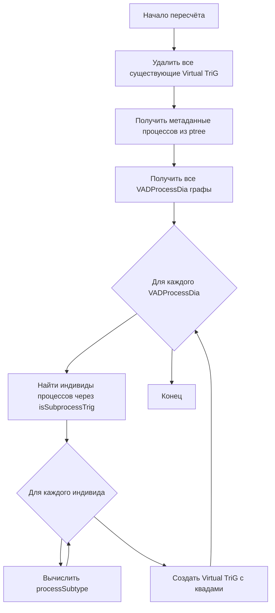
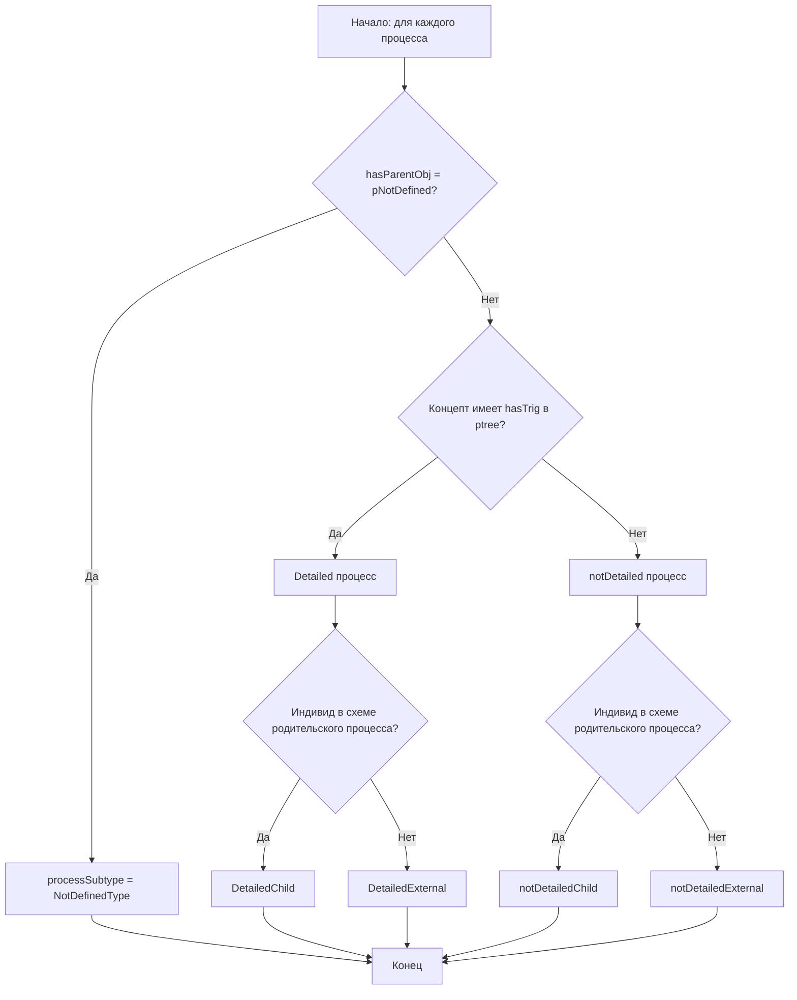

# Модуль 10_virtualTriG - Обработка Virtual TriG

<!-- Ссылка на issue: https://github.com/bpmbpm/rdf-grapher/issues/317 -->
<!-- Обновлено: https://github.com/bpmbpm/rdf-grapher/issues/322 -->
<!-- Дата создания: 2026-02-08 -->

## Содержание

1. [Введение](#1-введение)
2. [Реализация: Reasoning vs JavaScript](#2-реализация-reasoning-vs-javascript)
3. [Структура модуля](#3-структура-модуля)
4. [Алгоритм формирования Virtual TriG](#4-алгоритм-формирования-virtual-trig)
5. [Типы изменений, влияющие на Virtual TriG](#5-типы-изменений-влияющие-на-virtual-trig)
6. [API модуля](#6-api-модуля)
7. [Интеграция с UI](#7-интеграция-с-ui)
8. [Примеры использования](#8-примеры-использования)

---

## 1. Введение

Модуль **10_virtualTriG** отвечает за обработку вычислимых данных (Virtual TriG) в проекте RDF Grapher ver9c.

### 1.1 Назначение

Virtual TriG (`vad:vt_*`) — это автоматически вычисляемые данные, которые:
- Хранятся в графах типа `vad:Virtual`
- Связаны с родительским `vad:VADProcessDia` через `vad:hasParentObj`
- Содержат вычисленные свойства процессов (`vad:processSubtype`)

### 1.2 Ключевые принципы

Согласно [base_concept_rules.md](../design/base_concept_rules.md):

1. **Нет дублирующих объектов хранения** — Virtual данные хранятся только в TriG типа `vad:Virtual`, глобальный объект `virtualRDFdata` не используется
2. **SPARQL-driven подход** — все операции через SPARQL-запросы
3. **Единственное хранилище** — только `currentStore` (N3.Store)

### 1.3 Формат Virtual TriG

```turtle
# Виртуальный TriG для схемы процесса t_p1
vad:vt_p1 {
    # Метаданные виртуального контейнера
    vad:vt_p1 rdf:type vad:Virtual ;
        vad:hasParentObj vad:t_p1 .  # Родительский физический TriG

    # Вычисленные свойства процессов
    vad:p1_1 vad:processSubtype vad:DetailedChild .
    vad:p1_2 vad:processSubtype vad:notDetailedChild .
    vad:p1_3 vad:processSubtype vad:DetailedExternal .
}
```

---

## 2. Реализация: Reasoning vs JavaScript

### 2.1 Текущая реализация (JavaScript)

> **Важно:** В текущей версии (PR #321) вычисление Virtual TriG реализовано через **императивный JavaScript-код**, а НЕ через семантический reasoning.

#### Ключевые факты реализации:

1. **Основная функция вычисления:** `calculateProcessSubtypes()` в файле `2_triplestore_logic.js`
   - Реализует императивный алгоритм через циклы и условные операторы JavaScript
   - Не использует N3 правила вывода или comunica-feature-reasoning
   - Оперирует непосредственно с объектом `trigHierarchy` и массивом квадов

2. **Модуль 11_reasoning:**
   - Содержит **заготовку** для интеграции с comunica-feature-reasoning
   - Определяет N3 правила вывода в константе `INFERENCE_RULES_N3`
   - Функция `performInference()` **не вызывается** в основном потоке приложения
   - При недоступности reasoner используется fallback на `performInferenceFallback()`

3. **Модуль 10_virtualTriG:**
   - Функция `computeProcessSubtype()` дублирует логику из `calculateProcessSubtypes()`
   - Обе реализации используют идентичный алгоритм на JavaScript

### 2.2 Почему не используется Reasoning?

Причины выбора JavaScript-реализации вместо semantic reasoning:

| Критерий | JavaScript | Reasoning (N3/RDFS) |
|----------|------------|---------------------|
| **Производительность** | Быстро (синхронно) | Медленнее (асинхронно) |
| **Зависимости** | Нет дополнительных | Требует comunica-feature-reasoning |
| **Размер бандла** | Минимальный | +500KB-1MB |
| **Отладка** | Простая | Сложная (правила N3) |
| **Совместимость** | Работает везде | Требует WebAssembly/workers |

### 2.3 Будущее развитие: Переход на Reasoning

Согласно [base_concept_rules.md](../design/base_concept_rules.md), **целевая архитектура** предполагает:

1. **Полный переход на SPARQL-driven programming**
   - Вычисление `processSubtype` через SPARQL CONSTRUCT или N3 правила
   - Замена императивного JavaScript декларативными правилами

2. **Интеграция с comunica-feature-reasoning:**
   - Использование N3 правил из `INFERENCE_RULES_N3`
   - Материализация выведенных данных в `currentStore`

3. **Резервный вариант (fallback):**
   - JavaScript-реализация сохраняется для случаев недоступности reasoning
   - См. раздел [Резервный вариант обработки данных](11_reasoning.md#8-резервный-вариант-обработки-данных-fallback)

### 2.4 Примеры текущей vs целевой реализации

#### Текущая реализация (JavaScript):

```javascript
// 2_triplestore_logic.js: calculateProcessSubtypes()
function computeProcessSubtype(processUri, trigUri, metadata, trigDefinesProcess) {
    const hasParentObj = metadata.hasParentObj;
    const hasTrig = metadata.hasTrig;

    // Императивная логика через if-else
    if (hasParentObj && hasParentObj.endsWith('#pNotDefined')) {
        return 'NotDefinedType';
    }

    const isChild = trigDefinesProcess && hasParentObj === trigDefinesProcess;

    if (hasTrig) {
        return isChild ? 'DetailedChild' : 'DetailedExternal';
    } else {
        return isChild ? 'notDetailedChild' : 'notDetailedExternal';
    }
}
```

#### Целевая реализация (N3 Reasoning):

```notation3
# 11_reasoning_logic.js: INFERENCE_RULES_N3
# Правило 4: DetailedChild
{
    ?process vad:isDetailed true .
    ?process vad:isSubprocessTrig ?trig .
    ?trig vad:definesProcess ?parent .
    ?process vad:hasParentObj ?parent .
} => {
    ?process vad:processSubtype vad:DetailedChild .
} .
```

### 2.5 Резюме

| Аспект | Статус |
|--------|--------|
| Reasoning через comunica-feature-reasoning | ❌ НЕ используется |
| JavaScript fallback | ✅ Используется как основной метод |
| N3 правила определены | ✅ Да (в 11_reasoning_logic.js) |
| SPARQL запросы для данных | ✅ Да (чтение метаданных из ptree) |
| Полный SPARQL-driven подход | ⚠️ Частично (чтение — SPARQL, вычисление — JS) |

---

## 3. Структура модуля

```
ver9c/
├── 10_virtualTriG/
│   ├── 10_virtualTriG_logic.js    - Логика вычисления и управления Virtual TriG
│   ├── 10_virtualTriG_sparql.js   - SPARQL запросы для работы с Virtual TriG
│   ├── 10_virtualTriG_ui.js       - UI функции отображения
│   └── 10_virtualTriG.css         - Стили модуля
├── doc/
│   └── 10_virtualTriG.md          - Документация (этот файл)
```

### 2.1 Файлы модуля

| Файл | Назначение |
|------|------------|
| `10_virtualTriG_logic.js` | Основная логика: создание, удаление, пересчёт Virtual TriG |
| `10_virtualTriG_sparql.js` | Коллекция SPARQL запросов (VIRTUAL_TRIG_SPARQL) |
| `10_virtualTriG_ui.js` | UI: модальное окно Virtual TriG, секция в панели свойств |
| `10_virtualTriG.css` | CSS стили для UI компонентов |

---

## 4. Алгоритм формирования Virtual TriG

### 4.1 Общий алгоритм



### 4.2 Алгоритм вычисления processSubtype



### 4.3 Подтипы процессов

| Подтип | Условие | Визуализация |
|--------|---------|--------------|
| `DetailedChild` | hasTrig + в схеме родителя | Голубая заливка (#90CAF9) |
| `DetailedExternal` | hasTrig + во внешней схеме | Синяя заливка (#64B5F6) |
| `notDetailedChild` | без hasTrig + в схеме родителя | Зелёная заливка (#A5D6A7) |
| `notDetailedExternal` | без hasTrig + во внешней схеме | Светло-зелёная заливка (#C8E6C9) |
| `NotDefinedType` | hasParentObj = pNotDefined | Серая заливка (#BDBDBD), пунктир |

### 4.4 Определение "в схеме родительского процесса"

Процесс является **Child** (в схеме родителя), если:
- Его `vad:hasParentObj` (из ptree) совпадает с `vad:definesProcess` текущего TriG

Иначе процесс является **External** (во внешней схеме).

---

## 5. Типы изменений, влияющие на Virtual TriG

### 5.1 Таблица триггеров пересчёта

| Тип изменения | Затронутый граф | Влияние на Virtual TriG |
|---------------|-----------------|------------------------|
| Добавление индивида через `vad:isSubprocessTrig` | VADProcessDia | Пересчёт vad:processSubtype для нового индивида |
| Изменение `vad:hasTrig` в ptree | ptree | Пересчёт Detailed/notDetailed для затронутого процесса |
| Изменение `vad:hasParentObj` в ptree | ptree | Пересчёт Child/External для затронутого процесса |
| Изменение `vad:definesProcess` в VADProcessDia | VADProcessDia | Пересчёт Child/External для всех индивидов в этом TriG |
| Удаление VADProcessDia | VADProcessDia | Каскадное удаление соответствующего vt_* |
| Добавление нового VADProcessDia | VADProcessDia | Создание нового vt_* |
| Удаление индивида через `vad:isSubprocessTrig` | VADProcessDia | Удаление vad:processSubtype для этого индивида |

### 5.2 Предикаты-триггеры

```javascript
const TRIGGER_PREDICATES = [
    'http://example.org/vad#isSubprocessTrig',
    'http://example.org/vad#hasTrig',
    'http://example.org/vad#hasParentObj',
    'http://example.org/vad#hasParentProcess',
    'http://example.org/vad#definesProcess'
];
```

### 5.3 Стратегия оптимизации (будущее)

На текущем этапе при каждом изменении выполняется полный пересчёт всех Virtual TriG.

Для оптимизации в будущем можно реализовать:
- Инкрементальный пересчёт только затронутых Virtual TriG
- Кэширование метаданных процессов
- Отложенный пересчёт (debounce) при множественных изменениях

---

## 6. API модуля

### 6.1 Основные функции (10_virtualTriG_logic.js)

#### recalculateAllVirtualTriGs(prefixes)

Пересчитывает все Virtual TriG на основе текущих данных в store.

```javascript
/**
 * @param {Object} prefixes - Словарь префиксов
 * @returns {Promise<Object>} - Статистика пересчёта
 *   - removedQuads: количество удалённых квадов
 *   - createdQuads: количество созданных квадов
 *   - virtualTrigsCreated: количество созданных Virtual TriG
 *   - errors: массив ошибок
 */
const stats = await recalculateAllVirtualTriGs(currentPrefixes);
```

#### createVirtualTriG(parentTrigUri, processSubtypes, prefixes)

Создаёт Virtual TriG для указанного VADProcessDia.

```javascript
/**
 * @param {string} parentTrigUri - URI родительского VADProcessDia
 * @param {Object} processSubtypes - { processUri: subtypeName }
 * @param {Object} prefixes - Словарь префиксов
 * @returns {Array} - Массив созданных квадов
 */
const quads = createVirtualTriG(
    'http://example.org/vad#t_p1',
    {
        'http://example.org/vad#p1_1': 'DetailedChild',
        'http://example.org/vad#p1_2': 'notDetailedChild'
    },
    currentPrefixes
);
```

#### removeVirtualTriG(virtualTrigUri)

Удаляет Virtual TriG из store.

```javascript
/**
 * @param {string} virtualTrigUri - URI виртуального TriG
 * @returns {number} - Количество удалённых квадов
 */
const removed = removeVirtualTriG('http://example.org/vad#vt_p1');
```

#### isVirtualGraphSPARQL(graphUri)

Проверяет, является ли граф виртуальным через SPARQL ASK.

```javascript
/**
 * @param {string} graphUri - URI графа
 * @returns {Promise<boolean>} - true если граф типа vad:Virtual
 */
const isVirtual = await isVirtualGraphSPARQL('http://example.org/vad#vt_p1');
```

#### formatVirtualTriGFromStore(prefixes)

Форматирует Virtual TriG данные из store в строку TriG.

```javascript
/**
 * @param {Object} prefixes - Словарь префиксов
 * @returns {string} - Строка в формате TriG
 */
const trigString = formatVirtualTriGFromStore(currentPrefixes);
```

### 6.2 SPARQL запросы (10_virtualTriG_sparql.js)

| Запрос | Назначение |
|--------|------------|
| `IS_VIRTUAL_GRAPH(uri)` | ASK: является ли граф виртуальным |
| `GET_ALL_VIRTUAL_TRIGS()` | SELECT: все виртуальные графы с родителями |
| `GET_PROCESS_SUBTYPES(uri)` | SELECT: все processSubtype в Virtual TriG |
| `GET_PROCESS_METADATA_FROM_PTREE()` | SELECT: метаданные процессов из ptree |
| `GET_VAD_PROCESS_DIA_GRAPHS()` | SELECT: все VADProcessDia графы |
| `GET_PROCESS_INDIVIDUALS_IN_TRIG(uri)` | SELECT: индивиды в TriG |
| `DELETE_ALL_VIRTUAL_TRIGS()` | DELETE: удалить все Virtual TriG |
| `INSERT_VIRTUAL_TRIG(uri, parent, subtypes)` | INSERT: создать Virtual TriG |
| `CHECK_VIRTUAL_TRIG_CONSISTENCY()` | SELECT: проверка консистентности |

### 6.3 UI функции (10_virtualTriG_ui.js)

| Функция | Назначение |
|---------|------------|
| `showVirtualTriGWindow()` | Показать модальное окно Virtual TriG |
| `closeVirtualTriGModal()` | Закрыть модальное окно |
| `copyVirtualTriGToClipboard()` | Копировать содержимое в буфер |
| `recalculateVirtualTriGFromUI()` | Пересчитать и обновить UI |
| `showVirtualTriGAfterApply()` | Показать после применения SPARQL |
| `updateVirtualTriGSection(nodeUri)` | Обновить секцию в панели свойств |

---

## 7. Интеграция с UI

### 7.1 Кнопка "Virtual TriG"

В окне "Result in SPARQL" унифицированы кнопки:
- ~~"Показать Virtual TriG"~~ → **"Virtual TriG"**
- ~~"virtualRDFdata"~~ → **"Virtual TriG"**

```html
<button class="show-virtual-trig-btn" onclick="showVirtualTriGWindow()">
    Virtual TriG
</button>
```

### 7.2 Секция в панели свойств

При выборе узла-процесса в панели "Карточка объекта" отображается секция Virtual TriG:

```
┌─────────────────────────────────────┐
│ Virtual TriG                        │
├─────────────────────────────────────┤
│ vad:processSubtype: DetailedChild   │
└─────────────────────────────────────┘
```

### 7.3 Модальное окно

Модальное окно "Virtual TriG (vad:Virtual)" содержит:
- Textarea с TriG-представлением всех Virtual данных
- Кнопка "Копировать" — копирует в буфер обмена
- Кнопка "Пересчитать" — выполняет пересчёт всех Virtual TriG
- Кнопка "Закрыть" — закрывает окно

---

## 8. Примеры использования

### 8.1 Пересчёт Virtual TriG после загрузки данных

```javascript
// После парсинга RDF данных и добавления в store
await recalculateAllVirtualTriGs(currentPrefixes);
```

### 8.2 Получение подтипа процесса через SPARQL

```javascript
const query = VIRTUAL_TRIG_SPARQL.GET_PROCESS_SUBTYPE('http://example.org/vad#p1_1');
const results = await funSPARQLvaluesComunica(query, currentPrefixes);

if (results.length > 0) {
    console.log('Subtype:', results[0].subtype);
}
```

### 8.3 Проверка консистентности Virtual TriG

```javascript
const query = VIRTUAL_TRIG_SPARQL.CHECK_VIRTUAL_TRIG_CONSISTENCY();
const violations = await funSPARQLvaluesComunica(query, currentPrefixes);

if (violations.length > 0) {
    console.error('Inconsistent Virtual TriG:', violations);
}
```

### 8.4 Каскадное удаление при удалении VADProcessDia

```javascript
// При удалении vad:t_p1 автоматически удаляется vad:vt_p1
function onVADProcessDiaDeleted(trigUri) {
    const virtualTrigUri = trigUri.replace('#t_', '#vt_');
    removeVirtualTriG(virtualTrigUri);
}
```

---

## Источники

- [issue #317: ver9c_1rea1](https://github.com/bpmbpm/rdf-grapher/issues/317)
- [issue #322: ver9c_1rea1b](https://github.com/bpmbpm/rdf-grapher/issues/322)
- [base_concept_rules.md](../design/base_concept_rules.md)
- [reasoner_concept_v1.md](../design/reasoner/reasoner_concept_v1.md)
- [store_concept_v3.md](../design/store/store_concept_v3.md)
- [11_reasoning.md](./11_reasoning.md)

---

*Документ создан: 2026-02-08*
*Обновлён: 2026-02-08 (issue #322)*
*Автор: AI Assistant (Claude Opus 4.5)*
*Версия: 1.1*
*Ссылки на issues: #317, #322*
