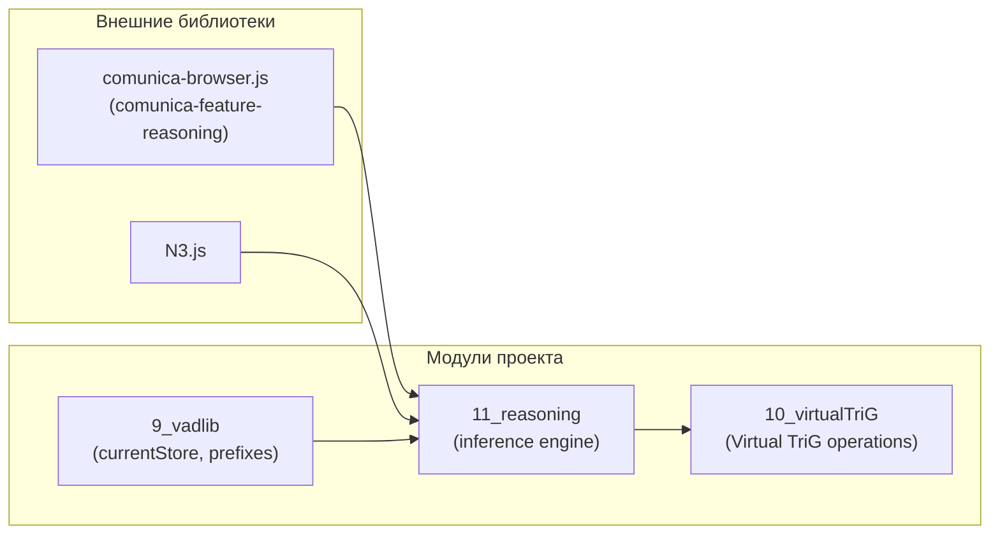
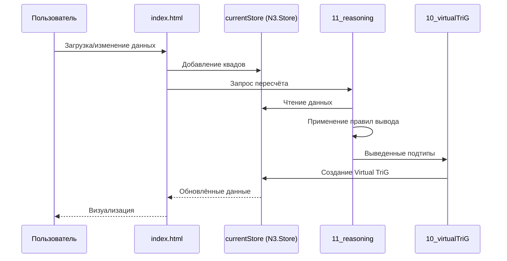
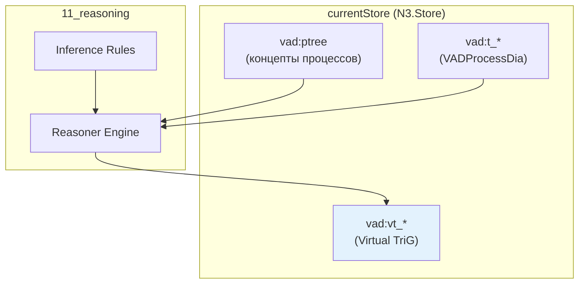
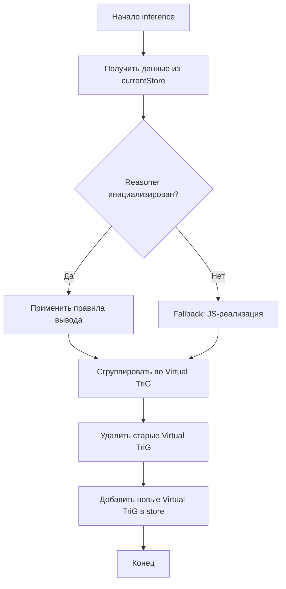
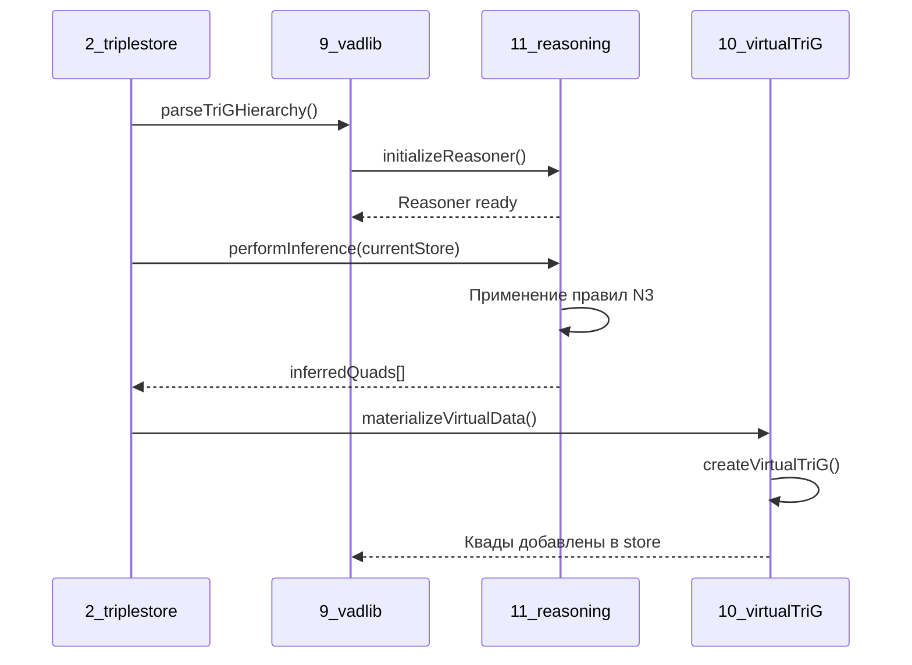

# Модуль 11_reasoning - Semantic Reasoner

<!-- Ссылка на issue: https://github.com/bpmbpm/rdf-grapher/issues/317 -->
<!-- Дата создания: 2026-02-08 -->

## Содержание

1. [Введение](#1-введение)
2. [Архитектура](#2-архитектура)
3. [Правила вывода](#3-правила-вывода)
4. [API модуля](#4-api-модуля)
5. [Интеграция с единственным хранилищем](#5-интеграция-с-единственным-хранилищем)
6. [Диаграммы взаимодействия](#6-диаграммы-взаимодействия)
7. [Примеры использования](#7-примеры-использования)

---

## 1. Введение

Модуль **11_reasoning** реализует механизм семантического вывода (reasoning) для вычисления Virtual TriG в проекте RDF Grapher ver9c.

### 1.1 Назначение

Согласно [base_concept_rules.md](../design/base_concept_rules.md), виртуальные данные (`vad:processSubtype`) должны вычисляться через механизм Reasoner, а не императивным JavaScript-кодом.

### 1.2 Выбор реализации

На основе анализа в [reasoner_concept_v1.md](../design/reasoner/reasoner_concept_v1.md) выбрана библиотека **comunica-feature-reasoning**:

| Критерий | comunica-feature-reasoning |
|----------|---------------------------|
| Интеграция с проектом | Высокая (Comunica уже используется) |
| Размер бандла | Средний |
| RDFS поддержка | Да |
| Forward chaining | Да |
| Документация | Базовая |
| Лицензия | MIT |

### 1.3 Принципы

1. **SPARQL-driven подход** — правила вывода описываются декларативно
2. **Единственное хранилище** — результаты reasoning добавляются в `currentStore`
3. **Материализация** — выведенные данные сохраняются как Virtual TriG

---

## 2. Архитектура

### 2.1 Структура модуля

```
ver9c/
├── 11_reasoning/
│   ├── 11_reasoning_logic.js    - Логика reasoning и inference
│   ├── 11_reasoning_sparql.js   - SPARQL запросы для reasoning
│   └── 11_reasoning.css         - Стили (резерв)
├── doc/
│   └── 11_reasoning.md          - Документация (этот файл)
```

### 2.2 Зависимости



### 2.3 Поток данных



---

## 3. Правила вывода

### 3.1 Формат правил N3

Правила вывода описаны в формате Notation3 (N3):

```notation3
@prefix rdf: <http://www.w3.org/1999/02/22-rdf-syntax-ns#> .
@prefix vad: <http://example.org/vad#> .

# Правило 1: NotDefinedType
{
    ?process rdf:type vad:TypeProcess .
    ?process vad:hasParentObj vad:pNotDefined .
} => {
    ?process vad:processSubtype vad:NotDefinedType .
} .

# Правило 2: DetailedChild
{
    ?process rdf:type vad:TypeProcess .
    ?process vad:hasTrig ?trig .
    ?process vad:isSubprocessTrig ?inTrig .
    ?inTrig vad:definesProcess ?parent .
    ?process vad:hasParentObj ?parent .
} => {
    ?process vad:processSubtype vad:DetailedChild .
} .
```

### 3.2 Таблица правил

| # | Правило | Условие | Результат |
|---|---------|---------|-----------|
| 1 | NotDefinedType | `hasParentObj = pNotDefined` | `processSubtype = NotDefinedType` |
| 2 | isDetailed | `hasTrig` существует | `isDetailed = true` |
| 3 | isNotDetailed | `hasTrig` не существует | `isDetailed = false` |
| 4 | DetailedChild | `isDetailed = true` AND `hasParentObj = definesProcess` | `processSubtype = DetailedChild` |
| 5 | DetailedExternal | `isDetailed = true` AND `hasParentObj ≠ definesProcess` | `processSubtype = DetailedExternal` |
| 6 | notDetailedChild | `isDetailed = false` AND `hasParentObj = definesProcess` | `processSubtype = notDetailedChild` |
| 7 | notDetailedExternal | `isDetailed = false` AND `hasParentObj ≠ definesProcess` | `processSubtype = notDetailedExternal` |

### 3.3 RDFS иерархия классов

```turtle
# Иерархия подтипов процессов
vad:DetailedChild rdfs:subClassOf vad:Detailed .
vad:DetailedExternal rdfs:subClassOf vad:Detailed .
vad:notDetailedChild rdfs:subClassOf vad:notDetailed .
vad:notDetailedExternal rdfs:subClassOf vad:notDetailed .
vad:Detailed rdfs:subClassOf vad:ProcessSubtype .
vad:notDetailed rdfs:subClassOf vad:ProcessSubtype .
vad:NotDefinedType rdfs:subClassOf vad:ProcessSubtype .
```

---

## 4. API модуля

### 4.1 Основные функции (11_reasoning_logic.js)

#### initializeReasoner(reasonerType)

Инициализирует Reasoner engine.

```javascript
/**
 * @param {string} reasonerType - Тип reasoner: 'comunica' | 'eye-js'
 * @returns {Promise<boolean>} - true если инициализация успешна
 */
await initializeReasoner('comunica');
```

#### performInference(store, rules)

Выполняет inference и возвращает выведенные квады.

```javascript
/**
 * @param {N3.Store} store - N3.Store с данными
 * @param {string} rules - Правила вывода в формате N3
 * @returns {Promise<Array>} - Массив выведенных квадов
 */
const inferredQuads = await performInference(currentStore, INFERENCE_RULES_N3);
```

#### materializeVirtualData(prefixes)

Выполняет полный цикл reasoning и материализует Virtual TriG.

```javascript
/**
 * @param {Object} prefixes - Словарь префиксов
 * @returns {Promise<Object>} - Статистика:
 *   - inferredQuads: количество выведенных квадов
 *   - virtualTrigsCreated: количество созданных Virtual TriG
 *   - errors: массив ошибок
 */
const stats = await materializeVirtualData(currentPrefixes);
```

#### validateInferredData()

Проверяет консистентность выведенных данных.

```javascript
/**
 * @returns {Promise<Array>} - Массив найденных нарушений
 */
const violations = await validateInferredData();
```

### 4.2 SPARQL запросы (11_reasoning_sparql.js)

| Запрос | Назначение |
|--------|------------|
| `CONSTRUCT_PROCESS_SUBTYPES()` | Вычисление processSubtype через CONSTRUCT |
| `GET_PROCESSES_FOR_REASONING()` | Подготовка данных для reasoning |
| `INSERT_INFERRED_SUBTYPES(...)` | Материализация выведенных данных |
| `DELETE_ALL_INFERRED_SUBTYPES()` | Очистка перед пересчётом |
| `CHECK_MISSING_SUBTYPES()` | Поиск процессов без подтипа |
| `CHECK_CONFLICTING_SUBTYPES()` | Поиск конфликтов |
| `DEBUG_REASONING_DATA()` | Отладочный запрос |

---

## 5. Интеграция с единственным хранилищем

### 5.1 Принцип единственного хранилища

Согласно [base_concept_rules.md](../design/base_concept_rules.md), в системе должен быть только один источник данных — `currentStore` (N3.Store).

### 5.2 Схема взаимодействия



### 5.3 Жизненный цикл Virtual данных

1. **Инициализация** — Reasoner инициализируется при загрузке страницы
2. **Загрузка данных** — Данные парсятся и добавляются в `currentStore`
3. **Inference** — Reasoner читает данные и применяет правила
4. **Материализация** — Выведенные квады добавляются в `currentStore` как Virtual TriG
5. **Изменение** — При изменении данных повторяется шаги 3-4
6. **Сохранение** — Virtual TriG исключаются при сохранении файла

---

## 6. Диаграммы взаимодействия

### 6.1 Процесс inference



### 6.2 Взаимодействие с модулями



---

## 7. Примеры использования

### 7.1 Инициализация и пересчёт

```javascript
// При загрузке приложения
await initializeReasoner('comunica');

// После загрузки данных
const stats = await materializeVirtualData(currentPrefixes);
console.log('Создано Virtual TriG:', stats.virtualTrigsCreated);
```

### 7.2 SPARQL CONSTRUCT для inference

```javascript
const query = REASONING_SPARQL.CONSTRUCT_PROCESS_SUBTYPES();
const result = await reasonerEngine.queryQuads(query, { sources: [currentStore] });

for await (const quad of result) {
    console.log('Inferred:', quad.subject.value, quad.object.value);
}
```

### 7.3 Отладка reasoning

```javascript
// Показать все данные для reasoning
const debugQuery = REASONING_SPARQL.DEBUG_REASONING_DATA();
const debugResults = await funSPARQLvaluesComunica(debugQuery, currentPrefixes);

console.table(debugResults);
```

### 7.4 Валидация выведенных данных

```javascript
const violations = await validateInferredData();

if (violations.length > 0) {
    console.error('Найдены нарушения:');
    violations.forEach(v => console.error(`  ${v.type}: ${v.message}`));
}
```

### 7.5 Fallback на JS-реализацию

Если Reasoner недоступен, используется fallback:

```javascript
if (!isReasonerInitialized()) {
    console.warn('Reasoner не инициализирован, используем JS fallback');
    const inferredQuads = performInferenceFallback(currentStore);
}
```

---

## Источники

- [issue #317: ver9c_1rea1](https://github.com/bpmbpm/rdf-grapher/issues/317)
- [base_concept_rules.md](../design/base_concept_rules.md)
- [reasoner_concept_v1.md](../design/reasoner/reasoner_concept_v1.md)
- [comunica-feature-reasoning на GitHub](https://github.com/comunica/comunica-feature-reasoning)
- [EYE-JS на GitHub](https://github.com/eyereasoner/eye-js)
- [Notation3 Specification](https://w3c.github.io/N3/spec/)

---

*Документ создан: 2026-02-08*
*Автор: AI Assistant (Claude Opus 4.5)*
*Версия: 1.0*
*Ссылка на issue: https://github.com/bpmbpm/rdf-grapher/issues/317*
