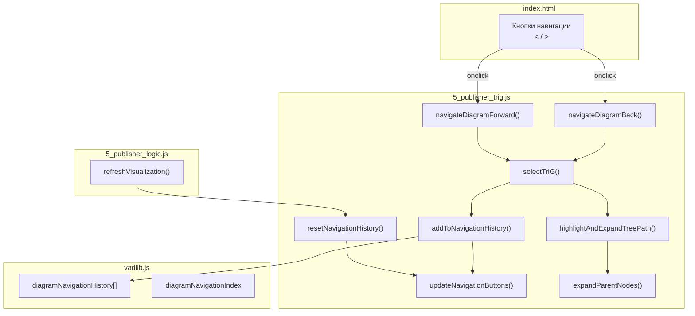
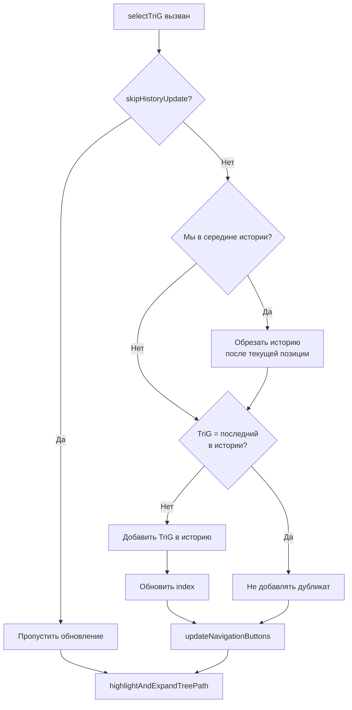

# Диаграмма ↔ TreeView: Навигация и синхронизация

**Issue:** #301
**Версия:** v1
**Дата:** 2026-02-05

## Содержание

1. [Требования](#1-требования)
2. [Архитектура решения](#2-архитектура-решения)
3. [Кнопки навигации](#3-кнопки-навигации)
4. [История навигации](#4-история-навигации)
5. [Синхронизация TreeView](#5-синхронизация-treeview)
6. [Двойной клик по Detailed элементам](#6-двойной-клик-по-detailed-элементам)
7. [Изменённые файлы](#7-изменённые-файлы)

---

## 1. Требования

### 1.1 Основные требования (issue #301)

1. **Кнопки навигации «<» и «>»**
   - Расположение: справа от надписи "Диаграмма" в заголовке панели диаграммы
   - Функциональность: аналог кнопок браузера "Назад" и "Вперёд"
   - Действие: переход по схемам процесса (TriG типа VADProcessDia)

2. **Синхронизация с TreeView**
   - При переходе на новую схему процесса должен передаваться фокус на соответствующую схему (TriG) в TreeView
   - TreeView должен автоматически раскрывать путь к выбранному элементу

3. **Исправление потери фокуса при двойном клике**
   - Проблема: при переходе через двойной клик на Detailed элемент на другой процесс происходила потеря фокуса в TreeView
   - Решение: при переходе должна открываться соответствующая ветка TreeView

---

## 2. Архитектура решения

### 2.1 Глобальные переменные

Добавлены в `vadlib.js`:

```javascript
// issue #301: Navigation history for diagram navigation (back/forward like browser)
let diagramNavigationHistory = [];   // Массив URI TriG для истории
let diagramNavigationIndex = -1;     // Текущая позиция в истории
```

### 2.2 Диаграмма взаимодействия модулей



---

## 3. Кнопки навигации

### 3.1 HTML структура

Расположение в `index.html`:

```html
<div class="diagram-panel-header">
    <span class="diagram-header-text">Диаграмма</span>
    <div class="diagram-nav-buttons">
        <button class="diagram-nav-btn" id="diagram-nav-back"
                onclick="navigateDiagramBack()" title="Назад" disabled>&lt;</button>
        <button class="diagram-nav-btn" id="diagram-nav-forward"
                onclick="navigateDiagramForward()" title="Вперёд" disabled>&gt;</button>
    </div>
</div>
```

### 3.2 CSS стили

Добавлены в `styles.css`:

```css
.diagram-panel-header {
    display: flex;
    justify-content: space-between;
    align-items: center;
}

.diagram-nav-buttons {
    display: flex;
    gap: 4px;
}

.diagram-nav-btn {
    width: 28px;
    height: 24px;
    background-color: rgba(255, 255, 255, 0.2);
    border: 1px solid rgba(255, 255, 255, 0.4);
    border-radius: 4px;
    color: white;
    cursor: pointer;
}

.diagram-nav-btn:disabled {
    opacity: 0.4;
    cursor: not-allowed;
}
```

### 3.3 Состояния кнопок

| Условие | Кнопка «<» | Кнопка «>» |
|---------|------------|------------|
| Начало истории | Disabled | Depends |
| Середина истории | Enabled | Enabled |
| Конец истории | Depends | Disabled |
| Единственный элемент | Disabled | Disabled |

---

## 4. История навигации

### 4.1 Структура данных

```javascript
// Пример состояния:
diagramNavigationHistory = [
    'http://example.org/vad#t_main',     // index 0
    'http://example.org/vad#t_subprocess1', // index 1
    'http://example.org/vad#t_subprocess2'  // index 2 (current)
];
diagramNavigationIndex = 2;
```

### 4.2 Алгоритм добавления в историю



### 4.3 Функции навигации

```javascript
/**
 * Навигация назад
 */
function navigateDiagramBack() {
    if (diagramNavigationIndex > 0) {
        diagramNavigationIndex--;
        selectTriG(diagramNavigationHistory[diagramNavigationIndex], true);
        updateNavigationButtons();
    }
}

/**
 * Навигация вперёд
 */
function navigateDiagramForward() {
    if (diagramNavigationIndex < diagramNavigationHistory.length - 1) {
        diagramNavigationIndex++;
        selectTriG(diagramNavigationHistory[diagramNavigationIndex], true);
        updateNavigationButtons();
    }
}
```

---

## 5. Синхронизация TreeView

### 5.1 Функция подсветки и раскрытия пути

```javascript
/**
 * Подсвечивает элемент в TreeView и раскрывает путь к нему
 * @param {string} trigUri - URI TriG для подсветки
 */
function highlightAndExpandTreePath(trigUri) {
    const treeItems = document.querySelectorAll('.trig-tree-item');
    treeItems.forEach(item => {
        if (item.getAttribute('data-trig-uri') === trigUri) {
            item.classList.add('selected', 'active');
            expandParentNodes(item);
            item.scrollIntoView({ behavior: 'smooth', block: 'nearest' });
        } else {
            item.classList.remove('selected', 'active');
        }
    });
}
```

### 5.2 Раскрытие родительских узлов

```javascript
/**
 * Раскрывает все родительские узлы до указанного элемента
 * @param {HTMLElement} element - Элемент дерева
 */
function expandParentNodes(element) {
    let parent = element.parentElement;
    while (parent) {
        if (parent.classList?.contains('trig-tree-children')) {
            parent.style.display = 'block';
            // Обновляем иконку переключателя
            const toggleId = parent.id.replace('tree-children-', 'tree-toggle-');
            const toggle = document.getElementById(toggleId);
            if (toggle) toggle.textContent = '▼';
        }
        parent = parent.parentElement;
    }
}
```

---

## 6. Двойной клик по Detailed элементам

### 6.1 Поведение до исправления

1. Пользователь дважды кликает на узел процесса с подтипом Detailed
2. Система находит связанный TriG через предикат `vad:hasTrig`
3. Вызывается `selectTriG(targetTrigUri)`
4. **Проблема**: TreeView не синхронизировался, фокус терялся

### 6.2 Поведение после исправления

1. Пользователь дважды кликает на узел процесса с подтипом Detailed
2. Система находит связанный TriG через предикат `vad:hasTrig`
3. Вызывается `selectTriG(targetTrigUri)` с обновлённой логикой
4. **Решение**:
   - TriG добавляется в историю навигации
   - TreeView раскрывает путь к элементу
   - Элемент подсвечивается и прокручивается в видимую область

### 6.3 Обработчик двойного клика

```javascript
function handleNodeDoubleClick(event) {
    // ... поиск nodeUri ...

    // Ищем vad:hasTrig в ptree
    const hasTrigPredicate = 'http://example.org/vad#hasTrig';
    let targetTrigUri = null;

    if (trigHierarchy?.[PTREE_GRAPH_URI]) {
        const ptreeQuads = trigHierarchy[PTREE_GRAPH_URI].quads;
        for (const quad of ptreeQuads) {
            if (quad.subject.value === nodeUri &&
                quad.predicate.value === hasTrigPredicate) {
                targetTrigUri = quad.object.value;
                break;
            }
        }
    }

    // Если найден связанный TriG, открываем его
    if (targetTrigUri && trigHierarchy[targetTrigUri]) {
        selectTriG(targetTrigUri);  // Теперь с синхронизацией TreeView
    }
}
```

---

## 7. Изменённые файлы

| Файл | Изменения |
|------|-----------|
| `ver9c/9_vadlib/vadlib.js` | Добавлены глобальные переменные `diagramNavigationHistory` и `diagramNavigationIndex` |
| `ver9c/index.html` | Добавлены кнопки навигации в заголовок панели диаграммы |
| `ver9c/styles.css` | Добавлены стили для кнопок навигации |
| `ver9c/5_publisher/5_publisher_trig.js` | Добавлены функции навигации, синхронизации TreeView, обновлён `selectTriG()` |
| `ver9c/5_publisher/5_publisher_logic.js` | Добавлен сброс истории при загрузке данных, инициализация истории |
| `ver9c/doc/algorithm/dia2treeview_v1.md` | Данный документ |

---

## Заключение

Реализация обеспечивает:

1. ✅ Кнопки навигации «<» и «>» для перехода по истории схем
2. ✅ Автоматическую синхронизацию TreeView при переходе между схемами
3. ✅ Раскрытие пути в TreeView до выбранного элемента
4. ✅ Корректную работу двойного клика по Detailed элементам
5. ✅ Прокрутку TreeView к выбранному элементу

Кнопки навигации работают аналогично кнопкам браузера, сохраняя историю переходов и позволяя возвращаться к ранее просмотренным схемам.
