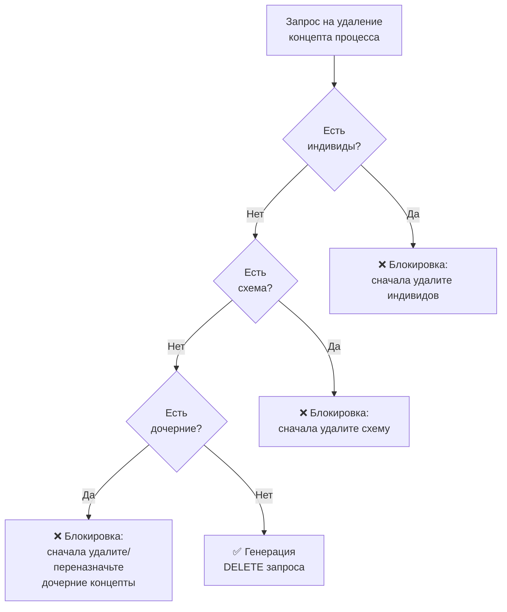

<!-- Ссылка на issue: https://github.com/bpmbpm/rdf-grapher/issues/272 -->
<!-- Pull Request: https://github.com/bpmbpm/rdf-grapher/pull/273 -->
<!-- Дата: 2026-02-04 -->

# Алгоритмы создания и удаления концептов и индивидов (v3)

Данный документ является доработкой [io_concept_individ_v2.md](io_concept_individ_v2.md) с учётом последних изменений и рекомендаций.

## Основные изменения относительно v2

1. **Унификация SPARQL-функций** — все операции используют `funSPARQLvalues` или `funSPARQLvaluesComunica`
2. **Добавлена функция `funSPARQLask()`** — для проверок типа ASK (существование объектов)
3. **Проверка через `checkIdExistsAsk()`** — SPARQL ASK вместо перебора массива
4. **Обновлённые схемы зависимостей** — с учётом виртуальных графов (vad:Virtual)
5. **Валидация через `validateVADSchema()`** — интеграция с кнопкой "Тест"

---

## 1. Создание концепта процесса — полностью SPARQL-ориентированный подход

### 1.1 Проверки при создании (v3)

| № | Проверка | Функция/Подход | SPARQL-функция | Описание |
|---|----------|----------------|----------------|----------|
| 1 | Уникальность ID в ptree | `checkIdExistsAsk(fullUri, graphUri)` | `funSPARQLask()` | ASK-запрос проверяет существование URI как subject |
| 2 | Допустимость символов в ID | `generateIdFromLabel(label)` | — (JS regex) | Валидация символов на стороне клиента |
| 3 | Непустое значение rdfs:label | Проверка формы | — (JS) | UI-валидация обязательного поля |
| 4 | Выбор родительского объекта | `getObjectsForParentSelector()` | `funSPARQLvaluesComunica()` | SELECT с OPTIONAL для получения label |
| 5 | Загрузка предикатов из techtree | `getPredicatesForNewConcept()` | `funSPARQLvalues()` | Получение предикатов из технологического объекта |

### 1.2 Функция checkIdExistsAsk (новая в v3)

**Замена `checkIdExists()` на SPARQL ASK:**

```javascript
/**
 * Проверяет существование ID в указанном графе через SPARQL ASK
 * @param {string} fullUri - Полный URI проверяемого объекта
 * @param {string} graphUri - URI графа (например, vad:ptree)
 * @returns {Promise<boolean>} true если ID уже существует
 */
async function checkIdExistsAsk(fullUri, graphUri) {
    const sparqlQuery = `
PREFIX rdf: <http://www.w3.org/1999/02/22-rdf-syntax-ns#>
PREFIX vad: <http://example.org/vad#>

ASK {
    GRAPH <${graphUri}> {
        <${fullUri}> ?p ?o .
    }
}`;
    return await funSPARQLask(sparqlQuery);
}
```

### 1.3 SPARQL-запросы для создания концепта процесса

#### Запрос 1: Проверка уникальности ID (ASK)

```sparql
# Функция: checkIdExistsAsk(fullUri, graphUri)
# Выполняется: funSPARQLask()
# Результат: boolean (true = ID существует)

PREFIX rdf: <http://www.w3.org/1999/02/22-rdf-syntax-ns#>
PREFIX vad: <http://example.org/vad#>

ASK {
    GRAPH vad:ptree {
        <http://example.org/vad#newId> ?p ?o .
    }
}
```

#### Запрос 2: Получение предикатов из techtree

```sparql
# Функция: getPredicatesForNewConcept(techObjectUri, config)
# Выполняется: funSPARQLvalues(sparqlQuery, 'predicate')

PREFIX vad: <http://example.org/vad#>

SELECT ?predicate WHERE {
    <http://example.org/vad#ConceptProcessPredicate> vad:includePredicate ?predicate .
}

# Результат: [{uri: 'rdf:type'}, {uri: 'rdfs:label'}, ...]
```

#### Запрос 3: Получение объектов для выбора родителя

```sparql
# Функция: getObjectsForParentSelector(typeUri, graphUri)
# Выполняется: funSPARQLvaluesComunica(sparqlQuery, 'object')
# Примечание: используется Comunica для поддержки OPTIONAL

PREFIX rdf: <http://www.w3.org/1999/02/22-rdf-syntax-ns#>
PREFIX rdfs: <http://www.w3.org/2000/01/rdf-schema#>
PREFIX vad: <http://example.org/vad#>

SELECT ?object ?label WHERE {
    GRAPH vad:ptree {
        ?object rdf:type vad:TypeProcess .
        OPTIONAL { ?object rdfs:label ?label }
    }
}

# Результат: [{uri: 'http://example.org/vad#p1', label: 'Процесс 1'}, ...]
```

#### Запрос 4: Итоговый INSERT для создания концепта

```sparql
# Генерируется: createNewConceptSparql()
# Выводится в: панель "Result in SPARQL"

PREFIX rdf: <http://www.w3.org/1999/02/22-rdf-syntax-ns#>
PREFIX rdfs: <http://www.w3.org/2000/01/rdf-schema#>
PREFIX dcterms: <http://purl.org/dc/terms/>
PREFIX vad: <http://example.org/vad#>

INSERT DATA {
    GRAPH vad:ptree {
        vad:p_new rdf:type vad:TypeProcess .
        vad:p_new rdfs:label "Новый процесс" .
        vad:p_new dcterms:description "Описание нового процесса" .
        vad:p_new vad:hasParentObj vad:ptree .
    }
}
```

---

## 2. Создание концепта исполнителя (rtree)

### 2.1 Проверки при создании

| № | Проверка | Функция | SPARQL-функция |
|---|----------|---------|----------------|
| 1 | Уникальность ID в rtree | `checkIdExistsAsk(fullUri, 'vad:rtree')` | `funSPARQLask()` |
| 2 | Допустимость символов в ID | `generateIdFromLabel(label)` | — |
| 3 | Непустое значение rdfs:label | Проверка формы | — |
| 4 | Выбор родительского объекта | `getObjectsForParentSelector('vad:TypeExecutor', 'vad:rtree')` | `funSPARQLvaluesComunica()` |

### 2.2 Итоговый INSERT для создания концепта исполнителя

```sparql
PREFIX rdf: <http://www.w3.org/1999/02/22-rdf-syntax-ns#>
PREFIX rdfs: <http://www.w3.org/2000/01/rdf-schema#>
PREFIX vad: <http://example.org/vad#>

INSERT DATA {
    GRAPH vad:rtree {
        vad:NewExecutor rdf:type vad:TypeExecutor .
        vad:NewExecutor rdfs:label "Новый исполнитель" .
        vad:NewExecutor vad:hasParentObj vad:rtree .
    }
}
```

---

## 3. Удаление концепта процесса — SPARQL-проверки

### 3.1 Предварительные проверки перед удалением

| № | Проверка | SPARQL-функция | Описание | Блокировка |
|---|----------|----------------|----------|------------|
| 1 | Наличие индивидов | `funSPARQLvaluesComunica()` | Проверяет использование в VADProcessDia | Да |
| 2 | Наличие схемы (hasTrig) | `funSPARQLvalues()` | Проверяет привязку схемы процесса | Да |
| 3 | Наличие дочерних концептов | `funSPARQLvaluesComunica()` | Проверяет дочерние процессы в ptree | Да |

### 3.2 SPARQL-запросы для проверок удаления

#### Запрос 1: Проверка индивидов в схемах

```sparql
# Функция: checkProcessIndividuals(conceptUri)
# Выполняется: funSPARQLvaluesComunica(sparqlQuery, 'trig')

PREFIX vad: <http://example.org/vad#>

SELECT ?trig WHERE {
    GRAPH ?trig {
        <CONCEPT_URI> vad:isSubprocessTrig ?trig .
    }
}

# Если результат не пустой — есть индивиды, удаление блокируется
```

#### Запрос 2: Проверка наличия схемы

```sparql
# Функция: checkProcessSchema(conceptUri)
# Выполняется: funSPARQLvalues(sparqlQuery, 'trig')

PREFIX vad: <http://example.org/vad#>

SELECT ?trig WHERE {
    GRAPH vad:ptree {
        <CONCEPT_URI> vad:hasTrig ?trig .
    }
}
```

#### Запрос 3: Проверка дочерних концептов

```sparql
# Функция: checkChildrenProcesses(conceptUri)
# Выполняется: funSPARQLvaluesComunica(sparqlQuery, 'child')

PREFIX vad: <http://example.org/vad#>
PREFIX rdfs: <http://www.w3.org/2000/01/rdf-schema#>

SELECT ?child ?label WHERE {
    GRAPH vad:ptree {
        ?child vad:hasParentObj <CONCEPT_URI> .
        OPTIONAL { ?child rdfs:label ?label }
    }
}
```

#### Запрос 4: Итоговый DELETE

```sparql
# Генерируется: GENERATE_DELETE_CONCEPT_QUERY(conceptUri)
# Выводится в: панель "Result in SPARQL"

PREFIX vad: <http://example.org/vad#>

DELETE WHERE {
    GRAPH vad:ptree {
        <CONCEPT_URI> ?p ?o .
    }
}
```

### 3.3 Порядок удаления при наличии зависимостей



---

## 4. Удаление концепта исполнителя

### 4.1 Предварительные проверки

| № | Проверка | SPARQL-функция | Описание |
|---|----------|----------------|----------|
| 1 | Использование в схемах | `funSPARQLvaluesComunica()` | Проверяет `vad:includes` в ExecutorGroup |

### 4.2 SPARQL-запрос проверки использования

```sparql
# Функция: checkExecutorUsage(executorUri)
# Выполняется: funSPARQLvaluesComunica(sparqlQuery, 'trig')

PREFIX vad: <http://example.org/vad#>

SELECT ?trig ?group WHERE {
    GRAPH ?trig {
        ?group vad:includes <EXECUTOR_URI> .
    }
}
```

---

## 5. Создание схемы процесса (TriG)

### 5.1 Проверки при создании

| № | Проверка | SPARQL-функция | Описание |
|---|----------|----------------|----------|
| 1 | Концепт существует | `funSPARQLask()` | Проверка существования концепта в ptree |
| 2 | У концепта нет схемы | `funSPARQLvalues()` | Проверка отсутствия `vad:hasTrig` |
| 3 | Уникальность ID схемы | `funSPARQLask()` | Проверка уникальности `vad:t_{id}` |

### 5.2 Итоговый INSERT для создания схемы

```sparql
PREFIX rdf: <http://www.w3.org/1999/02/22-rdf-syntax-ns#>
PREFIX rdfs: <http://www.w3.org/2000/01/rdf-schema#>
PREFIX vad: <http://example.org/vad#>

INSERT DATA {
    # Метаданные схемы
    vad:t_p1 rdf:type vad:VADProcessDia .
    vad:t_p1 rdfs:label "Схема t_p1 процесса p1" .
    vad:t_p1 vad:hasParentObj vad:p1 .

    # Связь с концептом в ptree
    GRAPH vad:ptree {
        vad:p1 vad:hasTrig vad:t_p1 .
    }

    # Пустой граф схемы
    GRAPH vad:t_p1 {
    }
}
```

---

## 6. Удаление индивида процесса

### 6.1 Предварительные проверки

| № | Проверка | SPARQL-функция | Описание |
|---|----------|----------------|----------|
| 1 | Входящие связи hasNext | `funSPARQLvalues()` | Проверка ссылок от других процессов |
| 2 | Наличие ExecutorGroup | `funSPARQLvalues()` | Проверка связанной группы исполнителей |

### 6.2 Итоговый DELETE для индивида

```sparql
PREFIX vad: <http://example.org/vad#>

DELETE WHERE {
    GRAPH vad:t_p1 {
        # Удаление всех триплетов индивида
        <INDIVID_URI> ?p ?o .
    }
}

# Отдельно: удаление входящих hasNext
DELETE WHERE {
    GRAPH vad:t_p1 {
        ?s vad:hasNext <INDIVID_URI> .
    }
}

# Отдельно: удаление ExecutorGroup
DELETE WHERE {
    GRAPH vad:t_p1 {
        <EXECUTOR_GROUP_URI> ?p ?o .
    }
}
```

---

## 7. Сводная таблица SPARQL-функций

| Функция | Тип запроса | Использование | Модуль |
|---------|-------------|---------------|--------|
| `funSPARQLvalues()` | SELECT (простой) | Получение списков, проверки без OPTIONAL | `vadlib_sparql.js` |
| `funSPARQLvaluesComunica()` | SELECT (полный) | Запросы с OPTIONAL, UNION, FILTER | `vadlib_sparql.js` |
| `funSPARQLask()` | ASK | Проверки существования | `vadlib_sparql.js` |
| `funSPARQLvaluesComunicaUpdate()` | UPDATE | INSERT/DELETE (будущее использование) | `vadlib_sparql.js` |

---

## 8. Схема зависимостей между сущностями

```
vad:ptree (ProcessTree)
 └── vad:p1 (TypeProcess — концепт)
      ├── rdfs:label "p1 Процесс 1"
      ├── dcterms:description "Описание"
      ├── vad:hasParentObj vad:ptree
      ├── vad:hasTrig vad:t_p1 ─────────────────┐
      │                                           │
      └── vad:p1.1 (TypeProcess — дочерний)       │
           └── vad:hasParentObj vad:p1             │
                                                   ▼
                                          vad:t_p1 (VADProcessDia — схема)
                                           ├── rdf:type vad:VADProcessDia
                                           ├── rdfs:label "Схема t_p1 ..."
                                           ├── vad:hasParentObj vad:p1
                                           └── содержит индивидов:
                                                ├── vad:p1.1 (индивид)
                                                │    ├── vad:isSubprocessTrig vad:t_p1
                                                │    ├── vad:hasExecutor vad:ExecutorGroup_p1.1
                                                │    └── vad:hasNext vad:p1.2
                                                └── vad:p1.2 (индивид)
                                                     └── vad:isSubprocessTrig vad:t_p1

vad:rtree (ExecutorTree)
 └── vad:Executor1 (TypeExecutor — концепт)
      ├── rdfs:label "Исполнитель 1"
      └── vad:hasParentObj vad:rtree
           │
           └── используется в TriG через:
                vad:ExecutorGroup_p1.1 vad:includes vad:Executor1

vad:vt_p1 (Virtual — виртуальный TriG, issue #264)
 └── вычисляемые данные (processSubtype)
      ├── vad:p1.1 vad:processSubtype vad:notDetailedChild
      └── vad:p1.2 vad:processSubtype vad:notDetailed
```

---

## 9. Связанные документы

- [io_concept_individ_v1.md](io_concept_individ_v1.md) — первоначальная версия алгоритмов
- [io_concept_individ_v2.md](io_concept_individ_v2.md) — версия с SPARQL-ориентированным подходом
- [checklistTestButton.md](../checklistTestButton.md) — перечень проверок по кнопке "Тест"
- [quadstore_io.md](../quadstore_io.md) — взаимодействие с quadstore
- [sparql-driven-programming_min1.md](../../requirements/sparql-driven-programming_min1.md) — принципы SPARQL-driven programming

---

*Документ создан в рамках PR #273 по issue #272*
