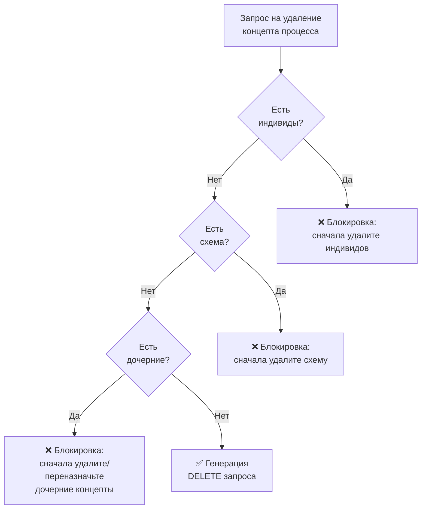
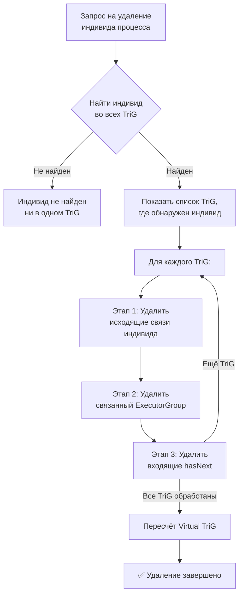
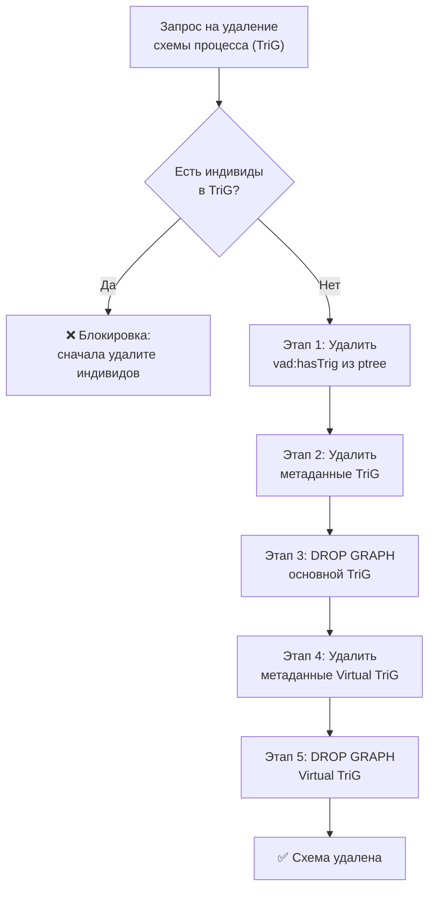

<!-- Ссылка на issue: https://github.com/bpmbpm/rdf-grapher/issues/309 -->
<!-- Pull Request: https://github.com/bpmbpm/rdf-grapher/pull/310 -->
<!-- Дата: 2026-02-06 -->

# Алгоритмы создания и удаления концептов, индивидов и схем (v4)

Данный документ является доработкой [io_concept_individ_v3.md](io_concept_individ_v3.md) с учётом полного набора операций создания и удаления объектов: концептов (4 операции), индивидов (4 операции) и схем (2 операции).

## Основные изменения относительно v3

1. **12 разделов по операциям** — полное покрытие создания и удаления для концептов, индивидов и схем (включая операции «в схеме»)
2. **Создание индивида процесса** (новый раздел) — выбор TriG из выпадающего списка, множественный выбор `vad:hasNext`, автоматическое создание `ExecutorGroup`
3. **Создание индивида исполнителя** (новый раздел) — добавление `vad:includes` в существующий `ExecutorGroup`
4. **Обновлённый алгоритм удаления индивида процесса** — полное удаление по каждому TriG: исходящие связи, `ExecutorGroup`, входящие `vad:hasNext` (issue #309 п.2)
5. **Удаление индивида исполнителя** (новый раздел) — удаление `vad:includes` из `ExecutorGroup`
6. **Удаление схемы процесса** (новый раздел) — `DROP GRAPH`, каскадное удаление Virtual TriG (issue #309 п.3)
7. **Раздел «Потенциальные риски нарушения целостности RDF-данных»** — анализ рисков и меры минимизации
8. **Кнопка «ПоказатьVirtual TriG»** — пересчёт виртуального TriG после применения SPARQL (issue #309 п.4)
9. **Кнопка Help** — показ основных этапов удаления индивида процесса (issue #309 п.2.2)
10. **Удаление индивида процесса в схеме** (issue #311, п.3) — удаление только из выбранной схемы
11. **Удаление индивида исполнителя в схеме** (issue #311, п.4) — удаление только из выбранной схемы
12. **Переименование операций** (issue #311, п.3–4): «Удалить индивид процесса» → «...во всех схемах», «Удалить индивид исполнителя» → «...во всех схемах»

---

## 1. Создание концепта процесса — полностью SPARQL-ориентированный подход

### 1.1 Проверки при создании (v3)

| № | Проверка | Функция/Подход | SPARQL-функция | Описание |
|---|----------|----------------|----------------|----------|
| 1 | Уникальность ID в ptree | `checkIdExistsAsk(fullUri, graphUri)` | `funSPARQLask()` | ASK-запрос проверяет существование URI как subject |
| 2 | Допустимость символов в ID | `generateIdFromLabel(label)` | — (JS regex) | Валидация символов на стороне клиента |
| 3 | Непустое значение rdfs:label | Проверка формы | — (JS) | UI-валидация обязательного поля |
| 4 | Выбор родительского объекта | `getObjectsForParentSelector()` | `funSPARQLvaluesComunica()` | SELECT с OPTIONAL для получения label |
| 5 | Загрузка предикатов из techtree | `getPredicatesForNewConcept()` | `funSPARQLvalues()` | Получение предикатов из технологического объекта |

### 1.2 Функция checkIdExistsAsk (новая в v3)

**Замена `checkIdExists()` на SPARQL ASK:**

```javascript
/**
 * Проверяет существование ID в указанном графе через SPARQL ASK
 * @param {string} fullUri - Полный URI проверяемого объекта
 * @param {string} graphUri - URI графа (например, vad:ptree)
 * @returns {Promise<boolean>} true если ID уже существует
 */
async function checkIdExistsAsk(fullUri, graphUri) {
    const sparqlQuery = `
PREFIX rdf: <http://www.w3.org/1999/02/22-rdf-syntax-ns#>
PREFIX vad: <http://example.org/vad#>

ASK {
    GRAPH <${graphUri}> {
        <${fullUri}> ?p ?o .
    }
}`;
    return await funSPARQLask(sparqlQuery);
}
```

### 1.3 SPARQL-запросы для создания концепта процесса

#### Запрос 1: Проверка уникальности ID (ASK)

```sparql
# Функция: checkIdExistsAsk(fullUri, graphUri)
# Выполняется: funSPARQLask()
# Результат: boolean (true = ID существует)

PREFIX rdf: <http://www.w3.org/1999/02/22-rdf-syntax-ns#>
PREFIX vad: <http://example.org/vad#>

ASK {
    GRAPH vad:ptree {
        <http://example.org/vad#newId> ?p ?o .
    }
}
```

#### Запрос 2: Получение предикатов из techtree

```sparql
# Функция: getPredicatesForNewConcept(techObjectUri, config)
# Выполняется: funSPARQLvalues(sparqlQuery, 'predicate')

PREFIX vad: <http://example.org/vad#>

SELECT ?predicate WHERE {
    <http://example.org/vad#ConceptProcessPredicate> vad:includePredicate ?predicate .
}

# Результат: [{uri: 'rdf:type'}, {uri: 'rdfs:label'}, ...]
```

#### Запрос 3: Получение объектов для выбора родителя

```sparql
# Функция: getObjectsForParentSelector(typeUri, graphUri)
# Выполняется: funSPARQLvaluesComunica(sparqlQuery, 'object')
# Примечание: используется Comunica для поддержки OPTIONAL

PREFIX rdf: <http://www.w3.org/1999/02/22-rdf-syntax-ns#>
PREFIX rdfs: <http://www.w3.org/2000/01/rdf-schema#>
PREFIX vad: <http://example.org/vad#>

SELECT ?object ?label WHERE {
    GRAPH vad:ptree {
        ?object rdf:type vad:TypeProcess .
        OPTIONAL { ?object rdfs:label ?label }
    }
}

# Результат: [{uri: 'http://example.org/vad#p1', label: 'Процесс 1'}, ...]
```

#### Запрос 4: Итоговый INSERT для создания концепта

```sparql
# Генерируется: createNewConceptSparql()
# Выводится в: панель "Result in SPARQL"

PREFIX rdf: <http://www.w3.org/1999/02/22-rdf-syntax-ns#>
PREFIX rdfs: <http://www.w3.org/2000/01/rdf-schema#>
PREFIX dcterms: <http://purl.org/dc/terms/>
PREFIX vad: <http://example.org/vad#>

INSERT DATA {
    GRAPH vad:ptree {
        vad:p_new rdf:type vad:TypeProcess .
        vad:p_new rdfs:label "Новый процесс" .
        vad:p_new dcterms:description "Описание нового процесса" .
        vad:p_new vad:hasParentObj vad:ptree .
    }
}
```

---

## 2. Создание концепта исполнителя (rtree)

### 2.1 Проверки при создании

| № | Проверка | Функция | SPARQL-функция |
|---|----------|---------|----------------|
| 1 | Уникальность ID в rtree | `checkIdExistsAsk(fullUri, 'vad:rtree')` | `funSPARQLask()` |
| 2 | Допустимость символов в ID | `generateIdFromLabel(label)` | — |
| 3 | Непустое значение rdfs:label | Проверка формы | — |
| 4 | Выбор родительского объекта | `getObjectsForParentSelector('vad:TypeExecutor', 'vad:rtree')` | `funSPARQLvaluesComunica()` |

### 2.2 Итоговый INSERT для создания концепта исполнителя

```sparql
PREFIX rdf: <http://www.w3.org/1999/02/22-rdf-syntax-ns#>
PREFIX rdfs: <http://www.w3.org/2000/01/rdf-schema#>
PREFIX vad: <http://example.org/vad#>

INSERT DATA {
    GRAPH vad:rtree {
        vad:NewExecutor rdf:type vad:TypeExecutor .
        vad:NewExecutor rdfs:label "Новый исполнитель" .
        vad:NewExecutor vad:hasParentObj vad:rtree .
    }
}
```

---

## 3. Удаление концепта процесса — SPARQL-проверки

### 3.1 Предварительные проверки перед удалением

| № | Проверка | SPARQL-функция | Описание | Блокировка |
|---|----------|----------------|----------|------------|
| 1 | Наличие индивидов | `funSPARQLvaluesComunica()` | Проверяет использование в VADProcessDia | Да |
| 2 | Наличие схемы (hasTrig) | `funSPARQLvalues()` | Проверяет привязку схемы процесса | Да |
| 3 | Наличие дочерних концептов | `funSPARQLvaluesComunica()` | Проверяет дочерние процессы в ptree | Да |

### 3.2 SPARQL-запросы для проверок удаления

#### Запрос 1: Проверка индивидов в схемах

```sparql
# Функция: checkProcessIndividuals(conceptUri)
# Выполняется: funSPARQLvaluesComunica(sparqlQuery, 'trig')

PREFIX vad: <http://example.org/vad#>

SELECT ?trig WHERE {
    GRAPH ?trig {
        <CONCEPT_URI> vad:isSubprocessTrig ?trig .
    }
}

# Если результат не пустой — есть индивиды, удаление блокируется
```

#### Запрос 2: Проверка наличия схемы

```sparql
# Функция: checkProcessSchema(conceptUri)
# Выполняется: funSPARQLvalues(sparqlQuery, 'trig')

PREFIX vad: <http://example.org/vad#>

SELECT ?trig WHERE {
    GRAPH vad:ptree {
        <CONCEPT_URI> vad:hasTrig ?trig .
    }
}
```

#### Запрос 3: Проверка дочерних концептов

```sparql
# Функция: checkChildrenProcesses(conceptUri)
# Выполняется: funSPARQLvaluesComunica(sparqlQuery, 'child')

PREFIX vad: <http://example.org/vad#>
PREFIX rdfs: <http://www.w3.org/2000/01/rdf-schema#>

SELECT ?child ?label WHERE {
    GRAPH vad:ptree {
        ?child vad:hasParentObj <CONCEPT_URI> .
        OPTIONAL { ?child rdfs:label ?label }
    }
}
```

#### Запрос 4: Итоговый DELETE

```sparql
# Генерируется: GENERATE_DELETE_CONCEPT_QUERY(conceptUri)
# Выводится в: панель "Result in SPARQL"

PREFIX vad: <http://example.org/vad#>

DELETE WHERE {
    GRAPH vad:ptree {
        <CONCEPT_URI> ?p ?o .
    }
}
```

### 3.3 Порядок удаления при наличии зависимостей



---

## 4. Удаление концепта исполнителя

### 4.1 Предварительные проверки

| № | Проверка | SPARQL-функция | Описание | Блокировка |
|---|----------|----------------|----------|------------|
| 1 | Использование в схемах | `funSPARQLvaluesComunica()` | Проверяет `vad:includes` в ExecutorGroup | Да |
| 2 | Наличие дочерних исполнителей | `funSPARQLvaluesComunica()` | Проверяет дочерние объекты в rtree | Да |

### 4.2 SPARQL-запрос проверки использования

```sparql
# Функция: checkExecutorUsage(executorUri)
# Выполняется: funSPARQLvaluesComunica(sparqlQuery, 'trig')

PREFIX vad: <http://example.org/vad#>

SELECT ?trig ?group WHERE {
    GRAPH ?trig {
        ?group vad:includes <EXECUTOR_URI> .
    }
}
```

### 4.3 SPARQL-запрос проверки дочерних исполнителей

```sparql
# Функция: checkChildrenExecutors(executorUri)
# Выполняется: funSPARQLvaluesComunica(sparqlQuery, 'child')

PREFIX vad: <http://example.org/vad#>
PREFIX rdfs: <http://www.w3.org/2000/01/rdf-schema#>

SELECT ?child ?label WHERE {
    GRAPH vad:rtree {
        ?child vad:hasParentObj <EXECUTOR_URI> .
        OPTIONAL { ?child rdfs:label ?label }
    }
}
```

### 4.4 Итоговый DELETE

```sparql
# Генерируется: GENERATE_DELETE_EXECUTOR_CONCEPT_QUERY(executorUri)
# Выводится в: панель "Result in SPARQL"

PREFIX vad: <http://example.org/vad#>

DELETE WHERE {
    GRAPH vad:rtree {
        <EXECUTOR_URI> ?p ?o .
    }
}
```

---

## 5. Создание индивида процесса

> Новый раздел, добавленный в v4 (issue #309, п.1).

Операция создания индивида процесса выполняется через кнопку **New Individ** в окне Smart Design. Индивид процесса добавляется в конкретный TriG (схему процесса типа `vad:VADProcessDia`).

### 5.1 Порядок действий пользователя

1. Пользователь нажимает кнопку **New Individ** и выбирает тип «Индивид процесса»
2. Из выпадающего списка выбирает **TriG** (схему процесса `vad:VADProcessDia`), в который будет добавлен индивид
3. Из дерева процессов (**ptree**) выбирает **концепт процесса**, который станет индивидом
4. (Опционально) Из справочника концептов процессов выбирает один или несколько объектов для `vad:hasNext` — множественный выбор через чекбоксы
5. Система автоматически формирует `ExecutorGroup` с ID вида `ExecutorGroup_{processId}`
6. Формируется SPARQL INSERT DATA и отображается в панели «Result in SPARQL»

### 5.2 Проверки при создании

| № | Проверка | Функция | SPARQL-функция | Описание |
|---|----------|---------|----------------|----------|
| 1 | Существование концепта в ptree | `checkIdExistsAsk(conceptUri, 'vad:ptree')` | `funSPARQLask()` | Проверка, что концепт действительно существует |
| 2 | Индивид не существует в TriG | `checkIndividualInTrig(conceptUri, trigUri)` | `funSPARQLask()` | Проверка через `vad:isSubprocessTrig`: индивид не должен быть уже добавлен в данный TriG |
| 3 | TriG существует и является VADProcessDia | `checkTrigType(trigUri)` | `funSPARQLask()` | Проверка типа `rdf:type vad:VADProcessDia` |
| 4 | Уникальность ExecutorGroup ID | `checkIdExistsAsk(groupUri, trigUri)` | `funSPARQLask()` | Проверка, что `ExecutorGroup_{processId}` ещё не занят |

### 5.3 SPARQL-запросы для проверок

#### Запрос 1: Проверка существования индивида в TriG

```sparql
# Функция: checkIndividualInTrig(conceptUri, trigUri)
# Выполняется: funSPARQLask()
# Результат: boolean (true = индивид уже добавлен в этот TriG)

PREFIX vad: <http://example.org/vad#>

ASK {
    GRAPH <TRIG_URI> {
        <CONCEPT_URI> vad:isSubprocessTrig <TRIG_URI> .
    }
}
```

#### Запрос 2: Получение списка доступных TriG (VADProcessDia)

```sparql
# Функция: getAvailableTrigs()
# Выполняется: funSPARQLvaluesComunica(sparqlQuery, 'trig')

PREFIX rdf: <http://www.w3.org/1999/02/22-rdf-syntax-ns#>
PREFIX rdfs: <http://www.w3.org/2000/01/rdf-schema#>
PREFIX vad: <http://example.org/vad#>

SELECT ?trig ?label WHERE {
    ?trig rdf:type vad:VADProcessDia .
    OPTIONAL { ?trig rdfs:label ?label }
}

# Результат: [{uri: 'vad:t_p1', label: 'Схема t_p1 процесса p1'}, ...]
```

#### Запрос 3: Получение концептов процессов для выбора hasNext

```sparql
# Функция: getProcessConceptsForHasNext()
# Выполняется: funSPARQLvaluesComunica(sparqlQuery, 'concept')
# Примечание: справочник всех концептов процесса из ptree (не индивидов схемы)

PREFIX rdf: <http://www.w3.org/1999/02/22-rdf-syntax-ns#>
PREFIX rdfs: <http://www.w3.org/2000/01/rdf-schema#>
PREFIX vad: <http://example.org/vad#>

SELECT ?concept ?label WHERE {
    GRAPH vad:ptree {
        ?concept rdf:type vad:TypeProcess .
        OPTIONAL { ?concept rdfs:label ?label }
    }
}

# Результат используется для отображения чекбоксов множественного выбора
```

### 5.4 Итоговый INSERT DATA для создания индивида процесса

```sparql
# Генерируется: createProcessIndividualSparql()
# Выводится в: панель "Result in SPARQL"
# Примечание: единая транзакция включает индивид и ExecutorGroup

PREFIX rdf: <http://www.w3.org/1999/02/22-rdf-syntax-ns#>
PREFIX rdfs: <http://www.w3.org/2000/01/rdf-schema#>
PREFIX vad: <http://example.org/vad#>

INSERT DATA {
    GRAPH vad:t_p1 {
        # Индивид процесса
        vad:p1.1 vad:isSubprocessTrig vad:t_p1 .
        vad:p1.1 vad:hasExecutor vad:ExecutorGroup_p1.1 .
        vad:p1.1 vad:hasNext vad:p1.2 .
        vad:p1.1 vad:hasNext vad:p1.3 .

        # Группа исполнителей (создаётся автоматически)
        vad:ExecutorGroup_p1.1 rdf:type vad:ExecutorGroup .
        vad:ExecutorGroup_p1.1 rdfs:label "Группа исполнителей процесса p1.1" .
    }
}
```

> **Примечание:** Предикаты типа `vad:includes` для `ExecutorGroup` не заполняются при создании индивида процесса — они заполняются при создании индивида исполнителя (раздел 6).

### 5.5 Пересчёт Virtual TriG

После применения INSERT DATA автоматически выполняется пересчёт Virtual TriG (`vad:vt_*`). Результат пересчёта доступен по кнопке **«ПоказатьVirtual TriG»** в окне «Result in SPARQL».

---

## 6. Создание индивида исполнителя

> Новый раздел, добавленный в v4 (issue #309, п.1). Обновлён: связанные справочники TriG → индивид процесса.

Операция создания индивида исполнителя заключается в добавлении связи `vad:includes` в существующий `ExecutorGroup` внутри конкретного TriG. ExecutorGroup создаётся автоматически при создании индивида процесса, а создание нового индивида исполнителя лишь добавляет исполнителя в эту группу.

### 6.1 Порядок действий пользователя

1. Пользователь нажимает кнопку **New Individ** и выбирает тип «Индивид исполнителя»
2. Из выпадающего списка выбирает **TriG** (схему процесса) — первый связанный справочник
3. Из списка **индивидов процесса** выбранного TriG выбирает индивид — второй связанный справочник
4. **ExecutorGroup** определяется **автоматически** по предикату `vad:hasExecutor` выбранного индивида процесса
5. Из дерева исполнителей (**rtree**) выбирает **концепт исполнителя** для добавления
6. Формируется SPARQL INSERT DATA и отображается в панели «Result in SPARQL»

> Примечание: связанные справочники означают, что при выборе TriG обновляется список индивидов процесса данного TriG. ExecutorGroup не выбирается пользователем вручную — она определяется автоматически из выбранного индивида процесса.

### 6.2 Проверки при создании

| № | Проверка | Функция | SPARQL-функция | Описание |
|---|----------|---------|----------------|----------|
| 1 | TriG выбран | UI validation | — | Проверка выбора схемы процесса |
| 2 | Индивид процесса выбран | UI validation | — | Проверка выбора индивида из связанного справочника |
| 3 | ExecutorGroup определена | `findExecutorGroupForProcessIndivid()` | manual quadstore | Авто-поиск ExecutorGroup через `vad:hasExecutor` |
| 4 | Концепт исполнителя выбран | UI validation | — | Проверка выбора исполнителя из rtree |

### 6.3 SPARQL-запросы

#### Запрос 1: Получение индивидов процесса в TriG (связанный справочник)

```sparql
# Функция: getIndividsInTrig(trigUri)
# Выполняется: manual quadstore search

PREFIX vad: <http://example.org/vad#>
PREFIX rdfs: <http://www.w3.org/2000/01/rdf-schema#>

SELECT ?individ ?label WHERE {
    GRAPH <TRIG_URI> {
        ?individ vad:isSubprocessTrig <TRIG_URI> .
    }
    OPTIONAL {
        GRAPH vad:ptree {
            ?individ rdfs:label ?label .
        }
    }
}
```

#### Запрос 2: Авто-определение ExecutorGroup для индивида процесса

```sparql
# Функция: findExecutorGroupForProcessIndivid(processIndividUri, trigUri)
# Выполняется: manual quadstore search

PREFIX vad: <http://example.org/vad#>

SELECT ?executorGroup WHERE {
    GRAPH <TRIG_URI> {
        <PROCESS_INDIVID_URI> vad:hasExecutor ?executorGroup .
    }
}
```

### 6.4 Итоговый INSERT DATA для создания индивида исполнителя

```sparql
# Генерируется: createExecutorIndividualSparql()
# Выводится в: панель "Result in SPARQL"

PREFIX vad: <http://example.org/vad#>

INSERT DATA {
    GRAPH vad:t_p1 {
        vad:ExecutorGroup_p1.1 vad:includes vad:Executor1 .
    }
}
```

### 6.5 Пересчёт Virtual TriG

После применения INSERT DATA автоматически выполняется пересчёт Virtual TriG. Результат доступен по кнопке **«ПоказатьVirtual TriG»**.

---

## 7. Удаление индивида процесса во всех схемах — полный алгоритм

> Обновлённый раздел (issue #309, п.2; issue #311, п.3 — переименовано из «Удаление индивида процесса»). Реализован полный алгоритм удаления с каскадной очисткой по каждому TriG.

### 7.1 Алгоритм удаления (3 этапа по каждому TriG)

Для **каждого TriG**, в котором обнаружен удаляемый индивид процесса, выполняются следующие этапы:

| Этап | Описание | Что удаляется | SPARQL-паттерн |
|------|----------|---------------|----------------|
| 1 | Удаление **всех** исходящих связей индивида | Все триплеты, где индивид является subject (без перечисления конкретных предикатов) | `DELETE WHERE { GRAPH ... { <individ> ?p ?o . } }` |
| 2 | Удаление связанного ExecutorGroup | Все триплеты группы `ExecutorGroup_{processId}` (без перечисления предикатов) | `DELETE WHERE { GRAPH ... { <EG> ?p ?o . } }` |
| 3 | Удаление входящих `vad:hasNext` от других индивидов | Триплеты вида `?otherIndivid vad:hasNext <удаляемый_индивид>` | `DELETE DATA { ... }` |

> **Важно:** Этапы 1 и 2 используют **обобщённое удаление по subject** (`?p ?o`) без явного перечисления предикатов. Это обеспечивает расширяемость: при добавлении новых предикатов индивида код удаления не требует изменений.

### 7.2 Предварительные проверки

| № | Проверка | SPARQL-функция | Описание |
|---|----------|----------------|----------|
| 1 | Наличие индивида в любом TriG | `funSPARQLvaluesComunica()` | Поиск во всех TriG и вывод списка обнаруженных |

> **Примечание:** Отображается список всех TriG, где обнаружен соответствующий индивид. Достаточно только этой проверки — все зависимости очищаются каскадно.

### 7.3 SPARQL-запросы для проверок

#### Запрос 1: Поиск индивида во всех TriG

```sparql
# Функция: findIndividualInAllTrigs(individualUri)
# Выполняется: funSPARQLvaluesComunica(sparqlQuery, 'trig')
# Результат: список всех TriG, содержащих данный индивид

PREFIX vad: <http://example.org/vad#>

SELECT DISTINCT ?trig WHERE {
    GRAPH ?trig {
        <INDIVIDUAL_URI> vad:isSubprocessTrig ?trig .
    }
}

# Результат отображается пользователю: "Индивид обнаружен в TriG: vad:t_p1, vad:t_p2, ..."
```

### 7.4 Итоговые DELETE-запросы (по каждому TriG)

#### Этап 1: Удаление всех исходящих связей индивида

```sparql
# Удаление всех триплетов, где индивид является subject
# Выполняется: для каждого TriG из списка

PREFIX vad: <http://example.org/vad#>

DELETE WHERE {
    GRAPH <TRIG_URI> {
        <INDIVIDUAL_URI> ?p ?o .
    }
}

# Удаляет: vad:isSubprocessTrig, vad:hasExecutor, vad:hasNext и другие исходящие
```

#### Этап 2: Удаление связанного ExecutorGroup

```sparql
# Удаление всех триплетов ExecutorGroup
# ID группы формируется как ExecutorGroup_{processId}

PREFIX vad: <http://example.org/vad#>

DELETE WHERE {
    GRAPH <TRIG_URI> {
        <EXECUTOR_GROUP_URI> ?p ?o .
    }
}

# Удаляет:
#   vad:ExecutorGroup_p1.1 rdf:type vad:ExecutorGroup .
#   vad:ExecutorGroup_p1.1 rdfs:label "Группа исполнителей процесса p1.1" .
#   vad:ExecutorGroup_p1.1 vad:includes vad:Executor1 .
#   vad:ExecutorGroup_p1.1 vad:includes vad:Executor2 .
```

#### Этап 3: Удаление входящих vad:hasNext от других индивидов

```sparql
# Удаление связей hasNext на удаляемый индивид от других индивидов процесса

PREFIX vad: <http://example.org/vad#>

DELETE WHERE {
    GRAPH <TRIG_URI> {
        ?s vad:hasNext <INDIVIDUAL_URI> .
    }
}

# Удаляет, например:
#   vad:p1.0 vad:hasNext vad:p1.1 .
#   vad:p1.3 vad:hasNext vad:p1.1 .
```

### 7.5 Пример полного сценария удаления

Допустим, удаляется индивид `vad:p1.1.1`, который обнаружен в `vad:t_p1.1`:

```sparql
# === Этап 1: Удаление исходящих связей ===
PREFIX vad: <http://example.org/vad#>

DELETE WHERE {
    GRAPH vad:t_p1.1 {
        vad:p1.1.1 ?p ?o .
    }
}
# Удалит:
#   vad:p1.1.1 vad:isSubprocessTrig vad:t_p1.1 .
#   vad:p1.1.1 vad:hasExecutor vad:ExecutorGroup_p1.1.1 .
#   vad:p1.1.1 vad:hasNext vad:p1.1.2 .

;

# === Этап 2: Удаление ExecutorGroup ===
PREFIX vad: <http://example.org/vad#>

DELETE WHERE {
    GRAPH vad:t_p1.1 {
        vad:ExecutorGroup_p1.1.1 ?p ?o .
    }
}
# Удалит:
#   vad:ExecutorGroup_p1.1.1 rdf:type vad:ExecutorGroup .
#   vad:ExecutorGroup_p1.1.1 rdfs:label "Группа исполнителей процесса p1.1.1" .
#   vad:ExecutorGroup_p1.1.1 vad:includes vad:Executor21 .

;

# === Этап 3: Удаление входящих hasNext ===
PREFIX vad: <http://example.org/vad#>

DELETE WHERE {
    GRAPH vad:t_p1.1 {
        ?s vad:hasNext vad:p1.1.1 .
    }
}
# Удалит все входящие связи hasNext на удаляемый индивид
```

### 7.6 Кнопка Help

При нажатии кнопки **Help** отображаются основные этапы удаления индивида процесса:

> **Удаление индивида процесса — 3 этапа (по каждому TriG):**
> 1. Удаление всех исходящих связей индивида (`vad:isSubprocessTrig`, `vad:hasExecutor`, `vad:hasNext`)
> 2. Удаление связанного `ExecutorGroup` (включая `rdf:type`, `rdfs:label`, `vad:includes`)
> 3. Удаление входящих `vad:hasNext` от других индивидов процесса в этом же TriG

### 7.7 Порядок удаления



### 7.8 Пересчёт Virtual TriG

После применения DELETE-запросов автоматически выполняется пересчёт Virtual TriG. Результат доступен по кнопке **«ПоказатьVirtual TriG»**.

---

## 7b. Удаление индивида процесса в схеме

> Новый раздел, добавленный в v4 по issue #311, п.3.

Операция «Удалить индивид процесса в схеме» позволяет удалить индивид процесса **только из одной выбранной схемы** (TriG), в отличие от операции 7, которая удаляет из всех схем.

### 7b.1 Порядок действий пользователя

1. Пользователь выбирает операцию **«Удалить индивид процесса в схеме»** (6-я позиция в справочнике)
2. Из выпадающего списка выбирает **схему процесса** (TriG типа `vad:VADProcessDia`)
3. После выбора схемы отображается список **индивидов процессов** данной схемы
4. Пользователь выбирает индивид для удаления
5. Формируется SPARQL DELETE запрос и выводится в «Result in SPARQL»

### 7b.2 Отличия от операции 7

| Критерий | Операция 7 (во всех схемах) | Операция 7b (в схеме) |
|----------|----------------------------|----------------------|
| Первый выбор | Концепт процесса | Схема (TriG) |
| Второй выбор | — (автопоиск во всех TriG) | Индивид из выбранной схемы |
| Область удаления | Все TriG, содержащие индивид | Только выбранный TriG |
| Алгоритм удаления | Одинаковый (3 этапа) | Одинаковый (3 этапа) |

### 7b.3 SPARQL-запрос: Получение индивидов процесса в TriG

```sparql
# Функция: findProcessIndividualsInTrig(trigUri)
# Выполняется: manual quadstore search

PREFIX vad: <http://example.org/vad#>
PREFIX rdfs: <http://www.w3.org/2000/01/rdf-schema#>

SELECT ?individ ?label WHERE {
    GRAPH <TRIG_URI> {
        ?individ vad:isSubprocessTrig <TRIG_URI> .
    }
    OPTIONAL {
        GRAPH vad:ptree {
            ?individ rdfs:label ?label .
        }
    }
}
```

### 7b.4 DELETE-запросы

Используются те же 3 этапа, что и в разделе 7.4, но только для одного выбранного TriG.

---

## 8. Удаление индивида исполнителя во всех схемах

> Новый раздел, добавленный в v4 (issue #309). Переименовано из «Удаление индивида исполнителя» (issue #311, п.4).

Операция удаления индивида исполнителя заключается в удалении связи `vad:includes` из `ExecutorGroup` в конкретном TriG.

### 8.1 Предварительные проверки

| № | Проверка | SPARQL-функция | Описание |
|---|----------|----------------|----------|
| 1 | Наличие исполнителя в ExecutorGroup | `funSPARQLvaluesComunica()` | Поиск `vad:includes` с данным исполнителем в указанном TriG |

### 8.2 SPARQL-запрос проверки

```sparql
# Функция: findExecutorInTrig(executorUri, trigUri)
# Выполняется: funSPARQLvaluesComunica(sparqlQuery, 'group')

PREFIX vad: <http://example.org/vad#>

SELECT ?group WHERE {
    GRAPH <TRIG_URI> {
        ?group vad:includes <EXECUTOR_URI> .
    }
}

# Результат: список ExecutorGroup, содержащих данного исполнителя в указанном TriG
```

### 8.3 Итоговый DELETE для индивида исполнителя

```sparql
# Генерируется: deleteExecutorIndividualSparql()
# Выводится в: панель "Result in SPARQL"

PREFIX vad: <http://example.org/vad#>

DELETE DATA {
    GRAPH <TRIG_URI> {
        <EXECUTOR_GROUP_URI> vad:includes <EXECUTOR_URI> .
    }
}

# Пример: удаление vad:Executor1 из vad:ExecutorGroup_p1.1 в vad:t_p1
# DELETE DATA {
#     GRAPH vad:t_p1 {
#         vad:ExecutorGroup_p1.1 vad:includes vad:Executor1 .
#     }
# }
```

### 8.4 Пересчёт Virtual TriG

После применения DELETE автоматически выполняется пересчёт Virtual TriG. Результат доступен по кнопке **«ПоказатьVirtual TriG»**.

---

## 8b. Удаление индивида исполнителя в схеме

> Новый раздел, добавленный в v4 по issue #311, п.4.

Операция «Удалить индивид исполнителя в схеме» позволяет удалить `vad:includes` **только из одной выбранной схемы** (TriG).

### 8b.1 Порядок действий пользователя

1. Пользователь выбирает операцию **«Удалить индивид исполнителя в схеме»** (7-я позиция в справочнике)
2. Из выпадающего списка выбирает **схему процесса** (TriG типа `vad:VADProcessDia`)
3. После выбора схемы отображается список **исполнителей** (концептов из rtree, используемых через `vad:includes`) в данной схеме
4. Пользователь выбирает исполнителя для удаления
5. Формируется SPARQL DELETE DATA запрос и выводится в «Result in SPARQL»

### 8b.2 SPARQL-запрос: Получение исполнителей в TriG

```sparql
# Функция: findExecutorIndividualsInTrig(trigUri)
# Выполняется: manual quadstore search

PREFIX vad: <http://example.org/vad#>
PREFIX rdfs: <http://www.w3.org/2000/01/rdf-schema#>

SELECT DISTINCT ?executor ?label WHERE {
    GRAPH <TRIG_URI> {
        ?group vad:includes ?executor .
    }
    OPTIONAL {
        GRAPH vad:rtree {
            ?executor rdfs:label ?label .
        }
    }
}
```

### 8b.3 Итоговый DELETE для индивида исполнителя в схеме

```sparql
# Аналогично разделу 8.3, но только для выбранного TriG

PREFIX vad: <http://example.org/vad#>

DELETE DATA {
    GRAPH <TRIG_URI> {
        <EXECUTOR_GROUP_URI> vad:includes <EXECUTOR_URI> .
    }
}
```

---

## 9. Создание схемы процесса (TriG)

### 9.1 Проверки при создании

| № | Проверка | SPARQL-функция | Описание |
|---|----------|----------------|----------|
| 1 | Концепт существует | `funSPARQLask()` | Проверка существования концепта в ptree |
| 2 | У концепта нет схемы | `funSPARQLvalues()` | Проверка отсутствия `vad:hasTrig` |
| 3 | Уникальность ID схемы | `funSPARQLask()` | Проверка уникальности `vad:t_{id}` |

### 9.2 Итоговый INSERT для создания схемы

```sparql
PREFIX rdf: <http://www.w3.org/1999/02/22-rdf-syntax-ns#>
PREFIX rdfs: <http://www.w3.org/2000/01/rdf-schema#>
PREFIX vad: <http://example.org/vad#>

INSERT DATA {
    # Метаданные схемы
    vad:t_p1 rdf:type vad:VADProcessDia .
    vad:t_p1 rdfs:label "Схема t_p1 процесса p1" .
    vad:t_p1 vad:hasParentObj vad:p1 .

    # Связь с концептом в ptree
    GRAPH vad:ptree {
        vad:p1 vad:hasTrig vad:t_p1 .
    }

    # Пустой граф схемы
    GRAPH vad:t_p1 {
    }
}
```

### 9.3 Пересчёт Virtual TriG

После создания схемы автоматически создаётся соответствующий Virtual TriG (`vad:vt_p1` для `vad:t_p1`). Результат доступен по кнопке **«ПоказатьVirtual TriG»**.

---

## 10. Удаление схемы процесса (TriG)

> Новый раздел, добавленный в v4 (issue #309, п.3).

Операция удаления схемы процесса включает удаление связи `vad:hasTrig` из концепта, удаление графа TriG и каскадное удаление ассоциированного Virtual TriG.

### 10.1 Предварительные проверки

| № | Проверка | SPARQL-функция | Описание | Блокировка |
|---|----------|----------------|----------|------------|
| 1 | Наличие индивидов в TriG | `funSPARQLvaluesComunica()` | Проверка, что в схеме нет индивидов процесса | Да |
| 2 | TriG существует | `funSPARQLask()` | Проверка существования графа | — |

### 10.2 SPARQL-запросы для проверок

#### Запрос 1: Проверка наличия индивидов в TriG

```sparql
# Функция: checkIndividualsInTrig(trigUri)
# Выполняется: funSPARQLvaluesComunica(sparqlQuery, 'individual')

PREFIX vad: <http://example.org/vad#>

SELECT ?individual WHERE {
    GRAPH <TRIG_URI> {
        ?individual vad:isSubprocessTrig <TRIG_URI> .
    }
}

# Если результат не пустой — в схеме есть индивиды, удаление блокируется
# Рекомендация: сначала удалите все индивиды процесса из данного TriG
```

### 10.3 Итоговые DELETE-запросы для удаления схемы

#### Этап 1: Удаление связи hasTrig из концепта в ptree

```sparql
# Удаление связи между концептом и схемой

PREFIX vad: <http://example.org/vad#>

DELETE DATA {
    GRAPH vad:ptree {
        <CONCEPT_URI> vad:hasTrig <TRIG_URI> .
    }
}
```

#### Этап 2: Удаление метаданных схемы

```sparql
# Удаление метаданных TriG (тип, метка, родитель)

PREFIX vad: <http://example.org/vad#>

DELETE WHERE {
    <TRIG_URI> ?p ?o .
}
```

#### Этап 3: DROP GRAPH TriG

```sparql
# Полное удаление именованного графа

DROP GRAPH <TRIG_URI>

# Пример: DROP GRAPH vad:t_p1
```

#### Этап 4: Каскадное удаление Virtual TriG

```sparql
# Удаление ассоциированного Virtual TriG (vt_* для t_*)
# Например: vad:vt_p1 для vad:t_p1

# Удаление метаданных Virtual TriG
DELETE WHERE {
    <VIRTUAL_TRIG_URI> ?p ?o .
}

# Удаление именованного графа Virtual TriG
;
DROP GRAPH <VIRTUAL_TRIG_URI>

# Пример: DROP GRAPH vad:vt_p1
```

### 10.4 Пример полного сценария удаления схемы

```sparql
# === Удаление схемы vad:t_p1 для концепта vad:p1 ===

# Этап 1: Удаление связи hasTrig
PREFIX vad: <http://example.org/vad#>

DELETE DATA {
    GRAPH vad:ptree {
        vad:p1 vad:hasTrig vad:t_p1 .
    }
}
;

# Этап 2: Удаление метаданных схемы
PREFIX vad: <http://example.org/vad#>

DELETE WHERE {
    vad:t_p1 ?p ?o .
}
;

# Этап 3: DROP GRAPH основного TriG
DROP GRAPH vad:t_p1
;

# Этап 4: Удаление метаданных Virtual TriG
PREFIX vad: <http://example.org/vad#>

DELETE WHERE {
    vad:vt_p1 ?p ?o .
}
;

# Этап 5: DROP GRAPH Virtual TriG
DROP GRAPH vad:vt_p1
```

### 10.5 Порядок удаления схемы



---

## 11. Сводная таблица SPARQL-функций

| Функция | Тип запроса | Использование | Модуль |
|---------|-------------|---------------|--------|
| `funSPARQLvalues()` | SELECT (простой) | Получение списков, проверки без OPTIONAL | `vadlib_sparql.js` |
| `funSPARQLvaluesComunica()` | SELECT (полный) | Запросы с OPTIONAL, UNION, FILTER | `vadlib_sparql.js` |
| `funSPARQLask()` | ASK | Проверки существования | `vadlib_sparql.js` |
| `funSPARQLvaluesComunicaUpdate()` | UPDATE | INSERT/DELETE операции | `vadlib_sparql.js` |

### 11.1 Распределение функций по операциям

| Операция | `funSPARQLask()` | `funSPARQLvalues()` | `funSPARQLvaluesComunica()` | UPDATE |
|----------|:----------------:|:-------------------:|:---------------------------:|:------:|
| 1. Создание концепта процесса | + | + | + | INSERT DATA |
| 2. Создание концепта исполнителя | + | — | + | INSERT DATA |
| 3. Удаление концепта процесса | — | + | + | DELETE WHERE |
| 4. Удаление концепта исполнителя | — | — | + | DELETE WHERE |
| 5. Создание индивида процесса | + | — | + | INSERT DATA |
| 6. Создание индивида исполнителя | — | + | — | INSERT DATA |
| 7. Удаление индивида процесса во всех схемах | — | — | + | DELETE WHERE |
| 7b. Удаление индивида процесса в схеме | — | — | + | DELETE WHERE |
| 8. Удаление индивида исполнителя во всех схемах | — | — | + | DELETE DATA |
| 8b. Удаление индивида исполнителя в схеме | — | — | + | DELETE DATA |
| 9. Создание схемы процесса | + | + | — | INSERT DATA |
| 10. Удаление схемы процесса | + | — | + | DELETE + DROP GRAPH |

---

## 12. Схема зависимостей между сущностями

```
vad:ptree (ProcessTree)
 └── vad:p1 (TypeProcess — концепт)
      ├── rdfs:label "p1 Процесс 1"
      ├── dcterms:description "Описание"
      ├── vad:hasParentObj vad:ptree
      ├── vad:hasTrig vad:t_p1 ─────────────────┐
      │                                           │
      └── vad:p1.1 (TypeProcess — дочерний)       │
           └── vad:hasParentObj vad:p1             │
                                                   ▼
                                          vad:t_p1 (VADProcessDia — схема)
                                           ├── rdf:type vad:VADProcessDia
                                           ├── rdfs:label "Схема t_p1 ..."
                                           ├── vad:hasParentObj vad:p1
                                           └── содержит индивидов:
                                                ├── vad:p1.1 (индивид процесса)
                                                │    ├── vad:isSubprocessTrig vad:t_p1
                                                │    ├── vad:hasExecutor vad:ExecutorGroup_p1.1
                                                │    └── vad:hasNext vad:p1.2
                                                └── vad:p1.2 (индивид процесса)
                                                     ├── vad:isSubprocessTrig vad:t_p1
                                                     └── vad:hasExecutor vad:ExecutorGroup_p1.2

vad:rtree (ExecutorTree)
 └── vad:Executor1 (TypeExecutor — концепт)
      ├── rdfs:label "Исполнитель 1"
      └── vad:hasParentObj vad:rtree
           │
           └── используется в TriG через:
                vad:ExecutorGroup_p1.1 vad:includes vad:Executor1
                                           │
                                           ├── rdf:type vad:ExecutorGroup
                                           ├── rdfs:label "Группа исполнителей процесса p1.1"
                                           └── vad:includes vad:Executor1
                                                vad:includes vad:Executor2

vad:vt_p1 (Virtual — виртуальный TriG, issue #264)
 └── вычисляемые данные (processSubtype)
      ├── vad:p1.1 vad:processSubtype vad:notDetailedChild
      └── vad:p1.2 vad:processSubtype vad:notDetailed

Связи удаления (каскад):
 ── Удаление концепта процесса → блокируется при наличии индивидов, схемы или дочерних
 ── Удаление концепта исполнителя → блокируется при наличии vad:includes
 ── Удаление индивида процесса → каскадное удаление: исходящие связи + ExecutorGroup + входящие hasNext
 ── Удаление индивида исполнителя → удаление vad:includes из ExecutorGroup
 ── Удаление схемы (TriG) → блокируется при наличии индивидов, каскад: hasTrig + метаданные + DROP GRAPH + Virtual TriG
```

---

## 13. Потенциальные риски нарушения целостности RDF-данных

Данный раздел описывает потенциальные риски, возникающие при выполнении операций создания и удаления объектов, необходимых для построения схем процессов, а также меры по их минимизации.

### 13.1 Риск 1: Осиротевшие ExecutorGroup при удалении индивидов

**Описание:** При удалении индивида процесса без очистки связанного `ExecutorGroup` в TriG остаются «осиротевшие» группы исполнителей, не привязанные ни к одному индивиду.

**Последствия:**
- Загрязнение данных в TriG неиспользуемыми триплетами
- Некорректное отображение схем процессов
- Потенциальные конфликты при повторном создании индивидов

**Мера минимизации:** Полный алгоритм удаления индивида процесса (раздел 7) включает обязательный этап 2 — удаление `ExecutorGroup`. В v4 предупреждение о неполном удалении снято (issue #309, п.2.2).

### 13.2 Риск 2: Разорванные цепочки hasNext

**Описание:** При удалении индивида процесса, на который ссылаются другие индивиды через `vad:hasNext`, возникают «висячие» ссылки на несуществующий объект.

**Последствия:**
- Некорректное построение последовательности процессов на схеме
- Ошибки при визуализации и навигации по схеме
- Потенциальные ошибки валидации при работе кнопки «Тест»

**Мера минимизации:** Полный алгоритм удаления индивида процесса (раздел 7) включает обязательный этап 3 — удаление входящих `vad:hasNext` от других индивидов в каждом TriG.

### 13.3 Риск 3: Удаление концепта при наличии индивидов или схем

**Описание:** Удаление концепта процесса или исполнителя при наличии ссылающихся на него индивидов в схемах процессов или привязанных TriG.

**Последствия:**
- Индивиды в TriG ссылаются на несуществующий концепт через `vad:isSubprocessTrig`
- Разрушение связи концепт—схема через `vad:hasTrig`
- Невозможность корректного отображения дерева процессов

**Мера минимизации:** Предварительные проверки (разделы 3 и 4) полностью блокируют удаление концепта при наличии:
- Индивидов в любом TriG
- Привязанной схемы (`vad:hasTrig`)
- Дочерних концептов (`vad:hasParentObj`)

### 13.4 Риск 4: Несогласованность Virtual TriG после удалений

**Описание:** После удаления индивидов, схем или изменения связей Virtual TriG (`vad:vt_*`) может содержать устаревшие вычисляемые данные (например, `vad:processSubtype`).

**Последствия:**
- Некорректные значения `processSubtype` для оставшихся индивидов
- Ошибки визуализации на диаграммах
- Несоответствие между реальными данными и виртуальным графом

**Мера минимизации:** Обязательный пересчёт Virtual TriG после каждой операции создания/удаления. Кнопка **«ПоказатьVirtual TriG»** (issue #309, п.4) позволяет пользователю проверить результат пересчёта.

### 13.5 Риск 5: Удаление схемы без каскадного удаления Virtual TriG

**Описание:** При удалении основного TriG (`vad:t_*`) без удаления соответствующего Virtual TriG (`vad:vt_*`) остаётся осиротевший виртуальный граф.

**Последствия:**
- Виртуальный граф ссылается на несуществующую схему
- Засорение хранилища данных
- Возможные ошибки при попытке пересчёта Virtual TriG

**Мера минимизации:** Алгоритм удаления схемы (раздел 10) включает обязательные этапы 4 и 5 — каскадное удаление метаданных и `DROP GRAPH` для Virtual TriG.

### 13.6 Риск 6: Дублирование индивидов в одном TriG

**Описание:** Повторное добавление одного и того же концепта как индивида в один и тот же TriG.

**Последствия:**
- Дублирование триплетов `vad:isSubprocessTrig`
- Создание множественных `ExecutorGroup` для одного индивида
- Некорректное отображение на схеме

**Мера минимизации:** Проверка при создании индивида процесса (раздел 5, п.5.2, проверка 2): ASK-запрос на наличие `vad:isSubprocessTrig` в целевом TriG.

### 13.7 Сводная таблица рисков и мер

| № | Риск | Операция | Мера минимизации | Раздел |
|---|------|----------|------------------|--------|
| 1 | Осиротевшие ExecutorGroup | Удаление индивида процесса | Каскадное удаление (этап 2) | 7 |
| 2 | Разорванные цепочки hasNext | Удаление индивида процесса | Удаление входящих hasNext (этап 3) | 7 |
| 3 | Удаление концепта с зависимостями | Удаление концепта | Блокирующие проверки | 3, 4 |
| 4 | Устаревший Virtual TriG | Любая операция | Пересчёт Virtual TriG | 5–10 |
| 5 | Осиротевший Virtual TriG | Удаление схемы | Каскадное DROP GRAPH | 10 |
| 6 | Дублирование индивидов | Создание индивида процесса | ASK-проверка перед INSERT | 5 |

---

## 14. Связанные документы

- [io_concept_individ_v1.md](io_concept_individ_v1.md) — первоначальная версия алгоритмов
- [io_concept_individ_v2.md](io_concept_individ_v2.md) — версия с SPARQL-ориентированным подходом
- [io_concept_individ_v3.md](io_concept_individ_v3.md) — версия с унификацией SPARQL-функций и SPARQL ASK
- [checklistTestButton.md](../checklistTestButton.md) — перечень проверок по кнопке "Тест"
- [quadstore_io.md](../quadstore_io.md) — взаимодействие с quadstore
- [sparql-driven-programming_min1.md](../../requirements/sparql-driven-programming_min1.md) — принципы SPARQL-driven programming

---

*Документ создан в рамках PR #310 по issue #309, обновлён в PR #312 по issue #311*
