# Навигатор методов Smart Design

## Обзор

Данный документ представляет навигатор по всем функциям, используемым в операциях Smart Design верссии 9c:
- New Concept (создание концепта)
- New Individ (создание индивида) 
- New TriG (создание схемы процесса)
- Del Concept\Individ\Schema (удаление концептов, индивидов и схем)

## Структура навигатора

### 1. Иерархия модулей

```
ver9c/3_sd/
├── 3_sd_create_new_concept/
│   ├── 3_sd_create_new_concept_logic.js
│   └── 3_sd_create_new_concept_sparql.js
├── 3_sd_create_new_individ/
│   ├── 3_sd_create_new_individ_logic.js
│   └── 3_sd_create_new_individ_sparql.js
├── 3_sd_create_new_trig/
│   └── 3_sd_create_new_trig_logic.js
└── 3_sd_del_concept_individ/
    ├── 3_sd_del_concept_individ_logic.js
    └── 3_sd_del_concept_individ_sparql.js
```

### 2. Таблица взаимосвязей функций

| Модуль | Функция | Назначение | Связанные функции |
|--------|---------|------------|-----------------|
| **New Concept** | openNewConceptModal() | Открытие модального окна создания концепта | resetNewConceptForm(), updateSmartDesignFieldsState() |
| | getPredicatesForNewConcept() | Получение предикатов из технологического объекта | funSPARQLvalues(), getPredicatesForNewConceptManual() |
| | getAutoGeneratedPredicates() | Получение автогенерируемых предикатов | funSPARQLvalues() |
| | getObjectsForParentSelector() | Получение родительских объектов | funSPARQLvaluesComunica(), getObjectsByTypeManual() |
| | checkIdExistsSparql() | Проверка уникальности ID | funSPARQLvalues() |
| | buildNewConceptForm() | Построение формы ввода | buildPredicateField(), initializeParentSelector() |
| | createNewConceptSparql() | Создание итогового SPARQL запроса | collectFormTriples(), checkIdExistsSparql() |
| **New Individ** | openNewIndividModal() | Открытие модального окна создания индивида | resetNewIndividForm(), updateSmartDesignFieldsState() |
| | getTrigsForIndivid() | Получение всех TriG типа VADProcessDia | funSPARQLvalues() |
| | checkIndividExistsInTrig() | Проверка существования индивида | currentStore.getQuads() |
| | getIndividsInTrig() | Получение индивидов процесса в TriG | currentStore.getQuads() |
| | findExecutorGroupForProcessIndivid() | Поиск ExecutorGroup для индивида | currentStore.getQuads() |
| | createNewIndividSparql() | Создание SPARQL для индивида | NEW_INDIVID_SPARQL.GENERATE_INSERT_* |
| **New TriG** | openNewTrigModal() | Открытие модального окна создания TriG | populateProcessConceptsWithDouble() |
| | populateProcessConceptsWithDouble() | Заполнение списка концептов | funSPARQLvaluesDouble(), populateProcessConceptsFallback() |
| | createNewTrig() | Создание SPARQL для TriG | updateNewTrigFields() |
| **Del Concept** | openDelConceptModal() | Открытие модального окна удаления | resetDelConceptForm(), updateSmartDesignFieldsState() |
| | getProcessConceptsForDeletion() | Получение концептов процессов | funSPARQLvalues(), getConceptsManual() |
| | checkProcessIndividuals() | Проверка индивидов процесса | findProcessIndividualsManual(), findConceptAsIndividualInTrigs() |
| | findProcessIndividualsManual() | Поиск индивидов процесса | currentStore.getQuads() |
| | deleteIndividuals() | Удаление индивидов | findExecutorGroupForIndivid(), findIncomingHasNext() |
| | createDeleteSparql() | Создание DELETE запроса | DEL_CONCEPT_SPARQL.GENERATE_DELETE_* |

### 3. Схема взаимосвязей (Mermaid)

```mermaid
graph TD
    %% Основные модули
    NC[New Concept Module] --> NCL[3_sd_create_new_concept_logic.js]
    NC --> NCS[3_sd_create_new_concept_sparql.js]
    
    NI[New Individ Module] --> NIL[3_sd_create_new_individ_logic.js]
    NI --> NIS[3_sd_create_new_individ_sparql.js]
    
    NT[New TriG Module] --> NTL[3_sd_create_new_trig_logic.js]
    
    DC[Del Concept Module] --> DCL[3_sd_del_concept_individ_logic.js]
    DC --> DCS[3_sd_del_concept_individ_sparql.js]
    
    %% Функции New Concept
    NCL --> openNewConceptModal
    NCL --> getPredicatesForNewConcept
    NCL --> buildNewConceptForm
    NCL --> createNewConceptSparql
    
    openNewConceptModal --> resetNewConceptForm
    openNewConceptModal --> updateSmartDesignFieldsState
    
    getPredicatesForNewConcept --> funSPARQLvalues
    getPredicatesForNewConcept --> getPredicatesForNewConceptManual
    
    buildNewConceptForm --> buildPredicateField
    buildNewConceptForm --> initializeParentSelector
    
    createNewConceptSparql --> collectFormTriples
    createNewConceptSparql --> checkIdExistsSparql
    
    %% Функции New Individ
    NIL --> openNewIndividModal
    NIL --> getTrigsForIndivid
    NIL --> findExecutorGroupForProcessIndivid
    NIL --> createNewIndividSparql
    
    openNewIndividModal --> resetNewIndividForm
    
    getTrigsForIndivid --> funSPARQLvalues
    
    findExecutorGroupForProcessIndivid --> currentStore_getQuads
    
    createNewIndividSparql --> NIS
    
    %% Функции New TriG
    NTL --> openNewTrigModal
    NTL --> populateProcessConceptsWithDouble
    NTL --> createNewTrig
    
    populateProcessConceptsWithDouble --> funSPARQLvaluesDouble
    
    %% Функции Del Concept
    DCL --> openDelConceptModal
    DCL --> getProcessConceptsForDeletion
    DCL --> checkProcessIndividuals
    DCL --> findProcessIndividualsManual
    DCL --> deleteIndividuals
    DCL --> createDeleteSparql
    
    openDelConceptModal --> resetDelConceptForm
    
    getProcessConceptsForDeletion --> funSPARQLvalues
    getProcessConceptsForDeletion --> getConceptsManual
    
    checkProcessIndividuals --> findProcessIndividualsManual
    checkProcessIndividuals --> findConceptAsIndividualInTrigs
    
    findProcessIndividualsManual --> currentStore_getQuads
    findConceptAsIndividualInTrigs --> currentStore_getQuads
    
    deleteIndividuals --> findExecutorGroupForIndivid
    deleteIndividuals --> findIncomingHasNext
    
    findExecutorGroupForIndivid --> currentStore_getQuads
    findIncomingHasNext --> currentStore_getQuads
    
    createDeleteSparql --> DCS
    
    %% Общие функции
    funSPARQLvalues --> currentStore_getQuads
    funSPARQLvaluesComunica --> currentStore_getQuads
    funSPARQLvaluesDouble --> currentStore_getQuads
    
    getObjectsByTypeManual --> currentStore_getQuads
    getPredicatesForNewConceptManual --> currentStore_getQuads
    getConceptsManual --> currentStore_getQuads
    
    currentStore_getQuads[Current Store<br/>getQuads]
 %%  currentStore_getQuads[Current Store<br/>getQuads()]
    %% Стили
    classDef logicModule fill:#e1f5fe
    classDef sparqlModule fill:#f3e5f5
    classDef commonFunction fill:#fff3e0
    classDef coreFunction fill:#e8f5e8
    
    class NCL,NIL,NTL,DCL logicModule
    class NCS,NIS,DCS sparqlModule
    class funSPARQLvalues,funSPARQLvaluesComunica,funSPARQLvaluesDouble,currentStore_getQuads commonFunction
    class openNewConceptModal,createNewConceptSparql,openNewIndividModal,createNewIndividSparql,openNewTrigModal,createNewTrig,openDelConceptModal,createDeleteSparql coreFunction
```



[mermaid.live](https://mermaid.live/edit#pako:eNqVV_1q21YUfxWhUdhAyeI6ij8Yhc5qOkOSpZVhsDgYRTqybydfaVdSmzTkj3ajMPYOhcFeYGOFsC17BvmNdvRl3StfRU7-MJHO73fP99G516rtO6AO1TmzgoUyMaZUwb9Hj5Tk4-pdcpf8l_yZ3K1-TT4pyb_48Nfqp-Sf5DZHnYzOTuCNMvKpDUGkHPtO7MG5srPzBEVHZ91Z6MxsBlYEMwpvZnaOm3n-nNi7r8Lz8pSCYTYywsBiP3oVpSCOM_Vj6pDXxBHVjzfVkxy3oX5cMMxGRoP6SaZ-wshzUfdkU3fEyLyuOP81RmcGeNIYGmUMHfDWoWjwwhgVFLOZIncjTfXvmNW75O_Vh-Q2uVW4nJYZOspO9wOgKCxkaKrliYA5RKcMHGKj3-GhzyqwiLuIiedUQkQuRUAeugphZqbzZktsyZgMQohkRzcR4sBBVebSYpEBIZnTQwKeE5oRvuUVNvuWHePG1Dx9-vLF0WvLiyHcitMsPrZobAn-SkJWhXJ9Smb7_QRCSUQsj7yFU4sBjUzwwI58xiuThz_PjO-l-PQ4rPzAK129j7IA-4ex8-yShFG4mUl5ARZdXfaoUICFjC_A8boA0ap5GkzpAS72wrNLsGN0-Dnz4wCBp8y3IQyl-LVXhbSxDnmThDosBFUdriujZmhzFeW_7abnFscsyyqiYIZaXsSWE0pzK7hUzsD2xKTzrhyAQlZSf_iUFNLAD2IPNRa2FuURfkeiheHHFx6I8LV56XG8Na3nyALIa2hyihu_5Syt_ELh5rgz-HEnWIM5QQZExKciNOsBMV3Y4KEISlO8ieFnQYl0UiXQeFAexMwSkJdsza-qZCuBpGSbvW2ZgffSEFGKNudeQ-C2jFcbu9D7lBOOadaY9dZr0tPWdPdr2a5lN7LdOMuEIdZMG1PbXxI6_8YKT-AyahszW84XyckPGUl8uZbLTL1zPyZ_rH7Brv2krH7mm7gwQKy_VntF-MhfxhS_og-kccOn1VF89-3FK_x8hl9fTa4C2K6E2taELfhif22ZFRngbJS_VbLXX12wL5-UonSrxBw9mPf5F-dVgn9bvcd8rm8YtmeFoQGukq27-XKMdeZ5w8-g4-ou1GD5iivg3C7orl7DYZEufXoYUzubQgXSRezeBpJBDQd9V4e-EKoUnS6vGi4OGn7KtHQSczaLMBNhJkJMwV4eU6sxraFUNWktatIM1HzmtUlWY02-z2mSdUeTbxRafS3QhE-7JvkKaZJBwMdf1fCaShx1GLEYNHUJbGmlj-p16s1UjRawhKk6xH8dcK3Yi6bqlN4gLbDo976_LJk41-YLdejiTMSn_AZgEAvvwBUEqANs5Mc0Uoed7qCfHaIOr9VLdbjT3evs6nt9Xe8M-vqg3-9q6hXCBge7vV73QB_oj3ud_b39_RtNfZvpfbzb7eo9HXmdjt4fHPQ0FTsaE3ScX7-zW_jN_0yEeOo)
## 4. Детальное описание функций по модулям

### 4.1 Модуль New Concept (Создание концепта)

**Основные файлы:**
- `3_sd_create_new_concept_logic.js` - основная логика
- `3_sd_create_new_concept_sparql.js` - SPARQL запросы

**Ключевые функции:**
- `openNewConceptModal()` - открытие модального окна
- `getPredicatesForNewConcept()` - получение предикатов из techtree
- `buildNewConceptForm()` - построение формы ввода
- `createNewConceptSparql()` - генерация итогового SPARQL

**Взаимосвязи:**
- Использует `funSPARQLvalues()` для выполнения запросов
- Связан с технологическим объектом `vad:ConceptProcessPredicate`

### 4.2 Модуль New Individ (Создание индивида)

**Основные файлы:**
- `3_sd_create_new_individ_logic.js` - основная логика
- `3_sd_create_new_individ_sparql.js` - SPARQL запросы

**Ключевые функции:**
- `openNewIndividModal()` - открытие модального окна
- `getTrigsForIndivid()` - получение списка TriG схем
- `findExecutorGroupForProcessIndivid()` - поиск группы исполнителей
- `createNewIndividSparql()` - генерация SPARQL

**Взаимосвязи:**
- Автоматически создает ExecutorGroup
- Использует предикаты из `vad:IndividProcessPredicate`

### 4.3 Модуль New TriG (Создание схемы)

**Основной файл:**
- `3_sd_create_new_trig_logic.js` - полная логика модуля

**Ключевые функции:**
- `openNewTrigModal()` - открытие модального окна
- `populateProcessConceptsWithDouble()` - заполнение справочника
- `createNewTrig()` - создание SPARQL для TriG

**Особенности:**
- Использует `funSPARQLvaluesDouble()` для отображения недоступных опций
- Формирует ID нового TriG как `t_{processId}`

### 4.4 Модуль Del Concept (Удаление)

**Основные файлы:**
- `3_sd_del_concept_individ_logic.js` - основная логика
- `3_sd_del_concept_individ_sparql.js` - SPARQL запросы

**Ключевые функции:**
- `openDelConceptModal()` - открытие модального окна
- `checkProcessIndividuals()` - проверка индивидов процесса
- `findProcessIndividualsManual()` - поиск индивидов
- `deleteIndividuals()` - удаление с каскадными операциями
- `createDeleteSparql()` - генерация DELETE запросов

**Особенности:**
- Поддерживает 7 типов операций удаления
- Выполняет каскадное удаление связанных объектов

## 5. Общие функции и зависимости

### 5.1 SPARQL функции
- `funSPARQLvalues()` - основной исполнитель SPARQL
- `funSPARQLvaluesComunica()` - расширенная поддержка SPARQL
- `funSPARQLvaluesDouble()` - справочники с отключенными опциями

### 5.2 Функции работы с данными
- `currentStore.getQuads()` - доступ к quadstore
- `getPrefixedName()` - преобразование URI в префиксную форму
- `currentPrefixes` - глобальный объект префиксов

### 5.3 UI функции
- `updateSmartDesignFieldsState()` - обновление состояния полей
- `resetModalPosition()` - сброс позиции модального окна
- `showSuccessNotification()` / `showErrorNotification()` - уведомления

## 6. Интеграция с онтологией

### 6.1 Технологические объекты
- `vad:ConceptProcessPredicate` - предикаты концептов процессов
- `vad:IndividProcessPredicate` - предикаты индивидов процессов
- `vad:ConceptExecutorPredicate` - предикаты исполнителей
- `vad:ConceptTriGPredicate` - предикаты TriG схем

### 6.2 Автогенерируемые предикаты
- `vad:autoGeneratedPredicate` -标记自动生成的谓词
- `vad:generatesProperty` - свойство генерации

## 7. Потоки выполнения

### 7.1 Создание концепта
```
openNewConceptModal() → 
getPredicatesForNewConcept() → 
buildNewConceptForm() → 
createNewConceptSparql()
```

### 7.2 Создание индивида процесса
```
openNewIndividModal() → 
getTrigsForIndivid() → 
onNewIndividTrigChange() → 
findExecutorGroupForProcessIndivid() → 
createNewIndividSparql()
```

### 7.3 Удаление индивида процесса
```
openDelConceptModal() → 
checkProcessIndividuals() → 
findProcessIndividualsManual() → 
deleteIndividuals() → 
createDeleteSparql()
```

## 8. Кросс-модульные зависимости

### 8.1 Общие SPARQL константы
Все модули используют общие префиксы:
```javascript
const prefixes = {
    'rdf': 'http://www.w3.org/1999/02/22-rdf-syntax-ns#',
    'rdfs': 'http://www.w3.org/2000/01/rdf-schema#',
    'vad': 'http://example.org/vad#',
    'dcterms': 'http://purl.org/dc/terms/'
};
```

### 8.2 Общие проверки
- Проверка загрузки quadstore (`currentStore`)
- Проверка уникальности ID
- Валидация входных данных

### 8.3 Общие UI паттерны
- Модальные окна с одинаковыми паттернами
- Формы с динамическим построением
- Промежуточный SPARQL для отладки

---

*Документ создан для решения задачи #342: создание навигатора по методам Smart Design*
