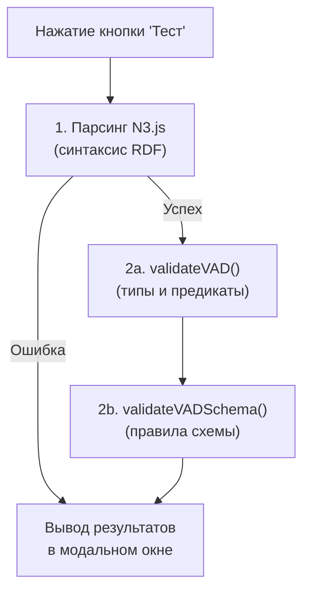

<!-- Ссылка на issue: https://github.com/bpmbpm/rdf-grapher/issues/272 -->
<!-- Pull Request: https://github.com/bpmbpm/rdf-grapher/pull/273 -->
<!-- Дата: 2026-02-04 -->

# Сводный перечень проверок по кнопке "Тест"

Данный документ содержит полный перечень проверок, выполняемых по кнопке **"Тест"** в окне "RDF данные" (модуль `2_triplestore`).

## 1. Обзор механизма проверки

### 1.1 Точка входа

**Кнопка:** "Тест" в заголовке окна "RDF данные"

**Функция:** `testRdfValidation()`

**Модуль:** `ver9c/2_triplestore/2_triplestore_test/2_triplestore_test_logic.js`

### 1.2 Два этапа проверки

Проверка выполняется в два последовательных этапа:

1. **Синтаксическая валидация** — парсинг через N3.js
2. **Семантическая валидация** — проверка правил VAD онтологии и VAD схемы



## 2. Полный перечень проверок

### 2.1 Синтаксическая проверка (N3.js)

| № | Проверка | Описание | Модуль |
|---|----------|----------|--------|
| 1 | **Синтаксис RDF** | Проверка корректности синтаксиса данных в формате TriG/Turtle/N-Triples/N-Quads через парсер N3.js | `2_triplestore_test_logic.js` |

**Обнаруживаемые ошибки:**
- Незакрытые скобки `{}`, `[]`, `()`
- Отсутствующие точки `.` в конце триплетов
- Некорректные URI (невалидные символы)
- Ошибки в литералах (незакрытые кавычки)
- Неопределённые префиксы
- Синтаксические ошибки в GRAPH блоках

---

### 2.2 Валидация VAD онтологии (validateVAD)

| № | Проверка | Описание | Модуль |
|---|----------|----------|--------|
| 2 | **Допустимость типов** | Проверка, что все типы (`rdf:type`) соответствуют списку `VAD_ALLOWED_TYPES` | `2_triplestore_logic.js` |
| 3 | **Допустимость предикатов** | Проверка, что все предикаты соответствуют списку `VAD_ALLOWED_PREDICATES` | `2_triplestore_logic.js` |

**Допустимые типы (VAD_ALLOWED_TYPES):**
- `vad:TypeProcess` — тип процесса
- `vad:TypeExecutor` — тип исполнителя
- `vad:ExecutorGroup` — группа исполнителей
- `vad:VADProcessDia` — схема процесса (TriG)
- `vad:ObjectTree`, `vad:ProcessTree`, `vad:ExecutorTree` — деревья
- `vad:TechTree`, `vad:TechnoTree` — технологические деревья
- `vad:Detailed`, `vad:DetailedChild`, `vad:DetailedExternal` — подтипы детализированных процессов
- `vad:notDetailed`, `vad:notDetailedChild`, `vad:notDetailedExternal` — подтипы не детализированных
- `vad:NotDefinedType` — не определённый тип

**Допустимые предикаты (VAD_ALLOWED_PREDICATES):**
- `rdf:type`, `rdfs:label`, `dcterms:description`
- `vad:hasNext`, `vad:hasExecutor`, `vad:hasParentObj`
- `vad:includes`, `vad:processSubtype`, `vad:hasTrig`
- `vad:hasParentProcess`, `vad:definesProcess`, `vad:isSubprocessTrig`

---

### 2.3 Валидация правил VAD схемы (validateVADSchema)

**Модуль:** `ver9c/2_triplestore/2_triplestore_validation.js`

| № | Правило | Описание | Серьёзность |
|---|---------|----------|-------------|
| 4 | **processesHaveIsSubprocessTrig** | Каждый индивид процесса (`vad:TypeProcess`) в VADProcessDia должен иметь предикат `vad:isSubprocessTrig` | error |
| 5 | **processesHaveExecutor** | Каждый индивид процесса в VADProcessDia должен иметь предикат `vad:hasExecutor` (связь с группой исполнителей) | error |
| 6 | **executorGroupsInCorrectGraph** | `ExecutorGroup` (`vad:ExecutorGroup`) должен находиться в VADProcessDia графах, а не в `ptree` или `rtree` | error |
| 7 | **processMetadataInPtree** | Метаданные процессов (`rdf:type`, `rdfs:label`, `dcterms:description`, `vad:hasTrig`, `vad:hasParentObj`) должны быть в графе `vad:ptree` | warning |
| 8 | **executorMetadataInRtree** | Метаданные исполнителей (`rdf:type`, `rdfs:label`, `vad:hasParentObj`) должны быть в графе `vad:rtree` | warning |
| 9 | **vadProcessDiaHasParentObj** | Все схемы процессов (`vad:VADProcessDia`) должны иметь `vad:hasParentObj`, указывающий на концепт процесса | error |
| 10 | **objectTreeHasParentObj** | Деревья объектов (`vad:ObjectTree`, `ProcessTree`, `ExecutorTree`) должны иметь `vad:hasParentObj = vad:root` | error |
| 11 | **processConceptsHaveParentObj** | Все концепты процессов в `ptree` должны иметь предикат `vad:hasParentObj` | error |
| 12 | **executorConceptsHaveParentObj** | Все концепты исполнителей в `rtree` должны иметь предикат `vad:hasParentObj` | error |

## 3. Подробное описание каждой проверки

### 3.1 Проверка синтаксиса RDF (№1)

**Что проверяется:**
- Корректность синтаксиса RDF данных согласно спецификации W3C
- Парсинг выполняется библиотекой N3.js

**Пример ошибки:**
```
❌ ОШИБКА СИНТАКСИСА RDF
Expected entity but got } on line 15 at position 2
```

**Как исправить:**
- Проверить синтаксис триплетов
- Убедиться, что все триплеты заканчиваются точкой
- Проверить балансировку скобок

---

### 3.2 processesHaveIsSubprocessTrig (№4)

**Правило:** Каждый индивид процесса в схеме VADProcessDia должен быть явно привязан к своему TriG через предикат `vad:isSubprocessTrig`.

**Проверяемое условие:**
```sparql
# Для каждого процесса в VADProcessDia (не в ptree/rtree)
?process rdf:type vad:TypeProcess .
# Должен существовать триплет:
?process vad:isSubprocessTrig ?trig .
```

**Пример ошибки:**
```
Процесс vad:p1.1 должен иметь предикат vad:isSubprocessTrig
```

**Как исправить:**
```trig
GRAPH vad:t_p1 {
    vad:p1.1 vad:isSubprocessTrig vad:t_p1 .  # Добавить эту строку
    vad:p1.1 vad:hasExecutor vad:ExecutorGroup_p1.1 .
}
```

---

### 3.3 processesHaveExecutor (№5)

**Правило:** Каждый индивид процесса должен быть связан с группой исполнителей.

**Проверяемое условие:**
```sparql
# Для каждого процесса с isSubprocessTrig
?process vad:isSubprocessTrig ?trig .
# Должен существовать триплет:
?process vad:hasExecutor ?executorGroup .
```

**Пример ошибки:**
```
Процесс vad:p1.1 должен иметь предикат vad:hasExecutor
```

**Как исправить:**
```trig
GRAPH vad:t_p1 {
    vad:p1.1 vad:hasExecutor vad:ExecutorGroup_p1.1 .  # Добавить эту строку

    vad:ExecutorGroup_p1.1 rdf:type vad:ExecutorGroup .
    vad:ExecutorGroup_p1.1 rdfs:label "Группа исполнителей p1.1" .
}
```

---

### 3.4 executorGroupsInCorrectGraph (№6)

**Правило:** Группы исполнителей должны определяться внутри схем процессов (VADProcessDia), а не в деревьях концептов.

**Проверяемое условие:**
```sparql
# ExecutorGroup НЕ должен быть в ptree или rtree
?group rdf:type vad:ExecutorGroup .
# Граф НЕ должен содержать 'ptree' или 'rtree'
```

**Пример ошибки:**
```
ExecutorGroup vad:ExecutorGroup_p1 не должен находиться в ptree или rtree
Граф: vad:ptree
```

**Как исправить:**
- Переместить определение ExecutorGroup из `ptree`/`rtree` в соответствующий VADProcessDia граф

---

### 3.5 processMetadataInPtree (№7)

**Правило:** Метаданные концептов процессов должны храниться в графе `vad:ptree`.

**Проверяемые предикаты:**
- `rdf:type`
- `rdfs:label`
- `dcterms:description`
- `vad:hasTrig`
- `vad:hasParentObj`

**Пример предупреждения:**
```
Метаданные процесса vad:p1 должны находиться в графе vad:ptree
Предикат: rdfs:label
Граф: vad:t_p1
```

---

### 3.6 executorMetadataInRtree (№8)

**Правило:** Метаданные концептов исполнителей должны храниться в графе `vad:rtree`.

**Проверяемые предикаты:**
- `rdf:type`
- `rdfs:label`
- `vad:hasParentObj`

---

### 3.7 vadProcessDiaHasParentObj (№9)

**Правило:** Каждая схема процесса должна указывать на свой концепт-родитель.

**Исключение:** TechnoTree графы не требуют `hasParentObj`.

**Пример ошибки:**
```
VADProcessDia vad:t_p1 должен иметь предикат vad:hasParentObj, указывающий на концепт процесса
```

**Как исправить:**
```trig
vad:t_p1 rdf:type vad:VADProcessDia .
vad:t_p1 rdfs:label "Схема процесса p1" .
vad:t_p1 vad:hasParentObj vad:p1 .  # Добавить эту строку
```

---

### 3.8 objectTreeHasParentObj (№10)

**Правило:** Деревья объектов должны быть привязаны к корневому элементу `vad:root`.

**Пример ошибки:**
```
ObjectTree vad:ptree должен иметь предикат vad:hasParentObj, указывающий на vad:root
```

**Как исправить:**
```trig
vad:ptree rdf:type vad:ProcessTree .
vad:ptree rdfs:label "Дерево процессов" .
vad:ptree vad:hasParentObj vad:root .  # Добавить эту строку
```

---

### 3.9 processConceptsHaveParentObj (№11)

**Правило:** Каждый концепт процесса в иерархии должен иметь родителя.

**Пример ошибки:**
```
Концепт процесса vad:p1 должен иметь предикат vad:hasParentObj в vad:ptree
```

**Как исправить:**
```trig
GRAPH vad:ptree {
    vad:p1 rdf:type vad:TypeProcess .
    vad:p1 rdfs:label "Процесс 1" .
    vad:p1 vad:hasParentObj vad:ptree .  # Добавить эту строку (корневой процесс)
    # или
    vad:p1 vad:hasParentObj vad:pGA .    # Для дочернего процесса
}
```

---

### 3.10 executorConceptsHaveParentObj (№12)

**Правило:** Каждый концепт исполнителя в иерархии должен иметь родителя.

**Пример ошибки:**
```
Концепт исполнителя vad:Executor1 должен иметь предикат vad:hasParentObj в vad:rtree
```

## 4. Результаты проверки

### 4.1 Успешная валидация

```
✅ ВАЛИДАЦИЯ УСПЕШНА

RDF данные полностью соответствуют правилам VAD онтологии и схемы.

Всего триплетов: 245
Префиксов: 5
```

### 4.2 Ошибки валидации

```
❌ ОШИБКИ ВАЛИДАЦИИ

ПРОВЕРКА ТИПОВ И ПРЕДИКАТОВ
═══════════════════════════════════════

Триплет 1:
  vad:unknown_type — недопустимый тип: vad:UnknownType
  Допустимые типы: vad:TypeProcess, vad:TypeExecutor, ...

ПРОВЕРКА ПРАВИЛ VAD СХЕМЫ
═══════════════════════════════════════

❌ ОШИБКИ (2):

1. vad:p1.1
   Правило: processesHaveIsSubprocessTrig
   Процесс должен иметь предикат vad:isSubprocessTrig

2. vad:t_p1
   Правило: vadProcessDiaHasParentObj
   VADProcessDia должен иметь предикат vad:hasParentObj, указывающий на концепт процесса

⚠️  ПРЕДУПРЕЖДЕНИЯ (1):

1. vad:p1
   Правило: processMetadataInPtree
   Метаданные процесса должны находиться в графе vad:ptree
   Граф: vad:t_p1
```

## 5. Связанные документы

- [2_triplestore.md](2_triplestore.md) — описание модуля хранилища RDF данных
- [quadstore_io.md](quadstore_io.md) — взаимодействие с quadstore
- [algorithm/io_concept_individ_v3.md](algorithm/io_concept_individ_v3.md) — алгоритмы создания и удаления концептов

---

*Документ создан в рамках PR #273 по issue #272*
