# Навигатор онтологии vad-basic-ontology_tech_Appendix.ttl

## Обзор

Данный документ представляет навигатор по классам, типам и объектам в технологическом приложении к онтологии VAD. Он отражает структуру взаимосвязей между технологическими классами, предикатами и автоматическими объектами.

## 1. Иерархия классов и типов

### 1.1 Основная иерархия классов

```
vad:Tech (Базовый технологический класс)
├── vad:Auto (Автозаполнение)
├── vad:Virtual (Виртуальные TriG-контейнеры)
└── vad:ObjectMethod (Методы объектов)

vad:Detailed (Детализированный процесс)
├── vad:DetailedChild
└── vad:DetailedExternal

vad:notDetailed (Не детализированный процесс)
├── vad:notDetailedChild
└── vad:notDetailedExternal

vad:NotDefinedType (Процесс с неопределённым родителем)
```

### 1.2 Технологические объекты (Tech Objects)

```
vad:ConceptProcessPredicate (Предикаты концептов процессов)
vad:IndividProcessPredicate (Предикаты индивидов процессов)
vad:ConceptExecutorPredicate (Предикаты концептов исполнителей)
vad:ConceptExecutorGroupPredicate (Предикаты групп исполнителей)
vad:ConceptTriGPredicate (Предикаты TriG схем)
vad:ConceptProcessTreePredicate (Предикаты дерева процессов)
vad:ConceptExecutorTreePredicate (Предикаты дерева исполнителей)
```

### 1.3 Автогенерируемые объекты (Auto Objects)

```
vad:AutoIsSubprocessTrig (Автоматическая связь процесса с TriG)
vad:AutoExecutorGroup (Автоматическая группа исполнителей)
vad:AutoNewTrigId (Автоматический ID нового TriG)
vad:AutoNewTrigLabel (Автоматический label нового TriG)
vad:AutoProcessSubtype (Автоматический подтип процесса)
```

### 1.4 Методы объектов (Object Methods)

```
vad:DeleteIndividProcess (Удаление индивида процесса)
vad:DeleteIndividExecutor (Удаление индивида исполнителя)
```

## 2. Таблица взаимосвязей классов, типов и объектов

| Класс/Тип | Родительский класс | Описание | Связанные предикаты | Автогенерируемые свойства |
|-----------|------------------|----------|-------------------|------------------------|
| **vad:Tech** | - | Базовый технологический класс | - | - |
| **vad:Auto** | vad:Tech | Автозаполнение | vad:generatesProperty, vad:generationRule | Да |
| **vad:Virtual** | vad:Tech | Виртуальные TriG-контейнеры | vad:hasParentObj | Нет |
| **vad:ObjectMethod** | vad:Tech | Методы объектов | vad:methodForType, vad:methodFunction | Нет |
| **vad:Detailed** | - | Детализированный процесс | vad:hasNodeStyle, vad:styleLegendLabel | Нет |
| **vad:DetailedChild** | vad:Detailed | Детализированный подпроцесс | vad:hasNodeStyle, vad:styleLegendLabel | Нет |
| **vad:DetailedExternal** | vad:Detailed | Детализированный внешний процесс | vad:hasNodeStyle, vad:styleLegendLabel | Нет |
| **vad:notDetailed** | - | Не детализированный процесс | vad:hasNodeStyle, vad:styleLegendLabel | Нет |
| **vad:notDetailedChild** | vad:notDetailed | Не детализированный подпроцесс | vad:hasNodeStyle, vad:styleLegendLabel | Нет |
| **vad:notDetailedExternal** | vad:notDetailed | Не детализированный внешний процесс | vad:hasNodeStyle, vad:styleLegendLabel | Нет |
| **vad:NotDefinedType** | - | Процесс с неопределённым родителем | vad:hasNodeStyle, vad:styleLegendLabel | Нет |

## 3. Технологические объекты и их предикаты

### 3.1 Предикаты концептов процессов

**vad:ConceptProcessPredicate**
- **Контекст:** vad:ProcessTree (vad:ptree)
- **Предикаты:**
  - `rdf:type` - тип объекта
  - `rdfs:label` - название процесса
  - `dcterms:description` - описание процесса
  - `vad:hasParentObj` - родительский элемент
  - `vad:hasTrig` - ссылка на TriG-схему детализации

### 3.2 Предикаты индивидов процессов

**vad:IndividProcessPredicate**
- **Контекст:** vad:VADProcessDia
- **Предикаты:**
  - `vad:isSubprocessTrig` - связь с TriG (авто)
  - `vad:hasExecutor` - группа исполнителей (авто)
  - `vad:processSubtype` - подтип процесса
  - `vad:hasNext` - следующий процесс в цепочке
- **Автогенерируемые:** `vad:isSubprocessTrig`, `vad:hasExecutor`

### 3.3 Предикаты концептов исполнителей

**vad:ConceptExecutorPredicate**
- **Контекст:** vad:ExecutorTree (vad:rtree)
- **Предикаты:**
  - `rdf:type` - тип объекта
  - `rdfs:label` - название исполнителя
  - `vad:hasParentObj` - родительский элемент

### 3.4 Предикаты групп исполнителей

**vad:ConceptExecutorGroupPredicate**
- **Контекст:** vad:VADProcessDia
- **Предикаты:**
  - `rdf:type` - тип объекта (авто)
  - `rdfs:label` - название группы (авто)
  - `vad:includes` - включённые исполнители
- **Автогенерируемые:** `rdf:type`, `rdfs:label`

### 3.5 Предикаты TriG схем

**vad:ConceptTriGPredicate**
- **Контекст:** vad:VADProcessDia
- **Предикаты:**
  - `rdf:type` - тип объекта (авто)
  - `rdfs:label` - название схемы (авто)
  - `vad:hasParentObj` - родительский TriG (авто)
  - `vad:definesProcess` - связь с процессом (авто)
- **Автогенерируемые:** все предикаты

## 4. Схема взаимосвязей (Mermaid)

### 4.1 Иерархия классов

```mermaid
graph TD
    %% Базовые технологические классы
    Tech[vad:Tech] --> Auto[vad:Auto]
    Tech --> Virtual[vad:Virtual]
    Tech --> ObjectMethod[vad:ObjectMethod]
    
    %% Процессные подтипы
    Detailed[vad:Detailed] --> DetailedChild[vad:DetailedChild]
    Detailed --> DetailedExternal[vad:DetailedExternal]
    
    notDetailed[vad:notDetailed] --> notDetailedChild[vad:notDetailedChild]
    notDetailed --> notDetailedExternal[vad:notDetailedExternal]
    
    NotDefinedType[vad:NotDefinedType]
    
    %% Технологические объекты
    ConceptProcessPredicate[vad:ConceptProcessPredicate]
    IndividProcessPredicate[vad:IndividProcessPredicate]
    ConceptExecutorPredicate[vad:ConceptExecutorPredicate]
    ConceptExecutorGroupPredicate[vad:ConceptExecutorGroupPredicate]
    ConceptTriGPredicate[vad:ConceptTriGPredicate]
    
    %% Автогенерируемые объекты
    Auto --> AutoIsSubprocessTrig[vad:AutoIsSubprocessTrig]
    Auto --> AutoExecutorGroup[vad:AutoExecutorGroup]
    Auto --> AutoNewTrigId[vad:AutoNewTrigId]
    Auto --> AutoNewTrigLabel[vad:AutoNewTrigLabel]
    Auto --> AutoProcessSubtype[vad:AutoProcessSubtype]
    
    %% Методы объектов
    ObjectMethod --> DeleteIndividProcess[vad:DeleteIndividProcess]
    ObjectMethod --> DeleteIndividExecutor[vad:DeleteIndividExecutor]
    
    %% Стили
    classDef baseClass fill:#e3f2fd
    classDef processClass fill:#e8f5e8
    classDef techObject fill:#fff3e0
    classDef autoObject fill:#fce4ec
    classDef methodClass fill:#f3e5f5
    
    class Tech,Auto,Virtual,ObjectMethod baseClass
%%  class,Detailed,DetailedChild,DetailedExternal,notDetailed,notDetailedChild,notDetailedExternal,NotDefinedType processClass
class Detailed,DetailedChild,DetailedExternal,notDetailed,notDetailedChild,notDetailedExternal,NotDefinedType processClass
    class ConceptProcessPredicate,IndividProcessPredicate,ConceptExecutorPredicate,ConceptExecutorGroupPredicate,ConceptTriGPredicate techObject
    class AutoIsSubprocessTrig,AutoExecutorGroup,AutoNewTrigId,AutoNewTrigLabel,AutoProcessSubtype autoObject
    class DeleteIndividProcess,DeleteIndividExecutor methodClass
```



[mermaid.live](https://mermaid.live/edit#pako:eNrFVs1q20AQfhWxJbdN8K_i6FAoTgiBJg3U9NDaB1kaxSqyZORVmjQEEpe20Fzae6G0T5D-mJqkSV5h9UYdrSRbK8mht8oYa-f3m9HMZ50QwzOBaOTA10cDpbPZdRW8VlYU_olf8t_8lv8IL_hUCSd8Gr7lNyi4xu9PPgvfo-ScX_EZqvHnml-G5_i5iEN0wBi8ONRNLbrpKaurD5VHAfOEKLrpLcyE8pnts0B3hD65z5s86b8Eg-0CG3imsMsKEuMF_i_hGb8N30UgEeaNqILfIfZfWMuM36VAN4HptgNxxPQQA05P7YHtyHoh6ckBJJetIwa-m9STF0pYXY9JEDLnGEVGsACSF_YKwfK-EqISuQRqL9Jbtgtm53gEwkUWFdr97f75uOXfww98yq_CSdr4tucaMGL7vmfAeLzvg2kbOouTLdElWXdc0z60zVLPJbqelHPrCAycQb80aUFZ7rvte8Ho3gCyhRyl49vbpc6SotDlj7iOE9HfKfZ6iiM-C8_CN3j6Ew94SZ-jbZvv3874adAfxc3BVAfzfcwreiXOUmFzT0la5rYHr6KIO-bcZS65x_yx3gcn7yGEZU7J88YaWDqwRXGhnZ-xhRNBCRdS6yLai62yFJMsuAMM5ClLlryo6P1LkLR_xSippoD7q6Cwaz6LRYajj8e4nEpfH0M7OiiW7TjaA6hbNcvMGSUPWbJrWU1o5ewY8m6MPLGyLKsOlZyVjgBlKwMaYOSshqL2bEoM1bSa2cKEsWB7Gj06mvwLUKl78wq7LjYi9aIpmVGJFGme42iG92ieQmkJKVKZ9aTedd0Y8f_JvejYEq6kS5iQLqM5ei990TJ-ysxIFlEZn9ACVVCJCWh-y2lxfzPDlk1Xtnm0dJGyc0govvTYJtGYHwAlQ_CHenQkJ1HsLmEDGEKXaHhrgqUHDuuSrnuKbiPdfe55w9QTazkYEM3SnTGegpGJjdm0dXyjWpiAa4Lf9gKXEa2lihBEOyFHRFuttRprjWq1ojbqeDWrVUqOiVatVNYqrZbarDRq66paV08peS2S1tbWW-u1jdpGU63WK6qqNinBx4HV7cavcuKN7vQvc_HD4g)

### 4.2 Связи предикатов с контекстами

```mermaid
graph LR
    %% Контексты TriG
    ptree[vad:ptree<br/>ProcessTree]
    rtree[vad:rtree<br/>ExecutorTree]
    vaddiag[vad:VADProcessDia<br/>Process Schema]
    
    %% Технологические объекты
    ConceptProcessPredicate[vad:ConceptProcessPredicate]
    ConceptExecutorPredicate[vad:ConceptExecutorPredicate]
    IndividProcessPredicate[vad:IndividProcessPredicate]
    ConceptExecutorGroupPredicate[vad:ConceptExecutorGroupPredicate]
    ConceptTriGPredicate[vad:ConceptTriGPredicate]
    
    %% Связи
    ptree --> ConceptProcessPredicate
    rtree --> ConceptExecutorPredicate
    vaddiag --> IndividProcessPredicate
    vaddiag --> ConceptExecutorGroupPredicate
    vaddiag --> ConceptTriGPredicate
    
    %% Предикаты
    Predicates_P[Предикаты:<br/>rdf:type, rdfs:label<br/>dcterms:description<br/>vad:hasParentObj, vad:hasTrig]
    Predicates_E[Предикаты:<br/>rdf:type, rdfs:label<br/>vad:hasParentObj]
    Predicates_IP[Предикаты:<br/>vad:isSubprocessTrig(а)<br/>vad:hasExecutor(а)<br/>vad:processSubtype<br/>vad:hasNext]
    Predicates_EG[Предикаты:<br/>rdf:type(а), rdfs:label(а)<br/>vad:includes]
    Predicates_T[Предикаты:<br/>rdf:type(а), rdfs:label(а)<br/>vad:hasParentObj(а)<br/>vad:definesProcess(а)]
    
    ConceptProcessPredicate --> Predicates_P
    ConceptExecutorPredicate --> Predicates_E
    IndividProcessPredicate --> Predicates_IP
    ConceptExecutorGroupPredicate --> Predicates_EG
    ConceptTriGPredicate --> Predicates_T
    
    %% Стили
    classDef contextClass fill:#e1f5fe
    classDef techObjectClass fill:#fff3e0
    classDef predicateClass fill:#f1f8e9
    
    class ptree,rtree,vaddiag contextClass
    class ConceptProcessPredicate,ConceptExecutorPredicate,IndividProcessPredicate,ConceptExecutorGroupPredicate,ConceptTriGPredicate techObjectClass
    class Predicates_P,Predicates_E,Predicates_IP,Predicates_EG,Predicates_T predicateClass
```

## 5. Детальное описание объектов

### 5.1 Автогенерируемые объекты

#### vad:AutoIsSubprocessTrig
- **Генерируемый предикат:** `vad:isSubprocessTrig`
- **Правило генерации:** При создании нового индивида процесса автоматически добавляется триплет: `{процесс} vad:isSubprocessTrig {текущий_TriG}`

#### vad:AutoExecutorGroup
- **Генерируемый предикат:** `vad:hasExecutor`
- **Правило генерации:** При создании нового индивида процесса автоматически создаётся ExecutorGroup с id `vad:ExecutorGroup_{processId}`

#### vad:AutoNewTrigId
- **Генерируемый предикат:** `rdf:ID`
- **Правило генерации:** ID нового TriG формируется как `t_{processId}` на основе выбранного концепта процесса

#### vad:AutoNewTrigLabel
- **Генерируемый предикат:** `rdfs:label`
- **Правило генерации:** rdfs:label нового TriG формируется как `'Схема t_{processId} процесса {processLabel}'`

#### vad:AutoProcessSubtype
- **Генерируемый предикат:** `vad:processSubtype`
- **Правило генерации:** Вычисляется автоматически на основе hasTrig и hasParentObj

### 5.2 Подтипы процессов

#### vad:DetailedChild
- **Условие:** индивид процесса находится в схеме родительского процесса
- **Визуальный стиль:** голубая заливка (#90CAF9) с синей рамкой (#1565C0)
- **Пример:** процесс `vad:p1.1.1` в TriG `vad:t_p1.1`, где `vad:t_p1.1` имеет родителя `vad:p1.1`

#### vad:DetailedExternal
- **Условие:** индивид процесса находится во внешней схеме (не родительской)
- **Визуальный стиль:** синяя заливка (#64B5F6) с тёмно-синей рамкой (#0D47A1)

#### vad:notDetailedChild
- **Условие:** процесс без детализации, находящийся в схеме родительского процесса
- **Визуальный стиль:** зелёная заливка (#A5D6A7) с тёмно-зелёной рамкой (#2E7D32)

#### vad:notDetailedExternal
- **Условие:** процесс без детализации, находящийся во внешней схеме
- **Визуальный стиль:** светло-зелёная заливка (#C8E6C9) с тёмно-зелёной рамкой (#1B5E20)

#### vad:NotDefinedType
- **Условие:** `vad:hasParentObj = vad:pNotDefined`
- **Визуальный стиль:** серая заливка (#BDBDBD) с пунктирной рамкой (#616161)

## 6. Предикаты связывания

### 6.1 Предикаты включения

#### vad:includePredicate
- **Домен:** `vad:Tech`
- **Диапазон:** `rdf:Property`
- **Назначение:** Связывает технологический объект с предикатами, которые он включает

#### vad:autoGeneratedPredicate
- **Домен:** `vad:Tech`
- **Диапазон:** `rdf:Property`
- **Назначение:** Указывает предикаты, генерируемые автоматически

### 6.2 Предикаты методов

#### vad:methodForType
- **Домен:** `vad:ObjectMethod`
- **Диапазон:** `rdfs:Class`
- **Назначение:** Связывает метод с типом объекта, для которого он доступен

#### vad:methodFunction
- **Домен:** `vad:ObjectMethod`
- **Диапазон:** `xsd:string`
- **Назначение:** Идентификатор JavaScript функции для вызова метода

### 6.3 Предикаты контекста

#### vad:contextTriGType
- **Домен:** `vad:Tech`
- **Диапазон:** `rdfs:Class`
- **Назначение:** Указывает тип TriG-контекста для технологического объекта

#### vad:predicateGroupForType
- **Домен:** `rdfs:Class`
- **Диапазон:** `vad:Tech`
- **Назначение:** Связывает тип объекта с технологическим объектом, определяющим группу предикатов

## 7. Правила использования

### 7.1 Ключевые правила Smart Design

1. **Правило добавления триплетов:** Только в TriG
2. **Разделение свойств процесса:** Концептуальные (ptree) и индивидуальные (VADProcessDia)
3. **Автоматическое создание связанных объектов:** ExecutorGroup при создании индивида процесса
4. **Определение исполнителей:** Разово в vad:rtree
5. **Автоматическое создание групп исполнителей:** `vad:ExecutorGroup_{processId}`
6. **Создание нового TriG:** На основе концепта процесса с ID `t_{processId}`

### 7.2 Виртуальные данные

- **Имя формата:** `vt_{processId}` (v = virtual, t = trig)
- **Обязательный предикат:** `vad:hasParentObj` для связи с родительским VADProcessDia
- **Правило удаления:** При удалении VADProcessDa удаляется связанный Virtual TriG

## 8. Технологические деревья

### 8.1 Структура

```
vad:techroot (Корень технологического дерева)
└── vad:techtree (Дерево технологических данных)
    ├── Технологические классы (vad:Tech, vad:Auto, vad:Virtual)
    ├── Группы предикатов (Concept*Predicate, Individ*Predicate)
    └── Подтипы процессов (Detailed*, notDetailed*, NotDefinedType)
```

### 8.2 Особенности

- Деревья типа `vad:TechnoTree` не отображаются в treeview окна Publisher
- Данные techtree загружаются при старте и добавляются в общий quadstore
- При сохранении через "Сохранить как" данные techtree исключаются из файла

## 9. Интеграция с кодом

### 9.1 Связь с JavaScript константами

- `PTREE_PREDICATES` - предикаты из `vad:ConceptProcessPredicate`
- `RTREE_PREDICATES` - предикаты из `vad:ConceptExecutorPredicate`
- `VAD_ALLOWED_PREDICATES` - все разрешенные предикаты VAD

### 9.2 Использование в Smart Design

1. **Выбор TriG = vad:ptree**
   - Subject Type: TypeProcess, ProcessTree
   - Predicate: из `vad:ConceptProcessPredicate`

2. **Выбор TriG = vad:rtree**
   - Subject Type: TypeExecutor, ExecutorTree
   - Predicate: из `vad:ConceptExecutorPredicate`

3. **Выбор TriG = VADProcessDia**
   - Subject Type: TypeProcess, ExecutorGroup, VADProcessDia
   - Predicate: из соответствующих технологических объектов

---

*Документ создан для решения задачи #342: создание навигатора по онтологии VAD*
