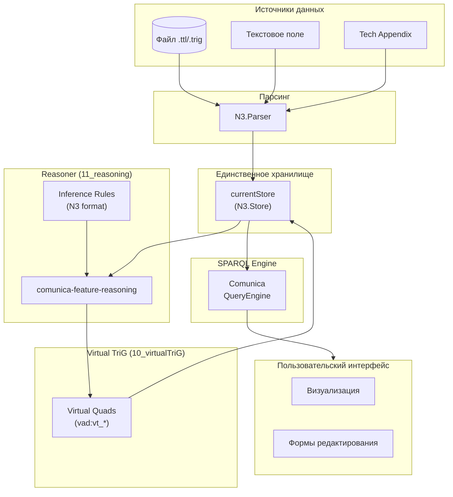
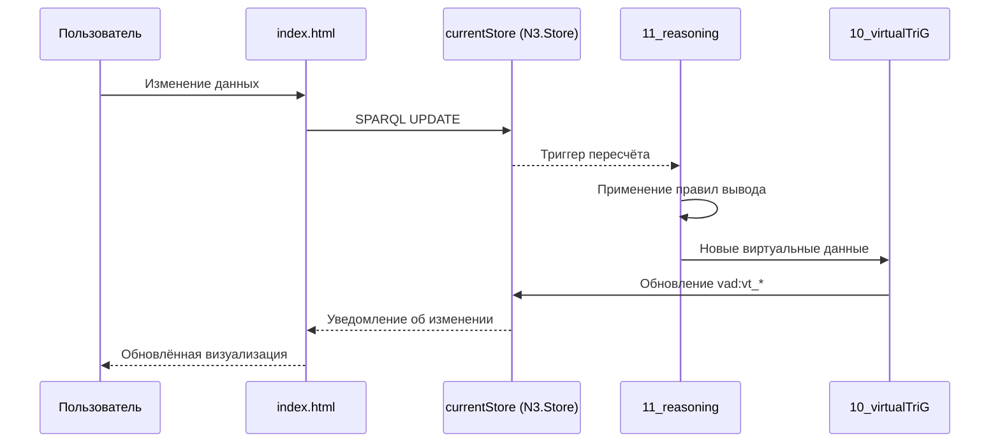

# Концептуальные правила Идеального Quadstore (Linked Data)

<!-- Ссылка на issue: https://github.com/bpmbpm/rdf-grapher/issues/317 -->
<!-- Дата создания: 2026-02-08 -->

## Содержание

1. [Введение](#1-введение)
2. [Принципы Идеального Quadstore](#2-принципы-идеального-quadstore)
3. [Правила хранения данных](#3-правила-хранения-данных)
4. [Правила Virtual TriG](#4-правила-virtual-trig)
5. [SPARQL-driven подход](#5-sparql-driven-подход)
6. [Запрещённые паттерны](#6-запрещённые-паттерны)
7. [Схема архитектуры](#7-схема-архитектуры)

---

## 1. Введение

Данный документ определяет концептуальные правила для реализации **Идеального Quadstore** в проекте RDF Grapher ver9d. Эти правила направлены на создание чистой архитектуры Linked Data без дублирующих объектов хранения.

**Ключевой принцип:** Приоритет декларативного SPARQL над императивным JavaScript.

---

## 2. Принципы Идеального Quadstore

### 2.1 Единственное хранилище

**Правило 1:** В системе должно существовать только одно хранилище RDF-данных — `currentStore` (N3.Store).

```javascript
// ПРАВИЛЬНО: Единственный источник данных
const currentStore = new N3.Store();

// НЕПРАВИЛЬНО: Дублирование данных
let currentQuads = []; // Запрещено
let virtualRDFdata = {}; // Запрещено
```

### 2.2 Только TriG в хранилище

**Правило 2:** В Идеальном Quadstore хранятся только данные в формате TriG (именованные графы). Отдельные RDF-триплеты вне TriG недопустимы.

```turtle
# ПРАВИЛЬНО: Данные в именованном графе
vad:ptree {
    vad:p1 rdf:type vad:TypeProcess .
    vad:p1 rdfs:label "Процесс 1" .
}

# НЕПРАВИЛЬНО: Триплеты в default graph
vad:p1 rdf:type vad:TypeProcess .  # Запрещено
```

### 2.3 SPARQL-first подход

**Правило 3:** Все операции с данными выполняются через SPARQL. JavaScript используется только для координации и UI.

| Операция | Запрещённый подход | Правильный подход |
|----------|-------------------|-------------------|
| Чтение данных | `currentQuads.filter()` | SPARQL SELECT |
| Фильтрация | `Array.filter()` | SPARQL WHERE + FILTER |
| Проверка существования | `Array.some()` | SPARQL ASK |
| Модификация | Ручное изменение массива | SPARQL UPDATE |
| Агрегация | `Array.reduce()` | SPARQL COUNT/GROUP BY |

---

## 3. Правила хранения данных

### 3.1 Структура графов

**Правило 4:** Каждый граф должен иметь чётко определённый тип и родителя (кроме корневых графов).

| Граф | Тип | hasParentObj | Описание |
|------|-----|--------------|----------|
| `vad:root` | `vad:TechTree` | null | Корень пользовательских данных |
| `vad:techroot` | `vad:TechTree` | null | Корень технологических данных |
| `vad:ptree` | `vad:ObjectTree` | `vad:root` | Дерево концептов процессов |
| `vad:rtree` | `vad:ObjectTree` | `vad:root` | Дерево концептов исполнителей |
| `vad:techtree` | `vad:TechnoTree` | `vad:techroot` | Технологическая онтология |
| `vad:t_*` | `vad:VADProcessDia` | `vad:ptree` или `vad:t_*` | Схемы процессов |
| `vad:vt_*` | `vad:Virtual` | `vad:t_*` | Виртуальные вычисляемые данные |

### 3.2 Правило именования Virtual TriG

**Правило 5:** Виртуальные графы именуются по формату `vt_{processId}` (v = virtual, t = trig).

```turtle
# Физический граф схемы процесса p1
vad:t_p1 {
    vad:t_p1 rdf:type vad:VADProcessDia ;
        rdfs:label "Схема процесса p1" ;
        vad:definesProcess vad:p1 ;
        vad:hasParentObj vad:ptree .
}

# Виртуальный граф с вычисляемыми данными для t_p1
vad:vt_p1 {
    vad:vt_p1 rdf:type vad:Virtual ;
        vad:hasParentObj vad:t_p1 .

    vad:p1_1 vad:processSubtype vad:DetailedChild .
    vad:p1_2 vad:processSubtype vad:notDetailedChild .
}
```

### 3.3 Правило связи Virtual TriG

**Правило 6:** Каждый Virtual TriG (`vad:vt_*`) ОБЯЗАН иметь:
- `rdf:type vad:Virtual` — для SPARQL-проверки типа
- `vad:hasParentObj` — ссылку на родительский физический TriG (`vad:t_*`)

---

## 4. Правила Virtual TriG

### 4.1 Вычисление через Reasoner

**Правило 7:** Виртуальные данные (vad:processSubtype) вычисляются через механизм Reasoner, а не императивным JavaScript-кодом.

```javascript
// ЗАПРЕЩЕНО: Императивное вычисление
function calculateProcessSubtypes(hierarchy, prefixes) {
    // Проход по массивам в JavaScript
    ptreeInfo.quads.forEach(quad => {
        // Логика определения подтипов
    });
}

// ПРАВИЛЬНО: Декларативные правила вывода
const INFERENCE_RULES = `
{
    ?process rdf:type vad:TypeProcess .
    ?process vad:hasTrig ?trig .
} => {
    ?process vad:processSubtype vad:Detailed .
} .
`;
```

### 4.2 Пересчёт Virtual TriG

**Правило 8:** Пересчёт Virtual TriG выполняется при каждом изменении quadstore через механизм Reasoner.

**Типы изменений, влияющие на Virtual TriG:**

| Тип изменения | Влияние на Virtual TriG |
|---------------|------------------------|
| Добавление индивида в VADProcessDia | Пересчёт vad:processSubtype |
| Изменение vad:hasTrig в ptree | Пересчёт Detailed/notDetailed |
| Изменение vad:hasParentObj в ptree | Пересчёт Child/External |
| Удаление VADProcessDia | Удаление соответствующего vt_* |
| Добавление VADProcessDia | Создание нового vt_* |

### 4.3 Удаление Virtual TriG

**Правило 9:** При удалении физического TriG (`vad:t_*`) ДОЛЖЕН автоматически удаляться соответствующий виртуальный TriG (`vad:vt_*`).

```sparql
# Каскадное удаление Virtual TriG при удалении VADProcessDia
DELETE {
    GRAPH ?virtualGraph { ?s ?p ?o }
}
WHERE {
    GRAPH ?virtualGraph {
        ?virtualGraph rdf:type vad:Virtual ;
            vad:hasParentObj <http://example.org/vad#t_p1> .
        ?s ?p ?o .
    }
}
```

---

## 5. SPARQL-driven подход

### 5.1 Принципы

**Правило 10:** Согласно концепции SPARQL-driven programming:
- Бизнес-логика описывается декларативно через SPARQL-запросы
- JavaScript используется минимально — только для UI и координации
- Данные и их структура определяются онтологией
- Справочники и формы генерируются динамически на основе метаданных

### 5.2 Замена JavaScript-массивов на SPARQL

| JavaScript-паттерн | SPARQL-эквивалент |
|-------------------|-------------------|
| `currentQuads.filter(q => ...)` | `SELECT WHERE { ... FILTER(...) }` |
| `currentQuads.map(q => ...)` | `SELECT ... WHERE { ... }` |
| `currentQuads.some(q => ...)` | `ASK { ... }` |
| `currentQuads.find(q => ...)` | `SELECT ... WHERE { ... } LIMIT 1` |
| `currentQuads.reduce(...)` | `SELECT (COUNT/SUM/... AS ?result)` |
| `currentQuads.forEach(q => ...)` | `CONSTRUCT { ... } WHERE { ... }` |

### 5.3 Получение данных из Store

**Правило 11:** Для получения всех квадов использовать `currentStore.getQuads()`, а не отдельный массив.

```javascript
// ПРАВИЛЬНО: Получение квадов из Store
function getAllQuads() {
    return currentStore.getQuads(null, null, null, null);
}

// ПРАВИЛЬНО: Фильтрация через Store
function getQuadsByGraph(graphUri) {
    return currentStore.getQuads(null, null, null, graphUri);
}

// НЕПРАВИЛЬНО: Использование отдельного массива
function getAllQuads() {
    return currentQuads; // Запрещено
}
```

---

## 6. Запрещённые паттерны

### 6.1 Дублирующие объекты хранения

**Запрещено:** Создание и использование объектов, дублирующих данные Store.

```javascript
// ЗАПРЕЩЕНО
let currentQuads = [];           // Дубликат Store
let virtualRDFdata = {};         // Должно храниться в vad:vt_*
let nodeTypesCache = {};         // Используйте SPARQL SELECT
let nodeSubtypesCache = {};      // Используйте SPARQL SELECT
let trigHierarchy = {};          // Вычисляйте через SPARQL с hasParentObj*
```

### 6.2 Императивное вычисление данных

**Запрещено:** Вычисление данных, которые могут быть выведены через Reasoner.

```javascript
// ЗАПРЕЩЕНО: Императивное вычисление подтипов
function calculateProcessSubtypes(hierarchy, prefixes) {
    const result = {};
    // ... императивный код ...
    return result;
}

// ПРАВИЛЬНО: Использование Reasoner
async function computeVirtualData() {
    return await reasoner.infer(currentStore, INFERENCE_RULES);
}
```

### 6.3 Гибридный подход

**Запрещено:** "Компромисс: Гибридный подход с синхронными JS-функциями для критичных операций".

Согласно issue #317, необходим классический quadstore (Linked Data), а не гибридный подход. Производительность вторична по отношению к декларативности.

---

## 7. Схема архитектуры

### 7.1 Идеальная архитектура



### 7.2 Поток вычисления Virtual TriG



---

## Источники

- [issue #317: ver9d_1rea1](https://github.com/bpmbpm/rdf-grapher/issues/317)
- [store_concept_v3.md](store/store_concept_v3.md)
- [reasoner_concept_v1.md](reasoner/reasoner_concept_v1.md)
- [SPARQL-driven Programming](../requirements/sparql-driven-programming_min1.md)

---

*Документ создан: 2026-02-08*
*Автор: AI Assistant (Claude Opus 4.5)*
*Версия: 1.0*
*Ссылка на issue: https://github.com/bpmbpm/rdf-grapher/issues/317*
