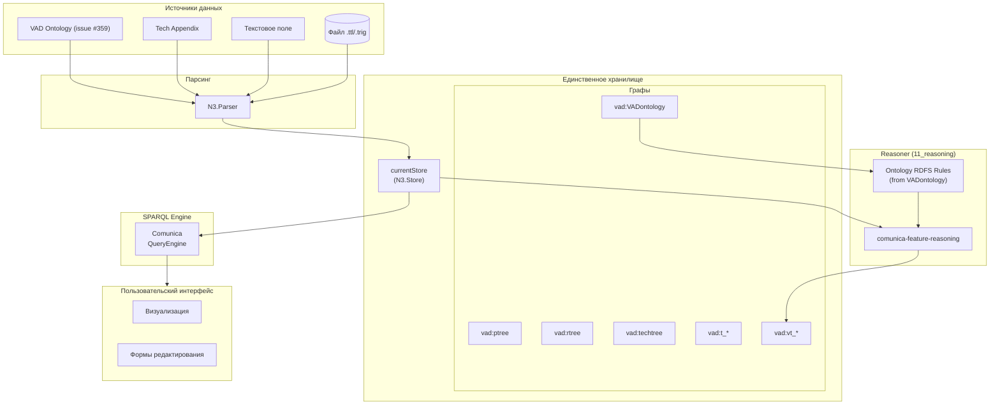
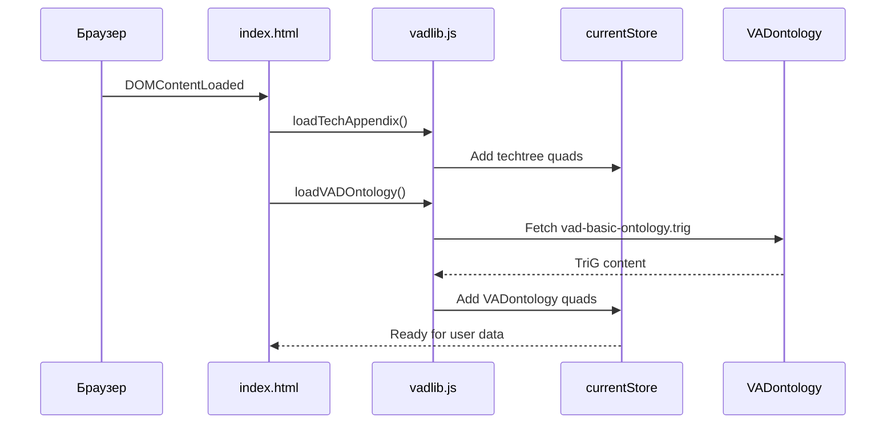

# Концептуальные правила Идеального Quadstore (Linked Data) - Версия 1

<!-- Ссылка на issue: https://github.com/bpmbpm/rdf-grapher/issues/359 -->
<!-- Дата создания: 2026-02-10 -->
<!-- Обновление: https://github.com/bpmbpm/rdf-grapher/issues/317 -->

## Содержание

1. [Введение](#1-введение)
2. [Принципы Идеального Quadstore](#2-принципы-идеального-quadstore)
3. [Правила хранения данных](#3-правила-хранения-данных)
4. [Правила Virtual TriG](#4-правила-virtual-trig)
5. [SPARQL-driven подход](#5-sparql-driven-подход)
6. [Semantic Reasoning](#6-semantic-reasoning)
7. [VADontology Graph](#7-vadontology-graph)
8. [Запрещённые паттерны](#8-запрещённые-паттерны)
9. [Схема архитектуры](#9-схема-архитектуры)

---

## 1. Введение

Данный документ определяет концептуальные правила для реализации **Идеального Quadstore** в проекте RDF Grapher ver9d. Версия 1 расширяет базовые правила поддержкой **полной семантизации** через comunica-feature-reasoning и интеграцию с базовой онтологией VAD.

**Ключевые принципы:**
- Приоритет декларативного SPARQL над императивным JavaScript
- Семантический вывод через онтологию вместо жёстко закодированных констант
- Единственный источник истины — quadstore с онтологией

---

## 2. Принципы Идеального Quadstore

### 2.1 Единственное хранилище

**Правило 1:** В системе должно существовать только одно хранилище RDF-данных — `currentStore` (N3.Store).

```javascript
// ПРАВИЛЬНО: Единственный источник данных
const currentStore = new N3.Store();

// НЕПРАВИЛЬНО: Дублирование данных
let currentQuads = []; // Запрещено
let virtualRDFdata = {}; // Запрещено
```

### 2.2 Только TriG в хранилище

**Правило 2:** В Идеальном Quadstore хранятся только данные в формате TriG (именованные графы). Отдельные RDF-триплеты вне TriG недопустимы.

```turtle
# ПРАВИЛЬНО: Данные в именованном графе
vad:ptree {
    vad:p1 rdf:type vad:TypeProcess .
    vad:p1 rdfs:label "Процесс 1" .
}

# НЕПРАВИЛЬНО: Триплеты в default graph
vad:p1 rdf:type vad:TypeProcess .  # Запрещено
```

### 2.3 SPARQL-first подход

**Правило 3:** Все операции с данными выполняются через SPARQL. JavaScript используется только для координации и UI.

| Операция | Запрещённый подход | Правильный подход |
|----------|-------------------|-------------------|
| Чтение данных | `currentQuads.filter()` | SPARQL SELECT |
| Фильтрация | `Array.filter()` | SPARQL WHERE + FILTER |
| Проверка существования | `Array.some()` | SPARQL ASK |
| Модификация | Ручное изменение массива | SPARQL UPDATE |
| Агрегация | `Array.reduce()` | SPARQL COUNT/GROUP BY |

---

## 3. Правила хранения данных

### 3.1 Структура графов (обновлено issue #359)

**Правило 4:** Каждый граф должен иметь чётко определённый тип и родителя (кроме корневых графов).

| Граф | Тип | hasParentObj | Описание |
|------|-----|--------------|----------|
| `vad:root` | `vad:TechTree` | null | Корень пользовательских данных |
| `vad:techroot` | `vad:TechTree` | null | Корень технологических данных |
| `vad:ptree` | `vad:ObjectTree` | `vad:root` | Дерево концептов процессов |
| `vad:rtree` | `vad:ObjectTree` | `vad:root` | Дерево концептов исполнителей |
| `vad:techtree` | `vad:TechnoTree` | `vad:techroot` | Технологическая онтология |
| **`vad:VADontology`** | **`vad:TechnoTree`** | **`vad:techroot`** | **Базовая онтология VAD (issue #359)** |
| `vad:t_*` | `vad:VADProcessDia` | `vad:ptree` или `vad:t_*` | Схемы процессов |
| `vad:vt_*` | `vad:Virtual` | `vad:t_*` | Виртуальные вычисляемые данные |

### 3.2 Правило именования Virtual TriG

**Правило 5:** Виртуальные графы именуются по формату `vt_{processId}` (v = virtual, t = trig).

```turtle
# Физический граф схемы процесса p1
vad:t_p1 {
    vad:t_p1 rdf:type vad:VADProcessDia ;
        rdfs:label "Схема процесса p1" ;
        vad:definesProcess vad:p1 ;
        vad:hasParentObj vad:ptree .
}

# Виртуальный граф с вычисляемыми данными для t_p1
vad:vt_p1 {
    vad:vt_p1 rdf:type vad:Virtual ;
        vad:hasParentObj vad:t_p1 .

    vad:p1_1 vad:processSubtype vad:DetailedChild .
    vad:p1_2 vad:processSubtype vad:notDetailedChild .
}
```

### 3.3 Правило связи Virtual TriG

**Правило 6:** Каждый Virtual TriG (`vad:vt_*`) ОБЯЗАН иметь:
- `rdf:type vad:Virtual` — для SPARQL-проверки типа
- `vad:hasParentObj` — ссылку на родительский физический TriG (`vad:t_*`)

### 3.4 Правило rdfs:label для ExecutorGroup (issue #359)

**Правило 6а:** Объекты типа `vad:ExecutorGroup` ДОЛЖНЫ иметь `rdfs:label`, вычисляемый через Reasoner на основе `vad:includes`.

```sparql
# SPARQL CONSTRUCT для вычисления rdfs:label ExecutorGroup
CONSTRUCT {
    ?executorGroup rdfs:label ?aggregatedLabel .
}
WHERE {
    ?executorGroup rdf:type vad:ExecutorGroup .
    {
        SELECT ?executorGroup (GROUP_CONCAT(?label; separator=", ") AS ?aggregatedLabel)
        WHERE {
            ?executorGroup vad:includes ?executor .
            ?executor rdfs:label ?label .
        }
        GROUP BY ?executorGroup
    }
}
```

---

## 4. Правила Virtual TriG

### 4.1 Вычисление через Reasoner

**Правило 7:** Виртуальные данные (vad:processSubtype) вычисляются через механизм Reasoner, а не императивным JavaScript-кодом.

```javascript
// ЗАПРЕЩЕНО: Императивное вычисление
function calculateProcessSubtypes(hierarchy, prefixes) {
    // Проход по массивам в JavaScript
    ptreeInfo.quads.forEach(quad => {
        // Логика определения подтипов
    });
}

// ПРАВИЛЬНО: Декларативные правила вывода через онтологию
async function computeVirtualData() {
    return await reasoner.infer(currentStore, getOntologyRDFSRules());
}
```

### 4.2 Пересчёт Virtual TriG

**Правило 8:** Пересчёт Virtual TriG выполняется при каждом изменении quadstore через механизм Reasoner.

| Тип изменения | Влияние на Virtual TriG |
|---------------|------------------------|
| Добавление индивида в VADProcessDia | Пересчёт vad:processSubtype |
| Изменение vad:hasTrig в ptree | Пересчёт Detailed/notDetailed |
| Изменение vad:hasParentObj в ptree | Пересчёт Child/External |
| Удаление VADProcessDia | Удаление соответствующего vt_* |
| Добавление VADProcessDia | Создание нового vt_* |

### 4.3 Удаление Virtual TriG

**Правило 9:** При удалении физического TriG (`vad:t_*`) ДОЛЖЕН автоматически удаляться соответствующий виртуальный TriG (`vad:vt_*`).

---

## 5. SPARQL-driven подход

### 5.1 Принципы

**Правило 10:** Согласно концепции SPARQL-driven programming:
- Бизнес-логика описывается декларативно через SPARQL-запросы
- JavaScript используется минимально — только для UI и координации
- Данные и их структура определяются онтологией
- Справочники и формы генерируются динамически на основе метаданных

### 5.2 Замена JavaScript-массивов на SPARQL

| JavaScript-паттерн | SPARQL-эквивалент |
|-------------------|-------------------|
| `currentQuads.filter(q => ...)` | `SELECT WHERE { ... FILTER(...) }` |
| `currentQuads.map(q => ...)` | `SELECT ... WHERE { ... }` |
| `currentQuads.some(q => ...)` | `ASK { ... }` |
| `currentQuads.find(q => ...)` | `SELECT ... WHERE { ... } LIMIT 1` |
| `currentQuads.reduce(...)` | `SELECT (COUNT/SUM/... AS ?result)` |
| `currentQuads.forEach(q => ...)` | `CONSTRUCT { ... } WHERE { ... }` |

### 5.3 Получение данных из Store

**Правило 11:** Для получения всех квадов использовать `currentStore.getQuads()`, а не отдельный массив.

---

## 6. Semantic Reasoning

### 6.1 Принцип полной семантизации (issue #359)

**Правило 12:** Жёстко закодированные JavaScript-константы ДОЛЖНЫ быть заменены на SPARQL-запросы к онтологии.

| Константа | Замена на SPARQL |
|-----------|-----------------|
| `VAD_ALLOWED_TYPES` | `SELECT ?class WHERE { GRAPH vad:VADontology { ?class rdf:type rdfs:Class } }` |
| `VAD_ALLOWED_PREDICATES` | `SELECT ?prop WHERE { GRAPH vad:VADontology { ?prop rdf:type rdf:Property } }` |
| `PROCESS_SUBTYPES` | `SELECT ?subtype WHERE { GRAPH vad:VADontology { ?subtype rdfs:subClassOf vad:ProcessSubtype } }` |
| `TRIG_TYPES` | `SELECT ?type WHERE { GRAPH vad:VADontology { ?type rdfs:subClassOf vad:TriG } }` |

### 6.2 Comunica Feature Reasoning

**Правило 13:** Для semantic reasoning используется comunica-feature-reasoning с RDFS правилами из онтологии.

```javascript
// Получение RDFS правил из vad:VADontology
async function getOntologyRDFSRules() {
    const rdfsQuads = currentStore.getQuads(
        null,
        'http://www.w3.org/2000/01/rdf-schema#subClassOf',
        null,
        'http://example.org/vad#VADontology'
    );
    return rdfsQuads;
}
```

### 6.3 Иерархия подтипов процессов

Подтипы процессов определяются через RDFS `rdfs:subClassOf` в онтологии:

```turtle
# В графе vad:VADontology
vad:DetailedChild rdfs:subClassOf vad:Detailed .
vad:DetailedExternal rdfs:subClassOf vad:Detailed .
vad:notDetailedChild rdfs:subClassOf vad:notDetailed .
vad:notDetailedExternal rdfs:subClassOf vad:notDetailed .
vad:Detailed rdfs:subClassOf vad:ProcessSubtype .
vad:notDetailed rdfs:subClassOf vad:ProcessSubtype .
vad:NotDefinedType rdfs:subClassOf vad:ProcessSubtype .
```

---

## 7. VADontology Graph

### 7.1 Назначение (issue #359)

**Правило 14:** Граф `vad:VADontology` содержит базовую онтологию VAD и используется для:
- RDFS/OWL reasoning через comunica-feature-reasoning
- Семантического вывода типов и подтипов процессов
- Замены жёстко закодированных констант на SPARQL-запросы

### 7.2 Структура графа

```turtle
vad:VADontology {
    # Метаданные графа
    vad:VADontology rdf:type vad:TechnoTree ;
        rdfs:label "VAD Basic Ontology" ;
        vad:hasParentObj vad:techroot .

    # Классы
    vad:Process rdf:type rdfs:Class .
    vad:TypeProcess rdf:type rdfs:Class .
    vad:VADProcessDia rdf:type rdfs:Class .
    # ... другие классы

    # Свойства
    vad:hasParentObj rdf:type rdf:Property .
    vad:hasTrig rdf:type rdf:Property .
    # ... другие свойства

    # RDFS иерархия для reasoning
    vad:DetailedChild rdfs:subClassOf vad:Detailed .
    vad:DetailedExternal rdfs:subClassOf vad:Detailed .
    # ... другие правила
}
```

### 7.3 Загрузка онтологии

Онтология загружается при старте приложения через функцию `loadVADOntology()`:

```javascript
// При старте приложения
document.addEventListener('DOMContentLoaded', function() {
    loadTechAppendix();       // vad:techtree
    loadVADOntology();        // vad:VADontology (issue #359)
});
```

### 7.4 Файлы онтологии

| Файл | Формат | Граф | Описание |
|------|--------|------|----------|
| `vad-basic-ontology.ttl` | Turtle | — | Исходная онтология |
| `vad-basic-ontology.trig` | TriG | `vad:VADontology` | Онтология для quadstore |
| `vad-basic-ontology_tech_Appendix.ttl` | Turtle | `vad:techtree` | Технологические классы |

---

## 8. Запрещённые паттерны

### 8.1 Дублирующие объекты хранения

**Запрещено:** Создание и использование объектов, дублирующих данные Store.

```javascript
// ЗАПРЕЩЕНО
let currentQuads = [];           // Дубликат Store
let virtualRDFdata = {};         // Должно храниться в vad:vt_*
let nodeTypesCache = {};         // Используйте SPARQL SELECT
let nodeSubtypesCache = {};      // Используйте SPARQL SELECT
```

### 8.2 Жёстко закодированные константы (issue #359)

**Запрещено:** Использование жёстко закодированных массивов типов и предикатов.

```javascript
// ЗАПРЕЩЕНО: Жёстко закодированные константы
const VAD_ALLOWED_TYPES = [
    'vad:TypeProcess', 'vad:ExecutorGroup', ...
];

// ПРАВИЛЬНО: Запрос к онтологии
const allowedTypes = await getOntologyAllowedTypes();
```

### 8.3 Гибридный подход

**Запрещено:** "Компромисс: Гибридный подход с синхронными JS-функциями для критичных операций".

Согласно issue #317 и #359, необходим полный Linked Data подход. Производительность вторична по отношению к декларативности.

---

## 9. Схема архитектуры

### 9.1 Идеальная архитектура (обновлено issue #359)



### 9.2 Поток загрузки при старте



---

## Источники

- [issue #359: ver9d_5rea1](https://github.com/bpmbpm/rdf-grapher/issues/359)
- [issue #317: ver9d_1rea1](https://github.com/bpmbpm/rdf-grapher/issues/317)
- [base_concept_rules.md](base_concept_rules.md)
- [store_concept_v3.md](store/store_concept_v3.md)
- [reasoner_concept_v1.md](reasoner/reasoner_concept_v1.md)
- [SPARQL-driven Programming](../requirements/sparql-driven-programming_min1.md)

---

*Документ создан: 2026-02-10*
*Автор: AI Assistant (Claude Opus 4.5)*
*Версия: 1.0*
*Ссылка на issue: https://github.com/bpmbpm/rdf-grapher/issues/359*
