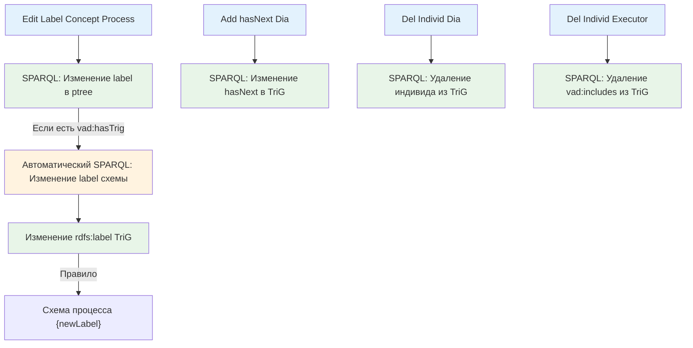
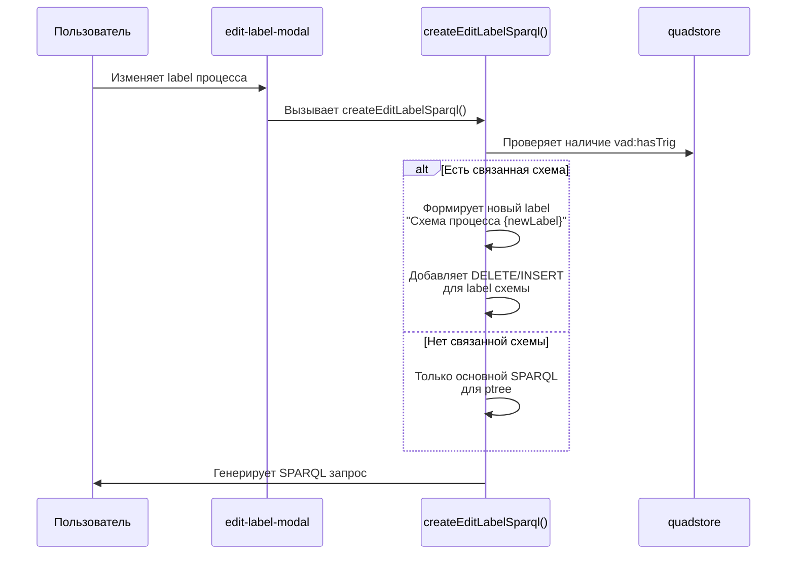

# Автоматически создаваемые SPARQL-запросы (Auto Methods)

## Обзор

Данный документ описывает SPARQL-запросы, которые создаются автоматически при выполнении методов объектов диаграммы. Это так называемые "автоматические" запросы, которые генерируются помимо основного запроса метода.

Issue #394

## Таблица автоматических SPARQL-запросов

| Метод | Основной SPARQL | Автоматический SPARQL | Условие активации |
|-------|----------------|-----------------------|-------------------|
| Edit Label Concept Process | Изменение rdfs:label концепта процесса в vad:ptree | Изменение rdfs:label схемы процесса (TriG) | Процесс имеет связанную схему (vad:hasTrig в ptree) |
| Add hasNext Dia | Изменение vad:hasNext в TriG | - | Нет |
| Del Individ Dia | Удаление индивида процесса из TriG | - | Нет |
| Del Individ Executor | Удаление vad:includes из TriG | - | Нет |

## Детали автоматических запросов

### Edit Label Concept Process

**Основной запрос:** Изменение rdfs:label концепта процесса в графе vad:ptree

```sparql
PREFIX rdfs: <http://www.w3.org/2000/01/rdf-schema#>
PREFIX vad: <http://example.org/vad#>

DELETE DATA {
    GRAPH vad:ptree {
        <processUri> rdfs:label "старый_label" .
    }
}
;
INSERT DATA {
    GRAPH vad:ptree {
        <processUri> rdfs:label "новый_label" .
    }
}
```

**Автоматический запрос:** Изменение rdfs:label связанной схемы процесса

```sparql
PREFIX rdfs: <http://www.w3.org/2000/01/rdf-schema#>
PREFIX vad: <http://example.org/vad#>

DELETE DATA {
    GRAPH <trigUri> {
        <trigUri> rdfs:label "Схема процесса старый_label" .
    }
}
;
INSERT DATA {
    GRAPH <trigUri> {
        <trigUri> rdfs:label "Схема процесса новый_label" .
    }
}
```

**Правило формирования label схемы:**
```
newTrigLabel = "Схема процесса " + newLabel
```

**Условие активации:**
- В графе vad:ptree существует триплет: `<processUri> vad:hasTrig ?trigUri`
- При изменении label концепта автоматически обновляется label связанной схемы

## Схема взаимосвязей (Mermaid)



## Логика автоматического обновления label схемы

### Workflow



### Пример транзакции

1. **Входные данные:**
   - processUri: `vad:p123`
   - currentLabel: "Процесс А"
   - newLabel: "Процесс Б"
   - hasTrig: `vad:trig456`

2. **Основной SPARQL (обязательный):**
   ```sparql
   # Удаление старого label
   DELETE DATA { GRAPH vad:ptree { vad:p123 rdfs:label "Процесс А" . } }
   # Добавление нового label
   INSERT DATA { GRAPH vad:ptree { vad:p123 rdfs:label "Процесс Б" . } }
   ```

3. **Автоматический SPARQL (если есть hasTrig):**
   ```sparql
   # Удаление старого label схемы
   DELETE DATA { GRAPH vad:trig456 { vad:trig456 rdfs:label "Схема процесса Процесс А" . } }
   # Добавление нового label схемы
   INSERT DATA { GRAPH vad:trig456 { vad:trig456 rdfs:label "Схема процесса Процесс Б" . } }
   ```

## Код автоматического обновления

### Функция createEditLabelSparql()

```javascript
function createEditLabelSparql() {
    // ... основной SPARQL для ptree ...
    
    // Если есть связанная схема, автоматически обновляем её label
    if (hasTrig) {
        const currentTrigLabel = getCurrentTrigLabel(hasTrig);
        const newTrigLabel = `Схема процесса ${newLabel}`;
        
        // Добавляем DELETE/INSERT для label схемы
        sparqlQuery += `\n;\n\n`;
        sparqlQuery += `# Автоматическое обновление label связанной схемы\n`;
        // ... формирование DELETE/INSERT для trigUri ...
    }
}
```

### Проверка наличия связанной схемы

```javascript
function getConceptLabelData(processUri) {
    const hasTrigUri = 'http://example.org/vad#hasTrig';
    const ptreeUri = 'http://example.org/vad#ptree';
    
    // Проверяем наличие vad:hasTrig в ptree
    const trigQuads = currentStore.getQuads(processUri, hasTrigUri, null, ptreeUri);
    if (trigQuads.length > 0) {
        hasTrig = trigQuads[0].object.value;
    }
    
    return { label, hasTrig };
}
```

## Связь с другими документами

- [op_methods_v1.md](./op_methods_v1.md) - Основная документация методов
- [io_concept_individ_v4.md](./io_concept_individ_v4.md) - Ввод/вывод концептов и индивидов

---

*Документ создан для issue #394*
*Дата: 2026-02-13*
