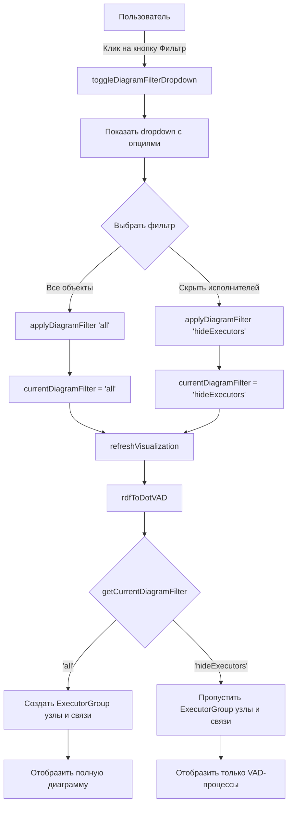
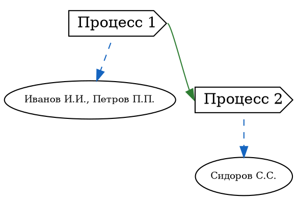
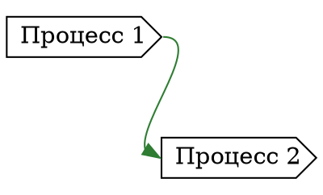

# Фильтр диаграммы (Filter Diagram)

**Issue:** [#406](https://github.com/bpmbpm/rdf-grapher/issues/406)

## 1. Обзор

Модуль фильтрации диаграммы позволяет управлять отображением элементов на схеме процесса. Реализация выполнена с использованием SPARQL-Driven Programming подхода, где фильтрация осуществляется через изменение параметров визуализации на основе состояния фильтра.

## 2. Архитектура

### 2.1 Компоненты

| Компонент | Файл | Описание |
|-----------|------|----------|
| UI (Кнопка Фильтр) | `ver9d/index.html` | HTML-разметка кнопки в заголовке диаграммы |
| Логика фильтрации | `ver9d/13_filter/13_filter_logic.js` | Управление состоянием фильтра и dropdown |
| Стили | `ver9d/styles.css` | CSS для кнопки и выпадающего списка |
| Рендеринг | `ver9d/5_publisher/5_publisher_logic.js` | Применение фильтра при генерации DOT-кода |

### 2.2 Расположение кнопки Фильтр

Кнопка **Фильтр** расположена в заголовке панели **Диаграмма**, справа от кнопок навигации (Назад/Вперёд) и слева от кнопки **Методы**.

```
┌─────────────────────────────────────────────────────────────┐
│ Диаграмма  [↻] [⌂] [<] [>] [Фильтр ▼] [Методы ▼]           │
├─────────────────────────────────────────────────────────────┤
│                                                             │
│                    [Схема процесса]                         │
│                                                             │
└─────────────────────────────────────────────────────────────┘
```

## 3. Типы фильтров

### 3.1 Доступные фильтры

| Фильтр | Значение | Описание |
|--------|----------|----------|
| **Все объекты** | `all` | Отображаются все элементы диаграммы (по умолчанию) |
| **Скрыть исполнителей** | `hideExecutors` | Скрываются узлы ExecutorGroup и связи hasExecutor |

### 3.2 Поведение по умолчанию

При загрузке страницы активен фильтр **"Все объекты"** (`all`), и диаграмма отображается полностью, включая:
- Процессы (CDS-узлы)
- Группы исполнителей (ExecutorGroup - желтые эллипсы)
- Связи hasNext между процессами
- Связи hasExecutor между процессами и группами исполнителей

## 4. Реализация фильтрации через SPARQL-Driven подход

### 4.1 Концепция SPARQL-Driven Programming

Хотя в данной реализации не используются прямые SPARQL-запросы для фильтрации, подход следует принципам SPARQL-Driven Programming:

1. **Декларативность**: Состояние фильтра хранится как данные (`currentDiagramFilter`)
2. **Разделение логики**: Логика фильтрации отделена от логики рендеринга
3. **Расширяемость**: Легко добавить новые типы фильтров без изменения основного кода

### 4.2 Псевдо-SPARQL логика фильтрации

Концептуально, фильтрация соответствует следующим SPARQL-запросам:

#### Фильтр "Все объекты" (all)

```sparql
# Получить все процессы для отображения
SELECT ?process ?label
WHERE {
  GRAPH ?trig {
    ?process a vad:TypeProcess ;
             rdfs:label ?label .
  }
}

# Получить все группы исполнителей для отображения
SELECT ?execGroup ?groupLabel ?process
WHERE {
  GRAPH ?trig {
    ?process a vad:TypeProcess ;
             vad:hasExecutor ?execGroup .
    ?execGroup a vad:ExecutorGroup .
  }
  # Получаем rdfs:label из Virtual TriG
  GRAPH ?virtualTrig {
    ?execGroup rdfs:label ?groupLabel .
  }
}
```

#### Фильтр "Скрыть исполнителей" (hideExecutors)

```sparql
# Получить только процессы для отображения
SELECT ?process ?label
WHERE {
  GRAPH ?trig {
    ?process a vad:TypeProcess ;
             rdfs:label ?label .
  }
}

# Группы исполнителей НЕ запрашиваются
# (пустой результат - узлы ExecutorGroup не создаются)
```

### 4.3 Фактическая реализация в JavaScript

В функции `rdfToDotVAD()` (файл `5_publisher_logic.js`) фильтрация реализована через условную логику:

```javascript
// Проверяем текущий фильтр диаграммы
const shouldShowExecutors = (typeof getCurrentDiagramFilter === 'function')
    ? getCurrentDiagramFilter() !== 'hideExecutors'
    : true;

// Рендеринг ExecutorGroup узлов
if (shouldShowExecutors) {
    // Создаём узлы ExecutorGroup и связи hasExecutor
    visibleProcesses.forEach((processInfo, uri) => {
        // ... код создания ExecutorGroup узлов ...
    });
} else {
    // Узлы и связи не создаются
    dot += '    // issue #406: ExecutorGroup узлы скрыты фильтром\n';
}
```

## 5. Диаграмма взаимодействия модулей



## 6. Структура данных

### 6.1 Глобальная переменная состояния

```javascript
/**
 * Текущее состояние фильтра диаграммы
 * Возможные значения:
 * - 'all' - показать все объекты (по умолчанию)
 * - 'hideExecutors' - скрыть исполнителей
 */
let currentDiagramFilter = 'all';
```

### 6.2 Конфигурация фильтров

```javascript
function getDiagramFilters() {
    return [
        { label: 'Все объекты', value: 'all' },
        { label: 'Скрыть исполнителей', value: 'hideExecutors' }
    ];
}
```

## 7. API функций модуля

### 7.1 Основные функции

| Функция | Параметры | Возвращаемое значение | Описание |
|---------|-----------|----------------------|----------|
| `toggleDiagramFilterDropdown` | `event` | - | Показать/скрыть dropdown фильтров |
| `applyDiagramFilter` | `filterValue: string` | - | Применить выбранный фильтр |
| `getCurrentDiagramFilter` | - | `string` | Получить текущее значение фильтра |
| `getDiagramFilters` | - | `Array<{label, value}>` | Получить список доступных фильтров |

### 7.2 Пример использования

```javascript
// Получить текущий фильтр
const currentFilter = getCurrentDiagramFilter();
console.log(currentFilter); // 'all' или 'hideExecutors'

// Применить фильтр программно
applyDiagramFilter('hideExecutors');

// Проверка в коде рендеринга
const shouldShowExecutors = getCurrentDiagramFilter() !== 'hideExecutors';
if (shouldShowExecutors) {
    // Рендерим ExecutorGroup
}
```

## 8. Влияние фильтра на визуализацию

### 8.1 Фильтр "Все объекты" (all)

**Отображаемые элементы:**
- ✅ VAD процессы (CDS-узлы)
- ✅ ExecutorGroup узлы (желтые эллипсы)
- ✅ Связи `vad:hasNext` (зелёные стрелки между процессами)
- ✅ Связи `vad:hasExecutor` (синие пунктирные линии к группам исполнителей)

**Пример DOT-кода:**


### 8.2 Фильтр "Скрыть исполнителей" (hideExecutors)

**Отображаемые элементы:**
- ✅ VAD процессы (CDS-узлы)
- ❌ ExecutorGroup узлы (скрыты)
- ✅ Связи `vad:hasNext` (зелёные стрелки между процессами)
- ❌ Связи `vad:hasExecutor` (скрыты)

**Пример DOT-кода:**


## 9. Расширение функциональности

### 9.1 Добавление новых фильтров

Для добавления нового фильтра необходимо:

1. Добавить новый фильтр в функцию `getDiagramFilters()`:
```javascript
function getDiagramFilters() {
    return [
        { label: 'Все объекты', value: 'all' },
        { label: 'Скрыть исполнителей', value: 'hideExecutors' },
        { label: 'Только детализированные процессы', value: 'onlyDetailed' } // новый
    ];
}
```

2. Добавить логику фильтрации в `rdfToDotVAD()`:
```javascript
// Пример: фильтр только детализированных процессов
const shouldShowOnlyDetailed = getCurrentDiagramFilter() === 'onlyDetailed';

if (shouldShowOnlyDetailed) {
    // Фильтруем процессы по подтипу Detailed
    const filteredProcesses = new Map();
    visibleProcesses.forEach((info, uri) => {
        const subtypes = getNodeSubtypes(uri);
        if (subtypes.includes('vad:Detailed')) {
            filteredProcesses.set(uri, info);
        }
    });
    visibleProcesses = filteredProcesses;
}
```

### 9.2 SPARQL-запросы для будущих фильтров

Если в будущем потребуется динамическая фильтрация через SPARQL, можно реализовать:

```javascript
async function getFilteredProcesses(filterType) {
    let query = '';

    if (filterType === 'onlyDetailed') {
        query = `
            PREFIX vad: <http://example.org/vad#>
            PREFIX rdfs: <http://www.w3.org/2000/01/rdf-schema#>

            SELECT ?process ?label
            WHERE {
                GRAPH ?trig {
                    ?process a vad:TypeProcess ;
                             rdfs:subtype vad:Detailed ;
                             rdfs:label ?label .
                }
            }
        `;
    }

    // Выполнить SPARQL-запрос через currentStore
    const results = await executeSparqlQuery(query);
    return results;
}
```

## 10. Визуальное представление

### 10.1 Диаграмма с фильтром "Все объекты"

```
┌─────────────────────────────────────────────────────┐
│                                                     │
│  ┌──────────────┐       ┌──────────────┐           │
│  │  Процесс 1   │──────>│  Процесс 2   │           │
│  └──────────────┘       └──────────────┘           │
│         │                       │                   │
│         │ hasExecutor           │ hasExecutor       │
│         ↓                       ↓                   │
│  ┌────────────────┐      ┌────────────────┐        │
│  │ Иванов И.И.,   │      │ Сидоров С.С.   │        │
│  │ Петров П.П.    │      └────────────────┘        │
│  └────────────────┘                                 │
│  (ExecutorGroup)         (ExecutorGroup)           │
│                                                     │
└─────────────────────────────────────────────────────┘
```

### 10.2 Диаграмма с фильтром "Скрыть исполнителей"

```
┌─────────────────────────────────────────────────────┐
│                                                     │
│  ┌──────────────┐       ┌──────────────┐           │
│  │  Процесс 1   │──────>│  Процесс 2   │           │
│  └──────────────┘       └──────────────┘           │
│                                                     │
│                                                     │
│  (ExecutorGroup скрыты)                            │
│                                                     │
│                                                     │
└─────────────────────────────────────────────────────┘
```

## 11. Тестирование

### 11.1 Сценарии тестирования

| # | Действие | Ожидаемый результат |
|---|----------|-------------------|
| 1 | Открыть диаграмму процесса | Фильтр "Все объекты" активен, видны все элементы |
| 2 | Кликнуть на кнопку "Фильтр" | Открывается dropdown с двумя опциями |
| 3 | Выбрать "Скрыть исполнителей" | ExecutorGroup узлы и связи hasExecutor исчезают |
| 4 | Выбрать "Все объекты" | ExecutorGroup узлы и связи hasExecutor появляются |
| 5 | Переключиться между диаграммами | Фильтр сохраняет текущее состояние |
| 6 | Обновить страницу | Фильтр сбрасывается на "Все объекты" |

### 11.2 Тестовые данные

Для тестирования используются существующие файлы TriG в папке `ver9d/dia/`:
- `Trig_VADv5.ttl`
- `Trig_VADv6.ttl`
- `Trig_VADv7.ttl`
- `Trig_VADv8.ttl`

Каждый из этих файлов содержит процессы с ExecutorGroup для проверки работы фильтра.

## 12. Интеграция с существующими модулями

### 12.1 Взаимодействие с модулем 5_publisher

Модуль фильтрации интегрируется с модулем публикации через:
- Вызов `getCurrentDiagramFilter()` в функции `rdfToDotVAD()`
- Вызов `refreshVisualization()` при изменении фильтра

### 12.2 Независимость от других модулей

Модуль фильтрации разработан как независимый компонент:
- Не влияет на хранилище данных (quadstore)
- Не изменяет логику навигации
- Не конфликтует с модулем методов (12_method)

## 13. Ссылки

- Issue: [#406 - Фильтр диаграммы](https://github.com/bpmbpm/rdf-grapher/issues/406)
- Модуль публикации: `ver9d/doc/5_publisher.md`
- Модуль методов: `ver9d/doc/12_method.md`
- SPARQL-Driven Programming: `ver9d/requirements/sparql-driven-programming_min2.md`
