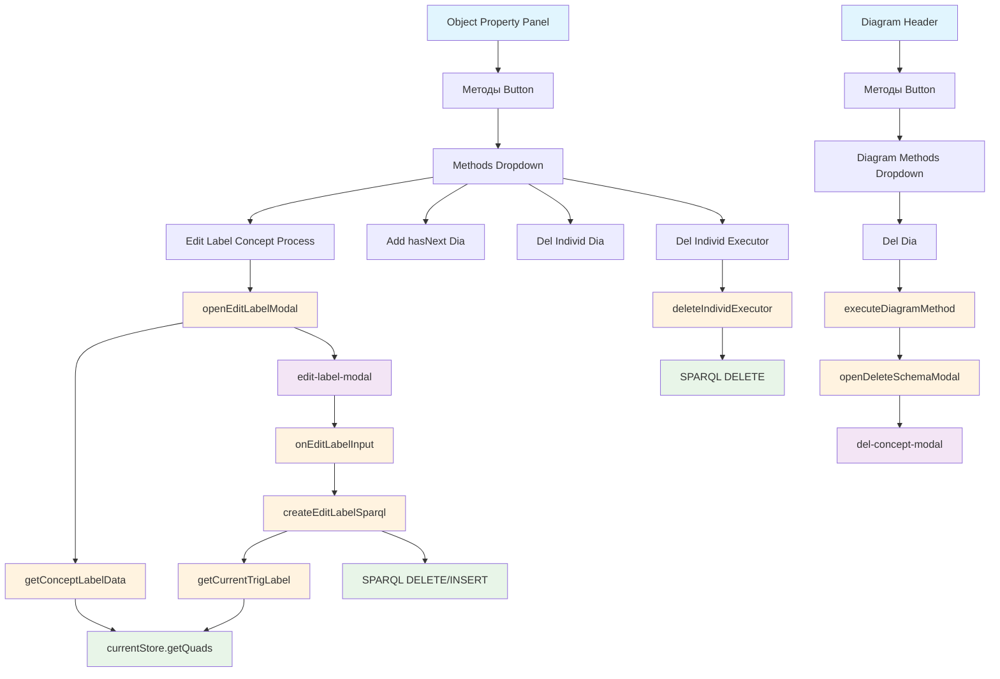

# Навигатор методов объектов диаграммы (Object Property Methods)

## Обзор

Данный документ описывает методы, доступные через кнопку "Методы" в окне "Свойство объекта диаграммы" (Object Property) и "Методы" в заголовке диаграммы.

Issue #386: ver9d_5label

## Типы методов

### 1. ObjectMethod (Методы объектов)

Методы, применяемые к выбранному объекту на диаграмме через кнопку "Методы" в окне "Свойство объекта диаграммы".

Определение в онтологии (`vad-basic-ontology_tech_Appendix.trig`):
```turtle
vad:ObjectMethod
    rdf:type rdfs:Class, owl:Class ;
    rdfs:subClassOf vad:Tech ;
    rdfs:label "ObjectMethod" ;
    rdfs:comment "Класс методов для объектов диаграммы" .
```

Свойства метода:
- `vad:methodForType` - тип объекта, для которого доступен метод
- `vad:methodFunction` - имя JavaScript функции для выполнения

### 2. DiagramMethod (Методы диаграммы)

Методы, применяемые к текущей открытой диаграмме через кнопку "Методы" в заголовке диаграммы.

Определение в онтологии:
```turtle
vad:DiagramMethod
    rdf:type rdfs:Class, owl:Class ;
    rdfs:subClassOf vad:Tech ;
    rdfs:label "DiagramMethod" ;
    rdfs:comment "Класс методов для диаграммы в целом" .
```

## Реализованные методы

### ObjectMethod: Edit Label Concept Process

**Назначение:** Редактирование label концепта процесса с автоматическим обновлением label схемы процесса.

**Применимость:** Объекты типа `vad:isSubprocessTrig` (Individ Process)

**Определение в онтологии:**
```turtle
vad:EditLabelConceptProcess
    rdf:type vad:ObjectMethod ;
    rdfs:label "Edit Label Concept Process" ;
    vad:methodForType vad:isSubprocessTrig ;
    vad:methodFunction "editLabelConceptProcess" .
```

**Алгоритм работы:**
1. Пользователь выбирает Individ Process на диаграмме
2. Открывается окно "Свойство объекта диаграммы"
3. Кликает на кнопку "Методы" и выбирает "Edit Label Concept Process"
4. Открывается модальное окно с полями:
   - ID концепта процесса (нередактируемый)
   - Label (редактируемый)
   - Информация о схеме (если есть vad:hasTrig)
5. При изменении label генерируется SPARQL:
   - DELETE/INSERT для изменения label концепта в vad:ptree
   - Если процесс имеет схему (vad:hasTrig), автоматически обновляется label схемы по правилу "Схема процесса {новый_label}"

**Правило изменения label схемы:**
```javascript
const newTrigLabel = `Схема процесса ${newLabel}`;
```

**Файлы:**
- `12_method/12_method_logic.js` - функции openEditLabelModal(), createEditLabelSparql()
- `index.html` - модальное окно edit-label-modal
- `styles.css` - стили .edit-label-*

### ObjectMethod: Add hasNext Dia

**Назначение:** Редактирование связей vad:hasNext для индивида процесса.

**Применимость:** Объекты типа `vad:isSubprocessTrig`

**Issue:** #370

### ObjectMethod: Del Individ Dia

**Назначение:** Удаление индивида процесса из диаграммы.

**Применимость:** Объекты типа `vad:isSubprocessTrig`

**Issue:** #368

### ObjectMethod: Del Individ Executor

**Назначение:** Удаление индивида исполнителя (группы исполнителей) из диаграммы.

**Применимость:** Объекты типа `vad:ExecutorGroup`

**Определение в онтологии:**
```turtle
vad:DeleteIndividExecutor
    rdf:type vad:ObjectMethod ;
    rdfs:label "Delete Individ Executor" ;
    vad:methodForType vad:ExecutorGroup ;
    vad:methodFunction "deleteIndividExecutor" .
```

**Алгоритм работы:**
1. Пользователь выбирает ExecutorGroup (группу исполнителей) на диаграмме
2. Открывается окно "Свойство объекта диаграммы"
3. Кликает на кнопку "Методы" и выбирает "Delete Individ Executor"
4. Генерируется SPARQL DELETE запрос для удаления всех предикатов `vad:includes` из текущего TriG

**Пример SPARQL:**
```sparql
PREFIX vad: <http://example.org/vad#>

DELETE {
    GRAPH <currentTrigUri> {
        <executorGroupUri> vad:includes ?executor .
    }
}
WHERE {
    GRAPH <currentTrigUri> {
        <executorGroupUri> vad:includes ?executor .
    }
}
```

**Связь с другими методами:**
- В отличие от Del Individ Dia (удаление процесса), этот метод удаляет только связь исполнителей
- Группа исполнителей (ExecutorGroup) остаётся, но становится пустой

**Файлы:**
- `12_method/12_method_logic.js` - функции deleteIndividExecutor()

### DiagramMethod: Del Dia

**Назначение:** Удаление всей диаграммы (схемы процесса).

**Определение в онтологии:**
```turtle
vad:DelDia
    rdf:type vad:DiagramMethod ;
    rdfs:label "Del Dia" ;
    vad:methodFunction "delDia" .
```

**Алгоритм работы:**
1. Пользователь открывает диаграмму (VADProcessDia)
2. Кликает на кнопку "Методы" в заголовке диаграммы
3. Выбирает "Del Dia"
4. Открывается существующее модальное окно удаления схемы из Smart Design

**Файлы:**
- `12_method/12_method_logic.js` - функции executeDiagramMethod(), openDeleteSchemaModal()
- `3_sd/3_sd_del_concept_individ/3_sd_del_concept_individ_logic.js` - модальное окно удаления

## Структура модуля 12_method

```
ver9d/12_method/
├── 12_method.css         - Стили модуля
├── 12_method_logic.js    - Бизнес-логика (ObjectMethod, DiagramMethod)
├── 12_method_sparql.js   - SPARQL запросы
└── 12_method_ui.js       - UI функции
```

## Таблица функций

| Метод | Функция | Назначение |
|-------|---------|------------|
| Edit Label Concept Process | openEditLabelModal() | Открытие модального окна редактирования label |
| | closeEditLabelModal() | Закрытие модального окна |
| | getConceptLabelData() | Получение текущего label из quadstore |
| | onEditLabelInput() | Обработка ввода нового label |
| | createEditLabelSparql() | Генерация SPARQL запроса |
| | getCurrentTrigLabel() | Получение текущего label схемы |
| Del Individ Dia | deleteIndividProcess() | Удаление индивида процесса из диаграммы |
| Del Individ Executor | deleteIndividExecutor() | Удаление индивида исполнителя из диаграммы |
| Del Dia | executeDiagramMethod() | Маршрутизатор методов диаграммы |
| | openDeleteSchemaModal() | Открытие модального окна удаления схемы |
| | toggleDiagramMethodsDropdown() | Открытие/закрытие выпадающего списка методов |
| | getDiagramMethods() | Загрузка методов диаграммы из techtree |
| | getCurrentOpenTrigUri() | Получение URI текущей открытой диаграммы |

## Схема взаимосвязей (Mermaid)



## Генерация SPARQL для Edit Label

### Изменение только label концепта:
```sparql
PREFIX rdfs: <http://www.w3.org/2000/01/rdf-schema#>
PREFIX vad: <http://example.org/vad#>

DELETE {
    GRAPH vad:ptree {
        <processUri> rdfs:label "старый_label" .
    }
}
INSERT {
    GRAPH vad:ptree {
        <processUri> rdfs:label "новый_label" .
    }
}
WHERE {
    GRAPH vad:ptree {
        <processUri> rdfs:label "старый_label" .
    }
}
```

### Изменение label концепта и схемы:
```sparql
PREFIX rdfs: <http://www.w3.org/2000/01/rdf-schema#>
PREFIX vad: <http://example.org/vad#>

DELETE {
    GRAPH vad:ptree {
        <processUri> rdfs:label "старый_label" .
    }
    GRAPH <trigUri> {
        <trigUri> rdfs:label "Схема процесса старый_label" .
    }
}
INSERT {
    GRAPH vad:ptree {
        <processUri> rdfs:label "новый_label" .
    }
    GRAPH <trigUri> {
        <trigUri> rdfs:label "Схема процесса новый_label" .
    }
}
WHERE {
    GRAPH vad:ptree {
        <processUri> rdfs:label "старый_label" .
    }
    OPTIONAL {
        GRAPH <trigUri> {
            <trigUri> rdfs:label ?oldTrigLabel .
        }
    }
}
```

## Интеграция с techtree

### Загрузка методов объекта:
```javascript
function getMethodsForType(objectType) {
    const sparql = `
        PREFIX rdf: <http://www.w3.org/1999/02/22-rdf-syntax-ns#>
        PREFIX rdfs: <http://www.w3.org/2000/01/rdf-schema#>
        PREFIX vad: <http://example.org/vad#>

        SELECT ?method ?label ?function WHERE {
            GRAPH vad:techtree {
                ?method rdf:type vad:ObjectMethod .
                ?method rdfs:label ?label .
                ?method vad:methodForType <${objectType}> .
                ?method vad:methodFunction ?function .
            }
        }
    `;
    return funSPARQLvalues(sparql);
}
```

### Загрузка методов диаграммы:
```javascript
function getDiagramMethods() {
    const sparql = `
        PREFIX rdf: <http://www.w3.org/1999/02/22-rdf-syntax-ns#>
        PREFIX rdfs: <http://www.w3.org/2000/01/rdf-schema#>
        PREFIX vad: <http://example.org/vad#>

        SELECT ?method ?label ?function WHERE {
            GRAPH vad:techtree {
                ?method rdf:type vad:DiagramMethod .
                ?method rdfs:label ?label .
                ?method vad:methodFunction ?function .
            }
        }
    `;
    return funSPARQLvalues(sparql);
}
```

---

*Документ создан для issue #386: ver9d_5label*
*Обновлено для issue #392: ver9d_6doc*
*Дата: 2026-02-13*
