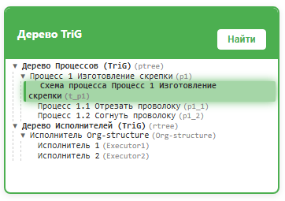
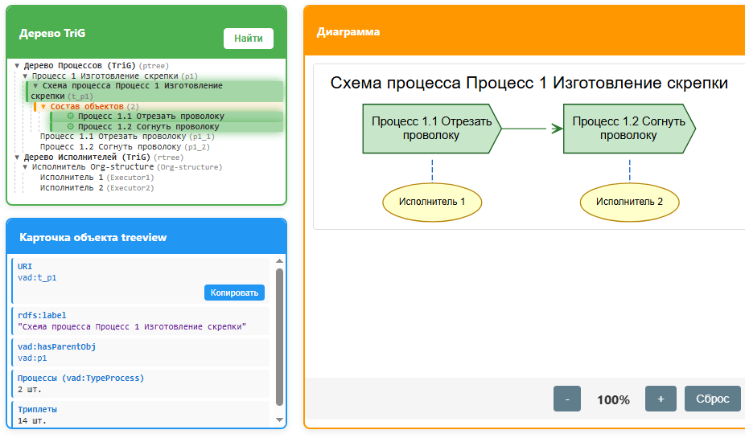

## easy_clip.md
Пример создания описания процесса на примере процесса изготовления Канцелярской скрепки (paper clip) 

Задача нарисовать процесс «Изготовление скрепки», состоящий из двух функций (подпроцессов) «Отрезать проволоку» и «Согнуть проволоку»  
Действия  
1 Загрузили шаблон Trig_VADempty_v1.ttl (из «Загрузить» пример или кнопка Загрузить)
### Часть 1 Создание концептов и схемы процесса
2 Создаем концепты процессов, Окно SD, Кнопка `New concept` и далее `Новый концепт процесса`.   
Окно SD (Smart Design) может быть свернуто, в этом случае его нужно развернуть.   

p1 = `Процесс 1 Изготовление скрепки`, а `hasParentObj` = ptree  
p1_1 = `Процесс 1.1 Отрезать проволоку` и p1_2 = `Процесс 2.1 Согнуть проволоку` - для них `hasParentObj` = p1 (родительский p1)   
id процесса лучше вводить в ручную, при вводе контролируем установленный язык на клавиатуре (en).  

Далее стандартные действия:  
- Создать запрос `New Concept` (окно SD)  
- `Применить как Simple Triple` (окно Result in SPARQL)  
`Дерево TriG` появится новый процесс, а в quadstore можно посмотреть его формализацию.  
Делаем три операции (три процесса).  
Встроенные проверки: 
- На конце введенного имени (label) пробелы удаляются. 
- Проверка id на отсутствие пробела при вводе id не выполняется, но соответствующий SPARQL выдаст ошибку на id с пробелом.

3 Создаем концепты исполнителя Окно SD, Кнопка `New concept` и далее `Новый концепт исполнителя`  
Создаем Executor1 = Исполнитель 1 и Executor2 = Исполнитель 2. Родительский элемент: `hasParentObj` = Org-structure

4 Создаём схему процесса p1: Окно SD, `Кнопка New TriG (VADProcessDia)`  

В итоге должно получиться treeview со следующими концептами (два концепта процесса и два концепта исполнителя):  

### Часть 2 Создание индивидов
Эти (следующие) действия (методы) уже доступны контекстно как методы Диаграммы или Свойства объекта диаграммы.

5 В окне `Дерево TriG` (treeview) находим созданную схему (диаграмму) и ее выделяем (кликаем). Можно воспользоваться поиском в `Дерево TriG` (treeview)   
5.1 Создаем `New Process Individ` (окно Диаграмма, кнопка Методы)  
Выбираем p1_1  
Сообщение «Индивиды процессов в выбранном TriG не найдены» относится к hasNext (имеетСледующего) и говорит, что на схеме пока нет элементов, которые можно было бы указать как следующие (в VAD нотации) за создаваемым Индивидом процесса.  

Далее стандартные действия:  
- `Создать запрос New Concept` (окно SD)
- `Применить как Simple Triple` (окно Result in SPARQL)  
На схеме (окно Диаграмма) появляется VAD – элемент.   
Повторяем операции для подпроцесса p1_2.

6 Далее создаем к ним (процессам) исполнителей: выделяем нужный Индивид процесса, например, p1_1.   
В окне `Свойства объекта диаграммы` кнопка `Метод` и выбор `New Executor Individ` и указываем "Исполнитель 1".  
Далее аналогично со вторым процессом p1_2 - для него указываем "Исполнитель 2"

7 hasNext
На схеме выделяем `Процесс 1.1 Отрезать проволоку` и по кнопке `Методы` вызываем `Add hasNext Dia` и выбираем `Процесс 1.2 Согнуть проволоку`.

Можно было обойтись без этого шага через один из вариантов:
- при создании индивида концепта процесса p1_1 выбрать опцию показывать все концепты и там выбрать p1_2
- вначале создать p1_2, а при создании p1_1 с опцией показать индивиды процесса, сделать соединение с p1_1, который уже есть на схеме.

### Итого

 
Обратить внимание, что теперь на рисунке на элементе Дерево TriG видны индивиды процессов.

8 Кнопка `Сохранить как` сохранит модель процесса в файл.    
Данная модель добавлена в пример как rdf-data_clip.trig

