# Навигатор онтологии - Схема взаимосвязей сущностей

## Обзор

Данный документ представляет схему взаимосвязей всех сущностей из онтологических файлов:
- `vad-basic-ontology.trig` - базовая онтология VAD
- `vad-basic-ontology_tech_Appendix.trig` - технологическое приложение к онтологии

Issue #392: ver9d_6doc

## 1. Графы (Named Graphs)

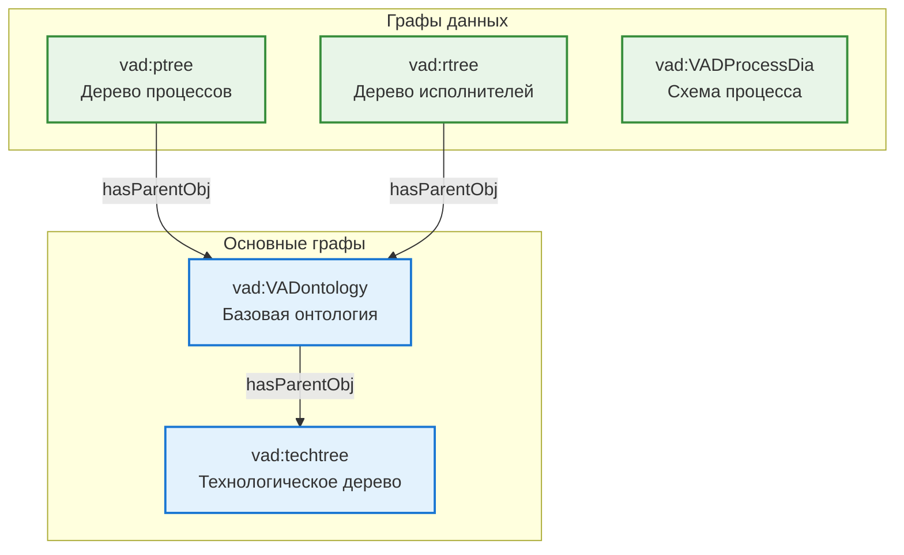

## 2. Иерархия классов

### 2.1 Базовые классы

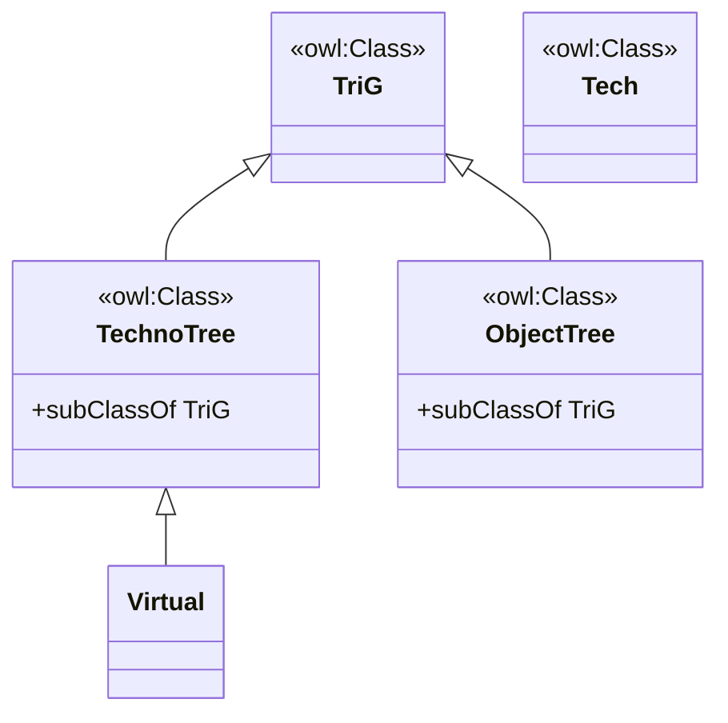

### 2.2 Классы процессов

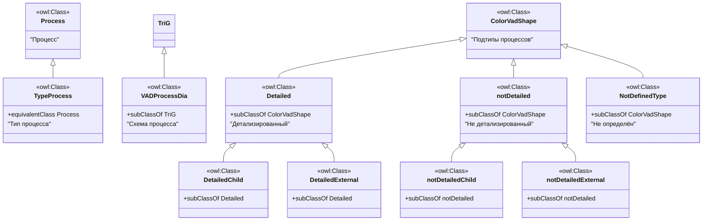

### 2.3 Классы исполнителей

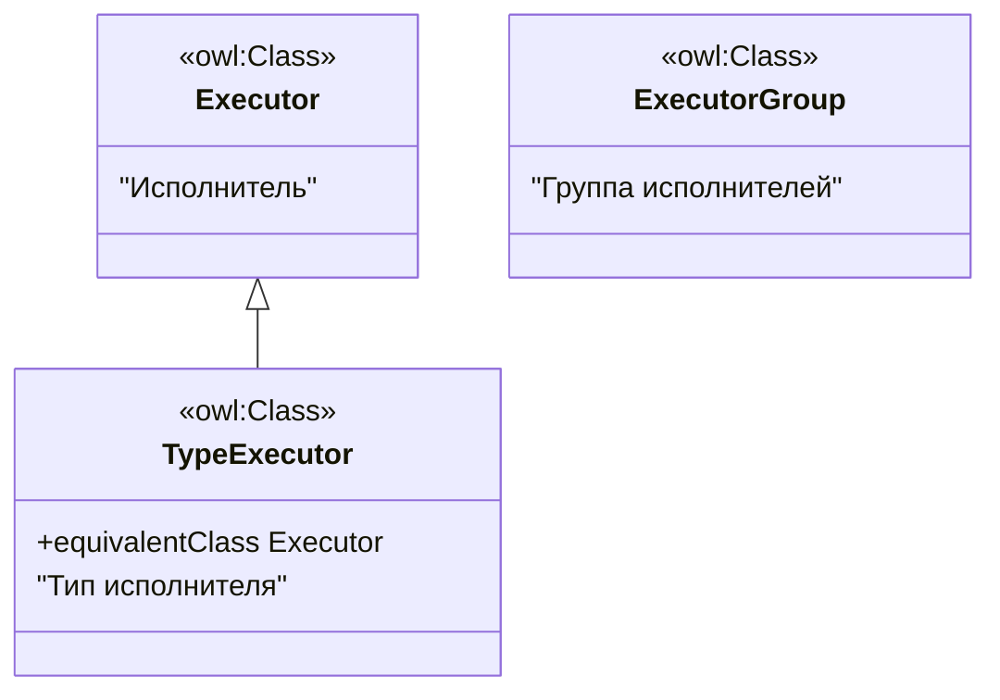

### 2.4 Технологические классы

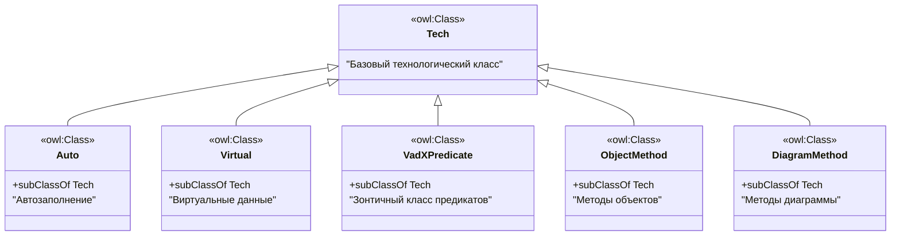

## 3. Предикаты (Properties)

### 3.1 Предикаты процессов

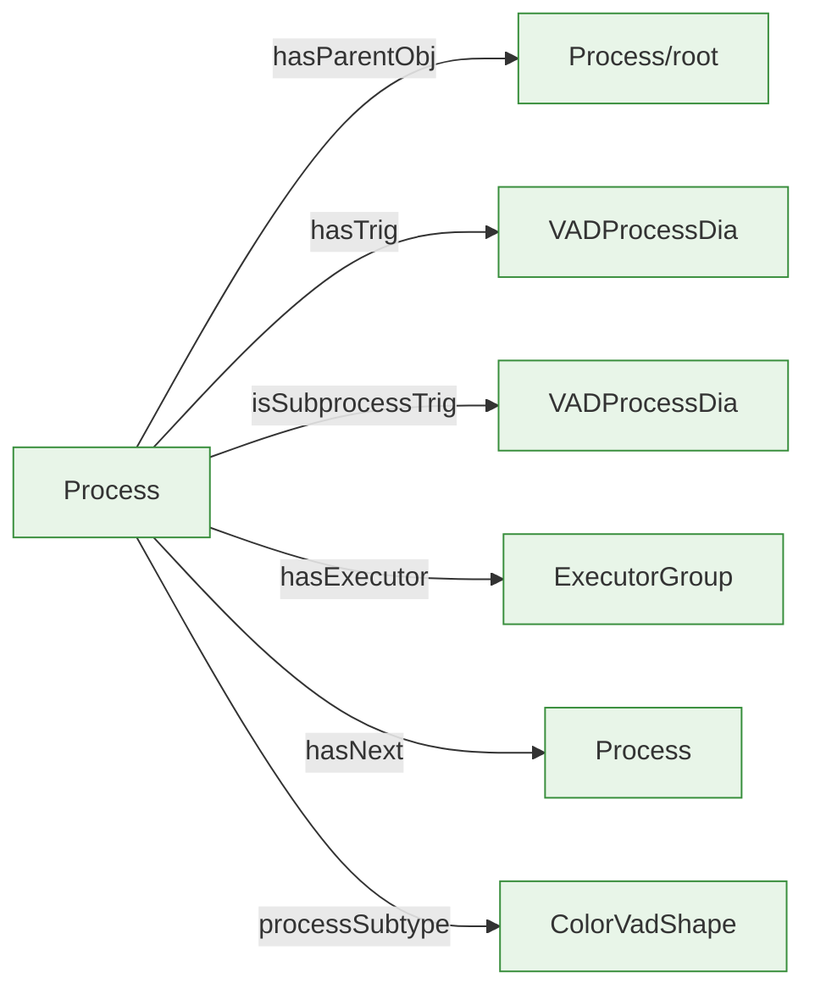

### 3.2 Предикаты исполнителей


## 4. Технологические объекты (Tech Objects)

### 4.1 Группы предикатов

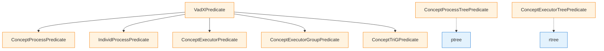

### 4.2 Автогенерируемые объекты

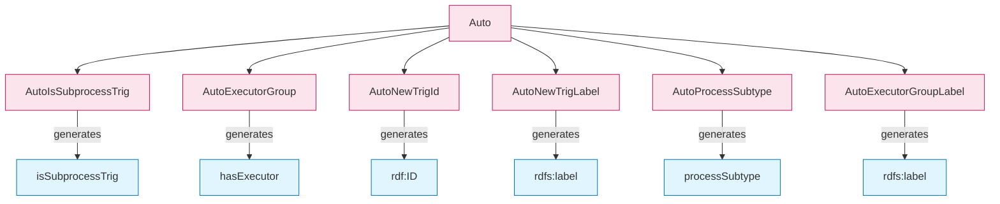

## 5. Методы (Methods)

### 5.1 Методы объектов

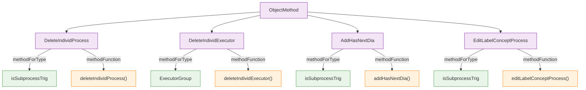

### 5.2 Методы диаграммы

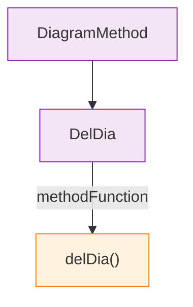

## 6. Полная схема взаимосвязей

```mermaid
flowchart TB
    subgraph "Графы"
        VAD[vad:VADontology]
        TECH[vad:techtree]
        PTREE[vad:ptree]
        RTREE[vad:rtree]
    end
    
    subgraph "Основные классы"
        PROC[Process<br/>TypeProcess]
        VAD_DIA[VADProcessDia]
        EXEC[Executor<br/>TypeExecutor]
        EG[ExecutorGroup]
    end
    
    subgraph "Технологические классы"
        TECH_C[Tech]
        AUTO[Auto]
        VIRT[Virtual]
        VADX[VadXPredicate]
        OM[ObjectMethod]
        DM[DiagramMethod]
    end
    
    subgraph "Подтипы процессов"
        CVS[ColorVadShape]
        DET[Detailed]
        NDET[notDetailed]
        NDT[NotDefinedType]
        DC[DetailedChild]
        DE[DetailedExternal]
        NDC[notDetailedChild]
        NDE[notDetailedExternal]
    end
    
    subgraph "Группы предикатов"
        CPP[ConceptProcessPredicate]
        IPP[IndividProcessPredicate]
        CEP[ConceptExecutorPredicate]
        CEGP[ConceptExecutorGroupPredicate]
        CTP[ConceptTriGPredicate]
    end
    
    subgraph "Автообъекты"
        AIST[AutoIsSubprocessTrig]
        AEG[AutoExecutorGroup]
        APS[AutoProcessSubtype]
    end
    
    subgraph "Методы"
        DIP[DeleteIndividProcess]
        DIE[DeleteIndividExecutor]
        AHND[AddHasNextDia]
        ELCP[EditLabelConceptProcess]
        DD[DelDia]
    end
    
    %% Связи графов
    VAD -->|hasParentObj| TECH
    PTREE -->|hasParentObj| VAD
    RTREE -->|hasParentObj| VAD
    
    %% Связи основных классов
    PROC -->|hasTrig| VAD_DIA
    PROC -->|isSubprocessTrig| VAD_DIA
    PROC -->|hasExecutor| EG
    PROC -->|hasNext| PROC
    EG -->|includes| EXEC
    
    %% Связи технологических классов
    TECH_C --> AUTO
    TECH_C --> VIRT
    TECH_C --> VADX
    TECH_C --> OM
    TECH_C --> DM
    
    %% Связи подтипов
    CVS --> DET
    CVS --> NDET
    CVS --> NDT
    DET --> DC
    DET --> DE
    NDET --> NDC
    NDET --> NDE
    
    %% Связи групп предикатов
    VADX --> CPP
    VADX --> IPP
    VADX --> CEP
    VADX --> CEGP
    VADX --> CTP
    
    %% Связи автообъектов
    AUTO --> AIST
    AUTO --> AEG
    AUTO --> APS
    
    %% Связи методов
    OM --> DIP
    OM --> DIE
    OM --> AHND
    OM --> ELCP
    DM --> DD
    
    %% Применение методов
    DIP -.->|methodForType| VAD_DIA
    DIE -.->|methodForType| EG
    AHND -.->|methodForType| VAD_DIA
    ELCP -.->|methodForType| VAD_DIA
    
    classDef graph1 fill:#e3f2fd,stroke:#1976d2
    classDef mainClass fill:#e8f5e8,stroke:#388e3c
    classDef techClass fill:#fff3e0,stroke:#f57c00
    classDef subtype fill:#ffe0b2,stroke:#ef6c00
    classDef predicate fill:#fce4ec,stroke:#c2185b
    classDef auto fill:#f3e5f5,stroke:#7b1fa2
    classDef method fill:#e0f2f1,stroke:#00695c
    
    class VAD,TECH,PTREE,RTREE graph1
    class PROC,VAD_DIA,EXEC,EG mainClass
    class TECH_C,AUTO,VIRT,VADX,OM,DM techClass
    class CVS,DET,NDET,NDT,DC,DE,NDC,NDE subtype
    class CPP,IPP,CEP,CEGP,CTP predicate
    class AIST,AEG,APS auto
    class DIP,DIE,AHND,ELCP,DD method
```

## 7. Таблица всех сущностей

### 7.1 Классы

| Сущность | Файл | Описание |
|----------|------|----------|
| vad:Process | vad-basic-ontology.trig | Базовый класс процесса |
| vad:TypeProcess | vad-basic-ontology.trig | Синоним Process |
| vad:TriG | vad-basic-ontology.trig | Базовый класс TriG |
| vad:VADProcessDia | vad-basic-ontology.trig | Схема процесса |
| vad:TechTree | vad-basic-ontology.trig | Техническое дерево |
| vad:TechnoTree | vad-basic-ontology.trig | Технологическое дерево |
| vad:ObjectTree | vad-basic-ontology.trig | Дерево объектов |
| vad:ProcessTree | vad-basic-ontology.trig | Дерево процессов (устарел) |
| vad:ExecutorTree | vad-basic-ontology.trig | Дерево исполнителей (устарел) |
| vad:Executor | vad-basic-ontology.trig | Исполнитель |
| vad:TypeExecutor | vad-basic-ontology.trig | Синоним Executor |
| vad:ExecutorGroup | vad-basic-ontology.trig | Группа исполнителей |
| vad:Virtual | vad-basic-ontology.trig / _tech_Appendix.trig | Виртуальные данные |
| vad:ColorVadShape | vad-basic-ontology.trig / _tech_Appendix.trig | Подтипы процессов |
| vad:Detailed | vad-basic-ontology.trig / _tech_Appendix.trig | Детализированный процесс |
| vad:DetailedChild | vad-basic-ontology.trig / _tech_Appendix.trig | Детализированный подпроцесс |
| vad:DetailedExternal | vad-basic-ontology.trig / _tech_Appendix.trig | Детализированный внешний |
| vad:notDetailed | vad-basic-ontology.trig / _tech_Appendix.trig | Не детализированный |
| vad:notDetailedChild | vad-basic-ontology.trig / _tech_Appendix.trig | Не детализированный подпроцесс |
| vad:notDetailedExternal | vad-basic-ontology.trig / _tech_Appendix.trig | Не детализированный внешний |
| vad:NotDefinedType | vad-basic-ontology.trig / _tech_Appendix.trig | Не определён |
| vad:Tech | vad-basic-ontology_tech_Appendix.trig | Базовый технологический класс |
| vad:Auto | vad-basic-ontology_tech_Appendix.trig | Автозаполнение |
| vad:VadXPredicate | vad-basic-ontology_tech_Appendix.trig | Зонтичный класс предикатов |
| vad:ObjectMethod | vad-basic-ontology_tech_Appendix.trig | Методы объектов |
| vad:DiagramMethod | vad-basic-ontology_tech_Appendix.trig | Методы диаграммы |
| vad:ConceptProcessPredicate | vad-basic-ontology_tech_Appendix.trig | Группа предикатов процессов |
| vad:IndividProcessPredicate | vad-basic-ontology_tech_Appendix.trig | Группа предикатов индивидов процессов |
| vad:ConceptExecutorPredicate | vad-basic-ontology_tech_Appendix.trig | Группа предикатов исполнителей |
| vad:ConceptExecutorGroupPredicate | vad-basic-ontology_tech_Appendix.trig | Группа предикатов групп исполнителей |
| vad:ConceptTriGPredicate | vad-basic-ontology_tech_Appendix.trig | Группа предикатов TriG |
| vad:ConceptProcessTreePredicate | vad-basic-ontology_tech_Appendix.trig | Группа предикатов дерева процессов |
| vad:ConceptExecutorTreePredicate | vad-basic-ontology_tech_Appendix.trig | Группа предикатов дерева исполнителей |

### 7.2 Предикаты

| Сущность | Файл | Описание |
|----------|------|----------|
| vad:hasParentObj | vad-basic-ontology.trig | Родительский объект |
| vad:hasTrig | vad-basic-ontology.trig | Ссылка на TriG |
| vad:isSubprocessTrig | vad-basic-ontology.trig | Связь с TriG |
| vad:hasExecutor | vad-basic-ontology.trig | Исполнитель процесса |
| vad:hasNext | vad-basic-ontology.trig | Следующий процесс |
| vad:processSubtype | vad-basic-ontology.trig | Подтип процесса |
| vad:includes | vad-basic-ontology.trig | Включает исполнителя |
| vad:definesProcess | vad-basic-ontology.trig | Устарел |
| vad:generatesProperty | vad-basic-ontology_tech_Appendix.trig | Генерируемое свойство |
| vad:generationRule | vad-basic-ontology_tech_Appendix.trig | Правило генерации |
| vad:hasNodeStyle | vad-basic-ontology_tech_Appendix.trig | Стиль узла |
| vad:styleLegendLabel | vad-basic-ontology_tech_Appendix.trig | Легенда стиля |
| vad:includePredicate | vad-basic-ontology_tech_Appendix.trig | Включённый предикат |
| vad:autoGeneratedPredicate | vad-basic-ontology_tech_Appendix.trig | Автогенерируемый предикат |
| vad:predicateGroupForType | vad-basic-ontology_tech_Appendix.trig | Группа предикатов для типа |
| vad:contextTriGType | vad-basic-ontology_tech_Appendix.trig | Тип контекста TriG |
| vad:methodForType | vad-basic-ontology_tech_Appendix.trig | Метод для типа |
| vad:methodFunction | vad-basic-ontology_tech_Appendix.trig | Функция метода |

### 7.3 Экземпляры

| Сущность | Файл | Описание |
|----------|------|----------|
| vad:root | vad-basic-ontology.trig | Корень дерева объектов |
| vad:ptree | vad-basic-ontology.trig | Дерево процессов |
| vad:rtree | vad-basic-ontology.trig | Дерево исполнителей |
| vad:techroot | vad-basic-ontology_tech_Appendix.trig | Корень технологического дерева |
| vad:pNotDefined | vad-basic-ontology.trig | Маркер неопределённого родителя |
| vad:AutoIsSubprocessTrig | vad-basic-ontology_tech_Appendix.trig | Автосвязь процесса с TriG |
| vad:AutoExecutorGroup | vad-basic-ontology_tech_Appendix.trig | Автогруппа исполнителей |
| vad:AutoNewTrigId | vad-basic-ontology_tech_Appendix.trig | АвтоID нового TriG |
| vad:AutoNewTrigLabel | vad-basic-ontology_tech_Appendix.trig | Автоlabel нового TriG |
| vad:AutoProcessSubtype | vad-basic-ontology_tech_Appendix.trig | Автоподтип процесса |
| vad:AutoExecutorGroupLabel | vad-basic-ontology_tech_Appendix.trig | Автолейбл группы |

### 7.4 Методы

| Сущность | Файл | Описание |
|----------|------|----------|
| vad:DeleteIndividProcess | vad-basic-ontology_tech_Appendix.trig | Удаление индивида процесса |
| vad:DeleteIndividExecutor | vad-basic-ontology_tech_Appendix.trig | Удаление индивида исполнителя |
| vad:AddHasNextDia | vad-basic-ontology_tech_Appendix.trig | Добавление hasNext |
| vad:EditLabelConceptProcess | vad-basic-ontology_tech_Appendix.trig | Редактирование label |
| vad:DelDia | vad-basic-ontology_tech_Appendix.trig | Удаление диаграммы |

## 8. Связь файлов

```
ver9d/ontology/
├── vad-basic-ontology.trig              # Базовая онтология (vad:VADontology)
│   ├── Классы процессов (Process, VADProcessDia, ...)
│   ├── Классы исполнителей (Executor, ExecutorGroup)
│   ├── Подтипы процессов (ColorVadShape, Detailed, ...)
│   └── Предикаты (hasParentObj, hasTrig, hasExecutor, ...)
│
├── vad-basic-ontology_tech_Appendix.trig # Технологическое приложение (vad:techtree)
│   ├── Технологические классы (Tech, Auto, Virtual, VadXPredicate)
│   ├── Группы предикатов (Concept*Predicate, Individ*Predicate)
│   ├── Автообъекты (Auto*)
│   ├── Подтипы процессов (ColorVadShape, Detailed*, notDetailed*)
│   ├── Методы (ObjectMethod, DiagramMethod)
│   └── Предикаты технологические
│
└── onto_all.trig                         # Объединённая онтология (создаётся для Protege)
    ├── vad:VADontology
    └── vad:techtree
```

---

*Документ создан для issue #392: ver9d_6doc*
*Дата: 2026-02-13*
